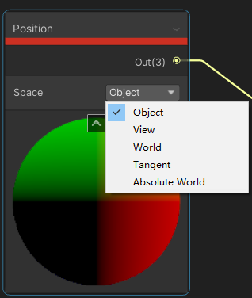
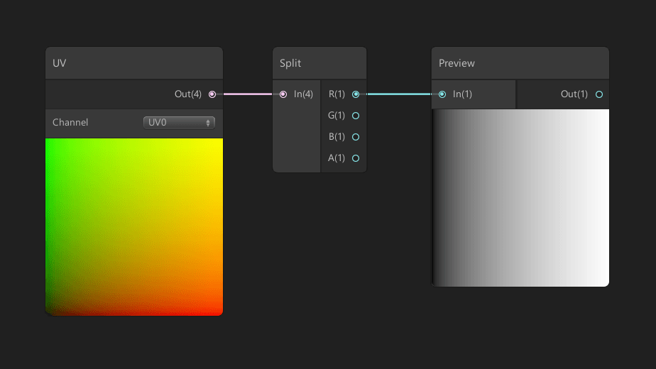
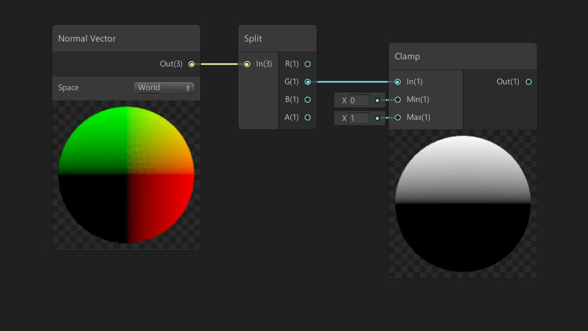

# 使用 ShaderGraph 创建动画材质

## 1. Position 节点

通过顶点节点，可以操作材质所对应对象上的顶点

通过随时间更改顶点位置，就能创造出动画效果材质

场景中的 Mesh 有五种类型的空间：

- Object 对象：相对于对象 mesh 枢轴的顶点位置。
- View 视图：相对于相机的顶点位置。
- World ：相对于世界原点的顶点位置。返回选定的 Scriptable Render Pipeline 的默认世界空间。
- Tangent 切线：解决一些特殊用例，例如逐像素照明。
- Absolute 绝对世界: 始终返回场景中所有可编写脚本渲染管线的对象的绝对世界位置，URP 的默认选项

## 2. 使用 Mask 限制移动

### 2.1 Texture Mask

使用黑白纹理，我们可以使用详细的形状来推动我们的 Mesh。

要使用具有顶点位置的纹理，您必须使用 Sample Texture 2D LOD 节点而不是典型的 Sample Texture 2D 节点。如果您需要具有独特形状或一定程度衰减的蒙版，纹理特别有用。

### 2.2 UV Mask

虽然类似于纹理蒙版，但使用 UV 蒙版，您可以根据 UV 展开选择您希望影响的网格部分。

在上面的屏幕截图中，我使用 UV 的 u 轴来创建从左到右的渐变。要偏移梯度，请使用 Add 节点；要增加强度，请使用乘法节点；要增加衰减，请使用 Power 节点。

### 2.3 Vertex Colour Mask

每个顶点存储一个 Vector3 信息单元，我们称之为 Vertex Color。这也是主堆栈 Master Stack 中，片元 Fragment 处理的部分

在上面的截图中，Vertex Color 节点被分割成红色 ( R ) 通道，然后连接到 Lerp 节点的 T 通道，充当遮罩。Lerp 节点的 A 通道在输入为 0 时使用，B 通道在输入为 1 时使用。实际上，如果顶点有红色顶点，上述设置只会在 y 轴上加 1 分配的颜色。

### 2.4 World Orientation Mask

通过使用法线向量节点，我们可以通过网格面的方向来屏蔽输入。

同样，Split 节点允许我们选择我们希望影响的轴（R=X，G=Y，B=Z）。在上面的屏幕截图中，我使用 y 轴进行遮罩，因此只有朝上的面是正面的。使用 Clamp 节点丢弃任何不在 0 和 1 之间的值很重要。

### 2.5 World Position Mask

如果对象的位置高于 y 轴上的世界位置 0，则这一系列节点会屏蔽输入。

 

 

> 参考资料：
>
> - [Position Node 位置节点 官方文档](https://docs.unity3d.com/Packages/com.unity.shadergraph@14.0/manual/Position-Node.html)
> - [Using Position Data - Shader Graph Basics - Episode 26 | Ben Cloward |
>   youtube](https://www.youtube.com/watch?v=Rm4ubzc-6Q4)
> - [Art That Moves: Creating Animated Materials with Shader Graph](https://blog.unity.com/technology/art-that-moves-creating-animated-materials-with-shader-graph)

 

 

配套视频教程：
[https://space.bilibili.com/43644141/channel/seriesdetail?sid=299912](https://space.bilibili.com/43644141/channel/seriesdetail?sid=299912)

文章也同时同步微信公众号，喜欢使用手机观看文章的可以关注

