# lighting 光照简介

## 1. Unity 光照概念

### 1.1 光照在游戏中的作用

一句话：提升游戏体验和视觉效果

Unity 中光照的工作方式类似于光在现实世界中的情况。Unity 使用详细的光线工作模型来获得更逼真的结果，并使用简化模型来获得更具风格化的结果。

### 1.2 物理概念

#### 1.2.1 直射

光源直接到眼睛

#### 1.2.2 反射

反射时我们能看到不发光物体的原因

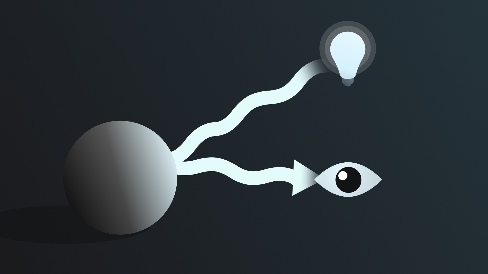

* 镜面反射：当光波撞击非常光滑的表面并产生镜像时，完全反射
* 非镜面反射：当光波撞击一个不光滑的表面时，一些能量被吸收，其余的被反射回各种不同的方向（散射）

#### 1.2.3 折射

当光波穿过空气以外的物体（如水或玻璃）时，它的路径会因此而改变。

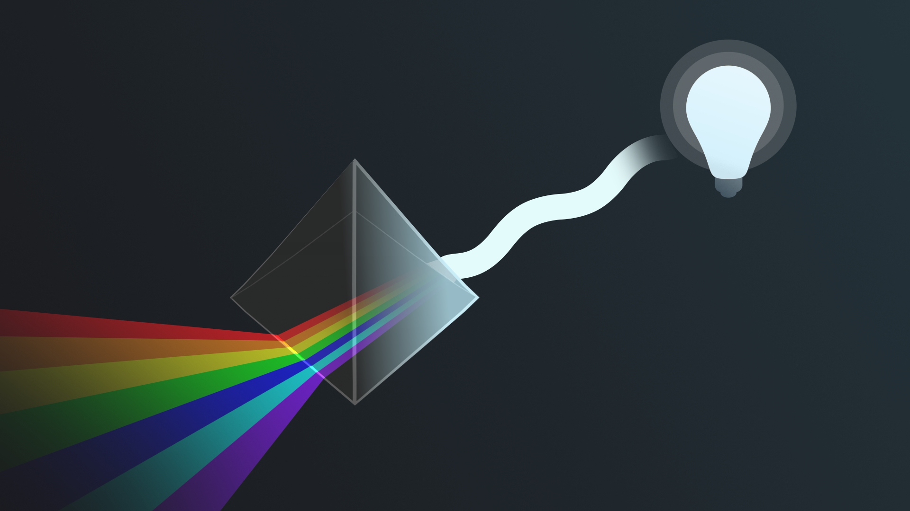

## 2. unity 中的光源

发光物体就是光源

### 2.1 光源的三个核心属性

* Shape ： 形状影响光发射的方向 direction
* size : 大小影响光照面积 area
* strength / intensity ：强度影响光传播的远近，以及亮度 

### 2.2 光源资源管理器窗口

Window > Rendering > Light Explorer

此窗口会列出场景中的所有光源以及您可以直接从窗口调整的关键细节。

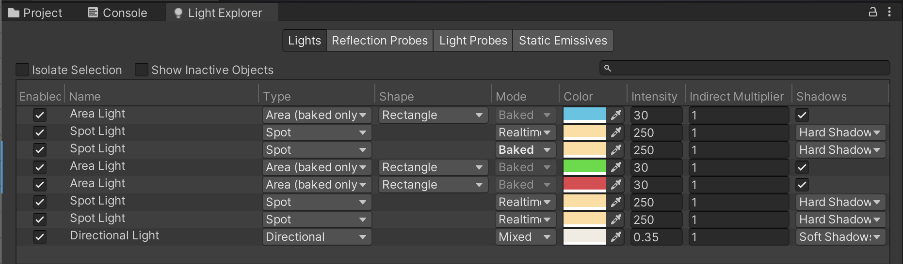

窗口中共有四个分页，其中最重要的是 Light

Lights 分页中的各项设置：

* Enabled : 是否开启
* Name : 光源对象在 Hierarchy 中的对象名
* Type ：光源类型
* Shape ：形状
* Mode : 模式
* Color ： 颜色
* Intensity ：强度。定向光的默认值为0.5。Point、Spot或Area（矩形或圆盘）光源的默认值为1。
* Indirect Multiplier: 间接乘数。使用此值来改变间接光的强度。如果将Indirect Multiplier设置为小于1 的值，则反射光会随着每次反射而变暗。大于1的值使每次反弹时光线更亮。
* Shadows : 影子设置

剩下三个分别为：Reflection Probes 反射探针、light Probes 光照探针和 Static Emissives 发光材料

### 2.3 光源场景设置窗口

当前场景 scene 中光照相关的总体设置

#### 2.3.1 Scene 分页

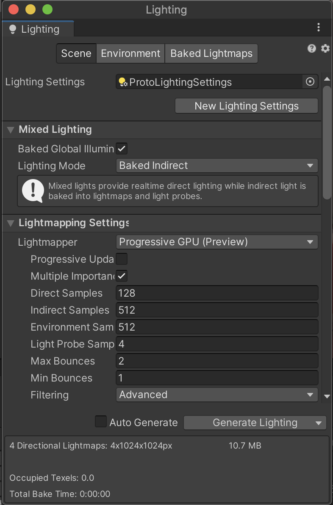

Scene 选项卡显示有关分配给活动场景光照设置资源的信息。如果没有为活动场景分配光照设置资源，它会显示有关默认 LightingSettings 对象的信息。

场景光照设置，是一个在 Assets 中的文件，可以新建和更换

Scene 选项卡分为几个部分：  
光照设置信息，包括实时光照、混合光照、光照贴图、自动生成等   

1. Lighting Settings Asset controls：  
   新建或选择不同的光照配置文件，将光照设置资源分配给活动（当前）场景

2.  Lightmapping Settings：
    * Lightmap Resolution 光照贴图解决方案：  
    指定每单位用于光照贴图的纹素(texel)数。增加此值可提高光照贴图质量，但也会增加烘焙时间。请注意，将该值加倍会使纹素的数量增加四倍，因为它决定了光照贴图的高度和宽度。
    * Lightmap Padding 光照贴图填充：  
    确定烘焙光照贴图中不同形状之间的间隔（以纹素为单位）。默认值为 2。
    * Max Lightmap Size 最大光照贴图大小：  
    指定完整光照贴图纹理的大小（以像素为单位），其中包含每个包含的游戏对象的单独区域。默认值为 1024。
    * Lightmap compression 光照贴图压缩：  
    编辑器用于光照贴图的压缩级别。四个选项，none，低中高质量。  
      - 无：不压缩光照贴图。
      - 低质量：这可能比正常质量使用更少的内存和存储空间，但也会引入视觉伪影。
      - 正常质量：这是内存使用和视觉质量之间的良好折衷。
      - 高质量：比普通质量需要更多的内存和存储空间，但提供更好的视觉效果。
    * Ambient Occlusion 环境光遮罩：  
     控制烘焙环境光遮蔽中表面的相对亮度。这仅适用于由光照贴图你用来烘烤你的照明。默认启用。如果启用了 Ambient Occlusion，它会显示三个设置：Max Distance、Indirect Contribution 和 Direct Contribution。对于所有三种设置，较高的值表示被遮挡区域和完全照明区域之间的对比度更大。
    * Max Distance 最大距离：  
     指定照明系统投射光线的距离，以确定是否将遮挡应用于对象。较高的值会产生较长的光线并为光照贴图贡献更多的阴影，而较低的值会产生较短的光线，仅当对象彼此非常接近时才会产生阴影。值 0 会投射无限长的射线，没有最大距离。默认值为 1。
    * Indirect Contribution 间接贡献：  
     在最终光照贴图中，设置环境光在对象上反弹和发射亮度的缩放值。这是一个介于 0 和 10 之间的值。默认值为 1。小于 1 的值会降低强度，而大于 1 的值会增加强度。
    * Direct Contribution 直接贡献：  
    缩放直射光的亮度。这是一个介于 0 和 10 之间的值。默认值为 0。该值越高，编辑器应用于直接照明的对比度就越大。
    * Directional Mode 定向模式：  
    使光照贴图能够存储有关对象表面上每个点的主要入射光的特征的信息。默认模式是定向。 
    * Directional 定向： 
    在Directional模式下，Unity 会生成第二个光照贴图来存储入射光的主要方向。这使得漫反射法线贴图材质可以与全局照明系统一起使用。着色器在渲染期间对两个光照贴图纹理进行采样。因此，定向模式需要的视频内存大约是非定向模式的两倍，用于额外的光照贴图数据。生成额外的方向性纹理会对烘焙性能产生影响。定向光照贴图无法在 SM2.0 硬件上或使用 GLES2.0 时解码
    * Non-directional 非定向：  
    非定向模式光照贴图只包含一个纹理。因此，与定向光照贴图相比，它们需要更少的视频内存和存储空间，并且在着色器中解码速度更快。这些优化降低了视觉质量。
    * Indirect Intensity 间接强度：  
    确定存储在实时和烘焙光照贴图中的间接光的亮度。这是一个介于 0 和 5 之间的值。大于 1 的值会增加间接光的强度，而小于 1 的值会降低间接光的强度。默认值为 1。
    * Albedo Boost 反照率提升：  
    指定 Unity 在曲面之间反射的光量。此值介于 1 和 10 之间。增加此值会将反照率值拉向白色以进行间接光计算。默认值 1 在物理上是准确的。 
    * Lightmap Parameters 光照贴图参数：  
    光照贴图参数资产商店与烘焙全局照明相关的设置值。编辑器提供了几个默认的光照贴图参数资源可供选择，但您也可以使用“新建”选项创建自己的光照贴图参数文件。默认值为Default-Medium。选项有 Default-Medium、Default-HighResolution、Default-LowResolution 和 Default-VeryLowResolution。
3. Workflow Settings：工作流设置  
   此部分包含可帮助您调试场景的设置。
   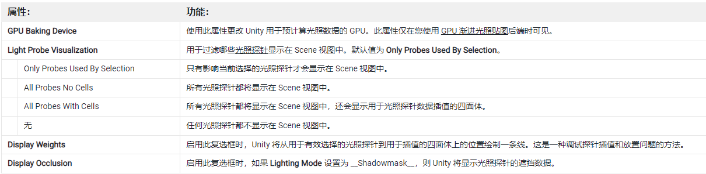
4. Auto Genaration 自动生成  
   如果启用了自动生成，Unity 会在您更改场景时自动预计算照明数据。该数据包括 Baked Global Illumination 系统的光照贴图、Enlighten Realtime Global Illumination 系统、Light Probes 和 Reflection Probes 的数据。  
   Unity 通常在您更改场景后几秒钟开始烘焙。如果禁用自动生成，您必须自己手动调用烘焙，使用 Lighting 窗口中的Generate Lighting按钮，或者Lightmapping.Bake或Lightmapping.BakeAsync API。  
   请注意，当您使用Auto Generate预先计算照明数据时，预先计算的照明数据不会作为资产存储在您的项目中。相反，它存储在内存中，并作为场景的一部分进行序列化。
5. Mixed Lighting 混合光照：  
   * Baked Indirect 烘焙间接光:    
  将实时直接光照与烘焙间接光照相结合。它提供实时阴影。此光照模式提供逼真的光照和合理的阴影保真度，适用于中档硬件。
   * Shadowmask 阴影遮罩:  
  将实时直接照明与烘焙间接照明相结合。它可以为远处提供烘焙阴影游戏对象，并自动将它们与实时阴影混合。它是最现实的，也是最耗费资源的光照模式。您可以使用质量设置来配置其性能和视觉保真度。此照明模式适用于高端或中档硬件。
   * Subtractive 减法:  
  提供烘焙的直接和间接照明。它只为一个定向光渲染直接实时阴影。此光照模式不提供特别逼真的光照效果，适用于风格化艺术或低端硬件。

#### 2.3.2 Environment 分页

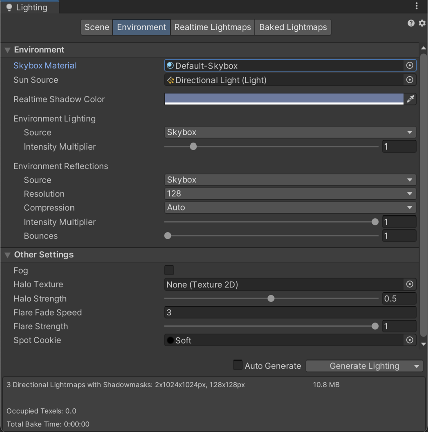

在内置渲染管线和 URP 中，Environment 选项卡分为两个部分：

* Environment :  
    Environment 部分包含与光照相关的设置和控件，这些设置和控件适用于当前场景中的环境光照，例如天空盒、漫射光照和反射。
    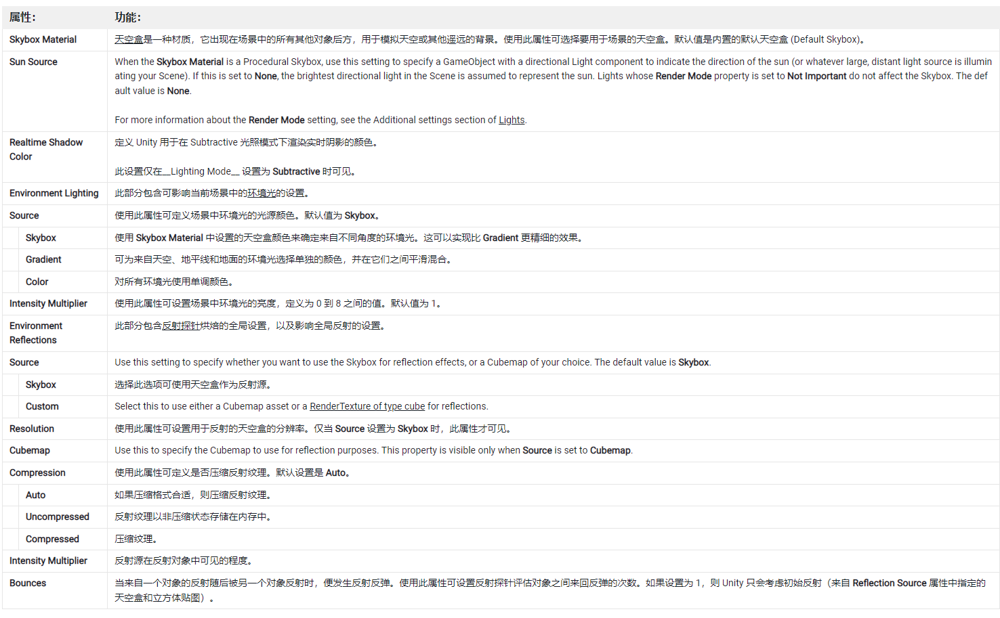

* Other settings
   Other Settings 部分包含雾、光环、光晕和剪影的设置。  
   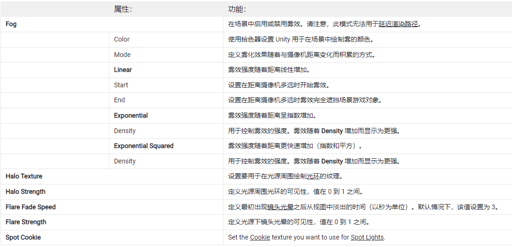

在 HDRP 中，Environment 选项卡允许您指定用于环境光照的天空。

#### 2.3.3 Baked Lightmaps 分页

此选项卡显示光照贴图为当前场景生成的所有光照贴图的列表，以及光照数据资源。如果项目中未启用烘焙全局光照 (Baked Global Illumination)，则此选项卡将为空。

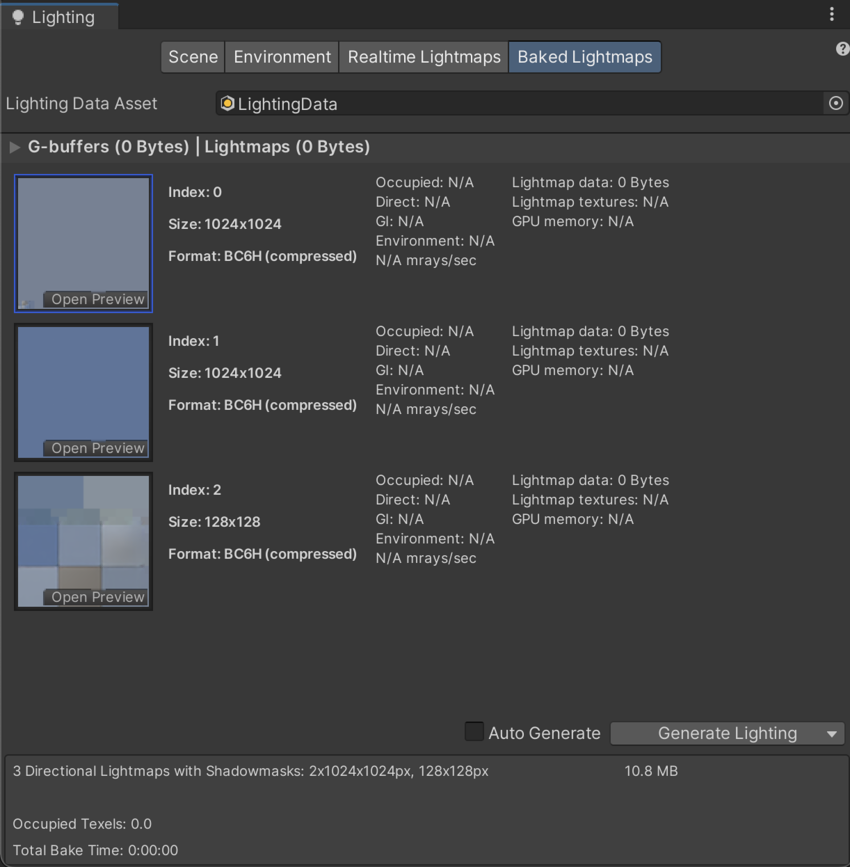

#### 2.3.4 Realtime Lightmpas 分页

实时光照贴图选项卡,显示由 Enlighten Realtime Global Illumination system （先导实时全局照明系统） 生成的全部光照贴图。如果您的项目中未启用 Enlighten Realtime Global Illumination，则此选项卡将为空。

 

### 2.4 直接光和间接光

* 直接光 
  物体表面直接反射光源进入传感器的光线  
  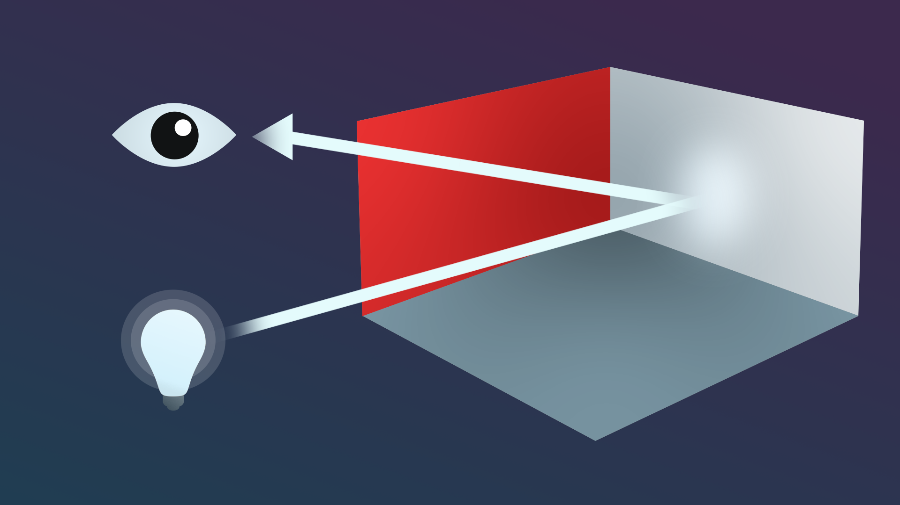
* 间接光  
  最终反射到传感器中的所有其他光，例如多次撞击表面的光以及当您不直接看太阳时来自天空的光  
  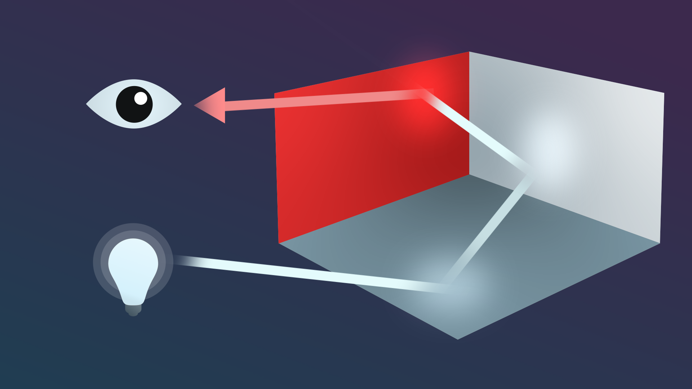
### 2.5 光照模式 Mode

光源设置中的 Mode

* 烘培光照 Baked ：  
   烘焙光照是指 Unity 提前执行光照计算并将结果保存为光照数据，然后在运行时应用。合理使用烘焙光照，可以节省较多资源，降低游戏要求的硬件配置。
  
* 实时光照 Realtime：   
  实时光照是指 Unity 在运行时计算光照。需要更高的配置，消耗更多算力

* 混合光照 Mixed：  
  实时和烘焙的混合

## 3. Global Illumination 全局照明系统

全局照明是一组可在 Unity 中用于提供逼真照明效果的技术。这些技术被称为全局照明，因为它可以同时模拟直接光和间接光，而不仅仅是直接光。

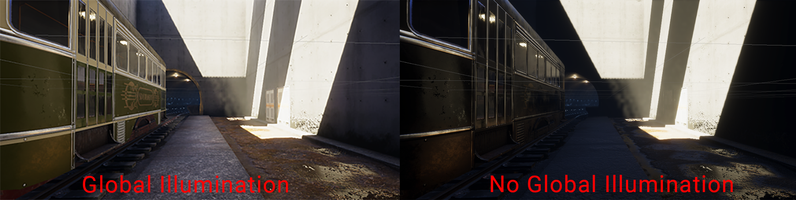

Unity 中有两种不同的全局光照系统：烘焙全局光照系统和实时全局光照系统。

### 3.1 Baked Global Illumination

Baked Global Illumination 系统包括：
* Lightmapping 光照贴图：  
  预先计算场景中表面的亮度并将结果存储在称为光照贴图的纹理中的过程。这个全局照明系统使用一个称为Progressive Lightmapper的特定光照贴图系统来完成这个过程。
* Light Probes 光照探针：  
  一种用于测量（或探测）有关穿过场景中空白空间的光的数据的工具。
* Reflection Probes 反射探针：  
  在 Unity 中模拟更真实反射的工具。

### 3.2 Realtime  Global Illumination

实时全局照明系统包括：  

* Lightmapping 光照贴图：  
  这个全局照明系统使用了一个已弃用的光照贴图，称为 Enlighten 光照贴图。
* Light Probes 光照探针：  
  光探头在这个全局照明系统中具有一些附加功能。

通用渲染管线 (URP)不支持实时全局照明系统。HDRP 支持

实时全局照明系统相对于烘焙全局照明系统效果更好，但也更加消耗系统资源

参考资料：
> 
> * [lighting unity 官方文档](https://docs.unity3d.com/cn/2022.1/Manual/LightingOverview.html)

 

 

配套视频教程：
[https://space.bilibili.com/43644141/channel/seriesdetail?sid=299912](https://space.bilibili.com/43644141/channel/seriesdetail?sid=299912)

文章也同时同步微信公众号，喜欢使用手机观看文章的可以关注

