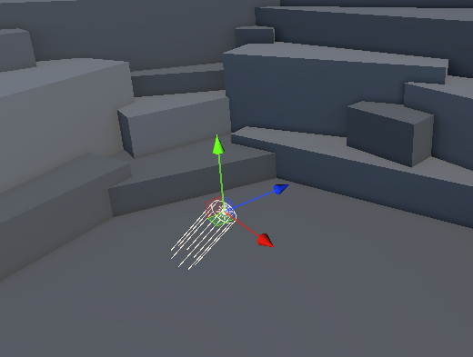
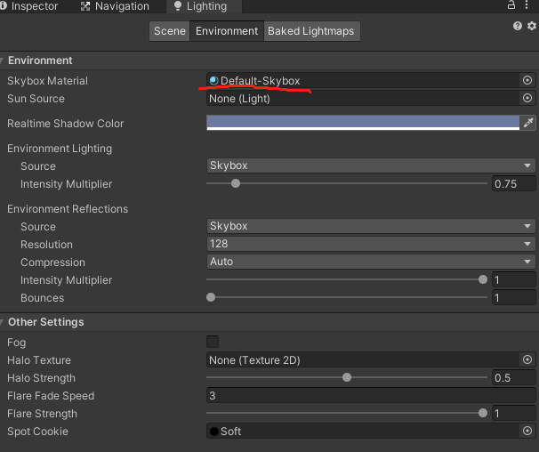
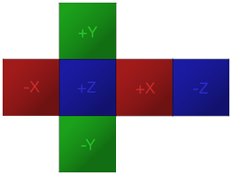
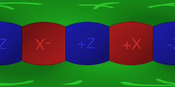
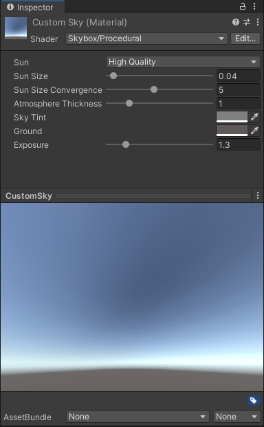

# 定向光和天空盒

光照设计：识别场景所需的光源是照明设计和实施的关键初始步骤。

一般游戏设计中最常使用的四种光照：
* 自然采光： 通常是太阳或月亮。
* 动态照明： 模仿场景中特定的真实光源——例如路灯或汽车前灯。
* 关键照明： 这是一种没有可识别光源的光，用于照亮场景中的焦点对象（类似于舞台上的聚光灯效果）。
* 环境光（在 Unity 中也称为漫反射环境光）：整个场景环境漫反射光照，不确定来自某个具体光源。

在室外场景中，可以使用 定向光 Directional Light 和 天空盒 Sky Box 快速营造出场景环境和气氛，甚至是昼夜转换效果，简单而重要，是构建室外场景需要首先考虑的两个关键元素。

## 1. 定向光 Directional Light

定向光对于在场景中创建诸如阳光之类的效果很有用。在许多方面都像太阳一样，定向光可以被认为是无限远的遥远光源。



特点：
* 会随着场景创建被自动加入；
* 位置、远近不影响效果；
* 旋转定向光，可以产生昼夜转换效果；
* 如果选择天空盒作为环境光源，环境光将根据其颜色发生变化。
* Lighting 窗口中 Environment - Sun Source ,默认值为 None ,则假定场景中最亮的定向光代表太阳。当Skybox 材质是 Procedural Skybox 时, 也可以指定任意定向光对象为太阳。

## 2. 天空盒

### 2.1 天空背景 Sky

Unity 中可以使用天空盒设置天空背景，天空背景会在摄像机在第一帧之前渲染。

用途：
1. 这种类型的背景极大地有利于 3D 游戏和应用程序，因为它提供了深度感并使环境看起来比实际大得多。
2. 天空本身可以包含任何东西，例如云、山、建筑物和其他无法到达的物体，以创造遥远的三维环境的错觉。
3. 场景中的环境光 Ambient lighting 也是由天空背景产生。

### 2.2 天空盒 Sky Box

Unity 中的天空背景是使用一种称为天空盒的特殊材质创建的。



天空盒是在每个面上具有不同纹理的立方体。

当您使用天空盒渲染天空时，Unity 基本上将您的场景放置在天空盒立方体内。

Unity 首先渲染立方体，因此天空渲染在场景中其他任何物体的后面。

> 注意：
> * 高清渲染管线 (HDRP)不支持天空盒材质，而是包含多个天空生成解决方案。
> * HDRP 包括它自己的使用Volume 系统的天空解决方案。每个体积都可以包含一个覆盖来指定要绘制的天空类型。每个摄影机在影响它的每个体积的天空设置之间进行插值并绘制结果

使用天空盒步骤：
1. 创建天空盒材质；
2. 将天空盒材质应用到 Lighting-Environment-SkyBox Material 上；
3. 配置其他相关属性

> 注意：
> * 天空盒的变化可能会更加戏剧化，但也不要忘记调整您的定向光配置。对Color属性的微小更改可能会对场景的气氛产生微妙但有效的影响。


### 2.3  SkyBox Shaders

Unity 中，可以将专门的 天空盒着色器  SkyBox Shader，应用到创建天空盒的

SkyBox Shaders 共有四种，可以分为两大类：
1. 使用纹理 Textured：
   * 6 Sided 六面：  
    从六个单独的纹理生成天空盒。每个纹理代表沿特定世界轴的天空视图。为了说明这一点，想想场景就像在一个立方体里面。每个纹理代表立方体的一个内部面，所有六个组合起来创建一个无缝的环境。
    
   * Cubemap 立方体贴图：  
    从单个Cubemap Asset生成天空盒。
   * Panoramic 全景：  
    将单个 Texture 球形包裹在场景
    
2. 不使用纹理：
   * Procedural 程序生成：  
     不需要任何输入纹理，而是纯粹从材质中设置的属性生成天空盒
    


## 3. 昼夜更替效果实现

### 3.1 创建时间显示UI

* 打开 TutorialScene_Lighting_Indoor 场景
* 在场景中加入 Text-TextMeshPro，并将其定位到右上角，宽高设置为：200*50，字体设置为45
* 场景中创建空对象，添加下面脚本作为组件

``` C#
public class TimeController : MonoBehaviour
{
     [SerializeField]
    private float timeMultiplier;

    [SerializeField]
    private float startHour;

    [SerializeField]
    private TextMeshProUGUI timeText;

    private DateTime currentTime;

    [SerializeField]
    private float sunriseHour;

    [SerializeField]
    private float sunsetHour;

    void Start()
    {
        currentTime = DateTime.Now.Date + TimeSpan.FromHours(startHour);

        sunriseTime = TimeSpan.FromHours(sunriseHour);
        sunsetTime = TimeSpan.FromHours(sunsetHour); 

    }

     void Update()
    {
        UpdateTimeOfDay();
    }

    private void UpdateTimeOfDay()
    { 
        currentTime = currentTime.AddSeconds(Time.deltaTime*timeMultiplier);
        if (timeText != null) { 
            timeText.text = currentTime.ToString("HH:mm");
        }
    }
}
```

### 3.2 让定向光随时间旋转

为代码添加定向光随时间旋转功能：
``` C#
public class TimeController : MonoBehaviour
{
    [SerializeField]
    private float timeMultiplier;

    [SerializeField]
    private float startHour;

    [SerializeField]
    private TextMeshProUGUI timeText;

    private DateTime currentTime;

    [SerializeField]
    private Light sunLight;

    [SerializeField]
    private float sunriseHour;

    [SerializeField]
    private float sunsetHour;

    private TimeSpan sunriseTime;
    private TimeSpan sunsetTime;

    void Start()
    {
        currentTime = DateTime.Now.Date + TimeSpan.FromHours(startHour);

        sunriseTime = TimeSpan.FromHours(sunriseHour);
        sunsetTime = TimeSpan.FromHours(sunsetHour); 

    }

    // Update is called once per frame
    void Update()
    {
        UpdateTimeOfDay();
        RotateSunLight();
    }

    private void UpdateTimeOfDay()
    { 
        currentTime = currentTime.AddSeconds(Time.deltaTime*timeMultiplier);
        if (timeText != null) { 
            timeText.text = currentTime.ToString("HH:mm");
        }
    }

    private void RotateSunLight() {
        float sunLightRotation;
        if (currentTime.TimeOfDay > sunriseTime && currentTime.TimeOfDay < sunsetTime)
        {
            TimeSpan sunriseToSunsetDuration = CalculateTimeDifference(sunriseTime, sunsetTime);
            TimeSpan timSinceSunrise = CalculateTimeDifference(sunriseTime, currentTime.TimeOfDay);

            double percentage = timSinceSunrise.TotalMinutes / sunriseToSunsetDuration.TotalMinutes;

            sunLightRotation = Mathf.Lerp(0, 180, (float)percentage);
        }
        else
        {
            TimeSpan sunsetToSunriseDuration  = CalculateTimeDifference(sunsetTime, sunriseTime);
            TimeSpan timeSinceSunset = CalculateTimeDifference(sunsetTime, currentTime.TimeOfDay);

            double percentage = timeSinceSunset.TotalMinutes / sunsetToSunriseDuration.TotalMinutes;

            sunLightRotation = Mathf.Lerp(180,360,(float)percentage);
        }

        sunLight.transform.rotation=Quaternion.AngleAxis(sunLightRotation,Vector3.right);
    }

    private TimeSpan CalculateTimeDifference(TimeSpan fromTime, TimeSpan toTime)
    { 
        TimeSpan diff = toTime - fromTime;
        if (diff.TotalSeconds < 0) {
            diff += TimeSpan.FromHours(24);
        }
        return diff;
    }
}
```

### 3.3 自动打开关闭路灯

* 场景中添加路灯预制件，并为其光源子对象添加 tag ：StreetLampLight
* 更改代码如下，增加自动开关路灯功能

``` C#
public class TimeController : MonoBehaviour
{
    [SerializeField]
    private bool streetLampLightEnabled;

    [SerializeField]
    private float timeMultiplier;

    [SerializeField]
    private float startHour;

    [SerializeField]
    private TextMeshProUGUI timeText;

    private DateTime currentTime;

    [SerializeField]
    private Light sunLight;

    [SerializeField]
    private float sunriseHour;

    [SerializeField]
    private float sunsetHour;

    private TimeSpan sunriseTime;
    private TimeSpan sunsetTime;

    void Start()
    {
        currentTime = DateTime.Now.Date + TimeSpan.FromHours(startHour);

        sunriseTime = TimeSpan.FromHours(sunriseHour);
        sunsetTime = TimeSpan.FromHours(sunsetHour); 

    }

    // Update is called once per frame
    void Update()
    {
        UpdateTimeOfDay();
        RotateSunLight();
    }

    private void UpdateTimeOfDay()
    { 
        currentTime = currentTime.AddSeconds(Time.deltaTime*timeMultiplier);
        if (timeText != null) { 
            timeText.text = currentTime.ToString("HH:mm");
        }
    }

    private void RotateSunLight() {
        float sunLightRotation;
        if (currentTime.TimeOfDay > sunriseTime && currentTime.TimeOfDay < sunsetTime)
        {
            TimeSpan sunriseToSunsetDuration = CalculateTimeDifference(sunriseTime, sunsetTime);
            TimeSpan timSinceSunrise = CalculateTimeDifference(sunriseTime, currentTime.TimeOfDay);

            double percentage = timSinceSunrise.TotalMinutes / sunriseToSunsetDuration.TotalMinutes;

            sunLightRotation = Mathf.Lerp(0, 180, (float)percentage);

            if (streetLampLightEnabled) {
                GameObject[] streetLamps = GameObject.FindGameObjectsWithTag("StreetLampLight");
                foreach (GameObject streetLamp in streetLamps) {
                    Light streetLampLight = streetLamp.GetComponent<Light>();
                    if (streetLampLight != null)
                    {
                        streetLampLight.enabled = false;
                    }
                }
            }
        }
        else
        {
            TimeSpan sunsetToSunriseDuration  = CalculateTimeDifference(sunsetTime, sunriseTime);
            TimeSpan timeSinceSunset = CalculateTimeDifference(sunsetTime, currentTime.TimeOfDay);

            double percentage = timeSinceSunset.TotalMinutes / sunsetToSunriseDuration.TotalMinutes;

            sunLightRotation = Mathf.Lerp(180,360,(float)percentage);
            if (streetLampLightEnabled)
            {
                GameObject[] streetLamps = GameObject.FindGameObjectsWithTag("StreetLampLight");
                foreach (GameObject streetLamp in streetLamps)
                {
                    Light streetLampLight = streetLamp.GetComponent<Light>();
                    if (streetLampLight != null)
                    {
                        streetLampLight.enabled = true;
                    }
                }
            }
        }

        sunLight.transform.rotation=Quaternion.AngleAxis(sunLightRotation,Vector3.right);
    }

    private TimeSpan CalculateTimeDifference(TimeSpan fromTime, TimeSpan toTime)
    { 
        TimeSpan diff = toTime - fromTime;
        if (diff.TotalSeconds < 0) {
            diff += TimeSpan.FromHours(24);
        }
        return diff;
    }

}
```

> 参考资料：
> * [CC Lighting 官方教程](https://learn.unity.com/tutorial/configure-the-directional-light-and-skybox)
> * [天空 Unity 官方文档](https://docs.unity3d.com/2022.1/Documentation/Manual/sky.html)
> * [youtube - Unity 3D 场景昼夜转换](https://www.youtube.com/watch?v=m9hj9PdO328)
> * [youtube - Unity 3D 场景昼夜转换](https://www.youtube.com/watch?v=L4t2c1_Szdk)
> * [youtube - Unity 2D 场景昼夜转换](https://www.youtube.com/watch?v=ihurRMKz2es)

<br>
<hr>
<br>

配套视频教程：
[https://space.bilibili.com/43644141/channel/seriesdetail?sid=299912](https://space.bilibili.com/43644141/channel/seriesdetail?sid=299912)

文章也同时同步微信公众号，喜欢使用手机观看文章的可以关注

