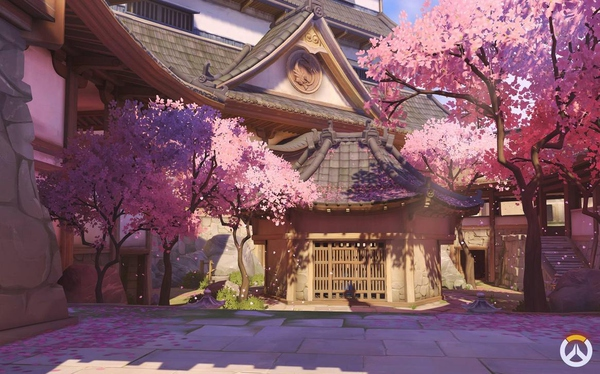
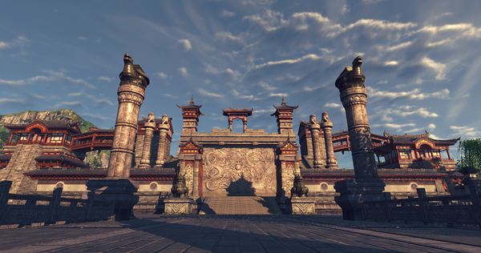
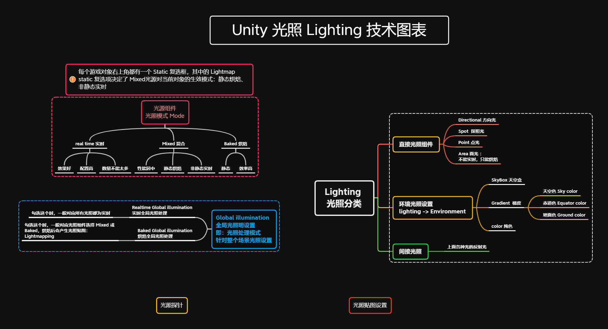
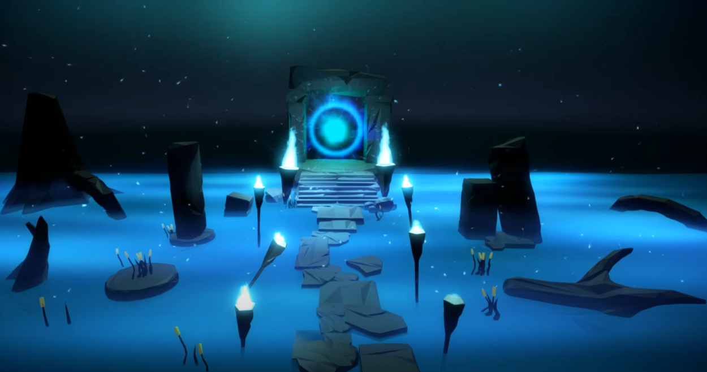
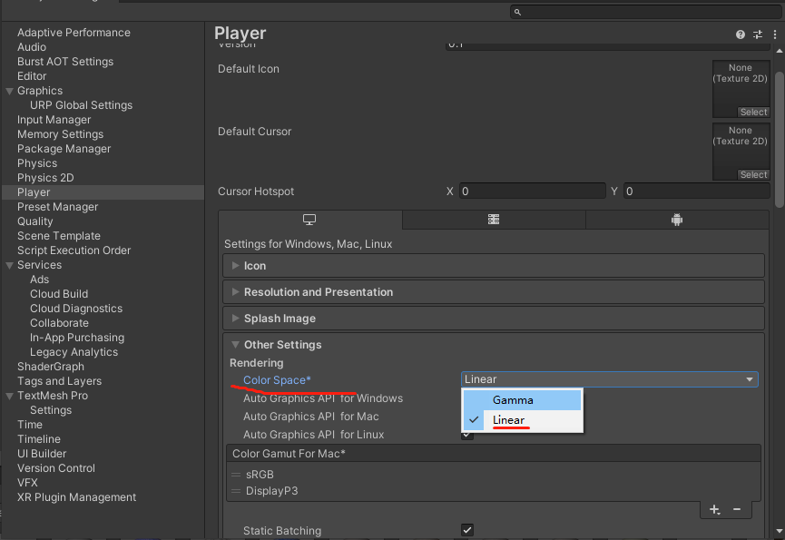
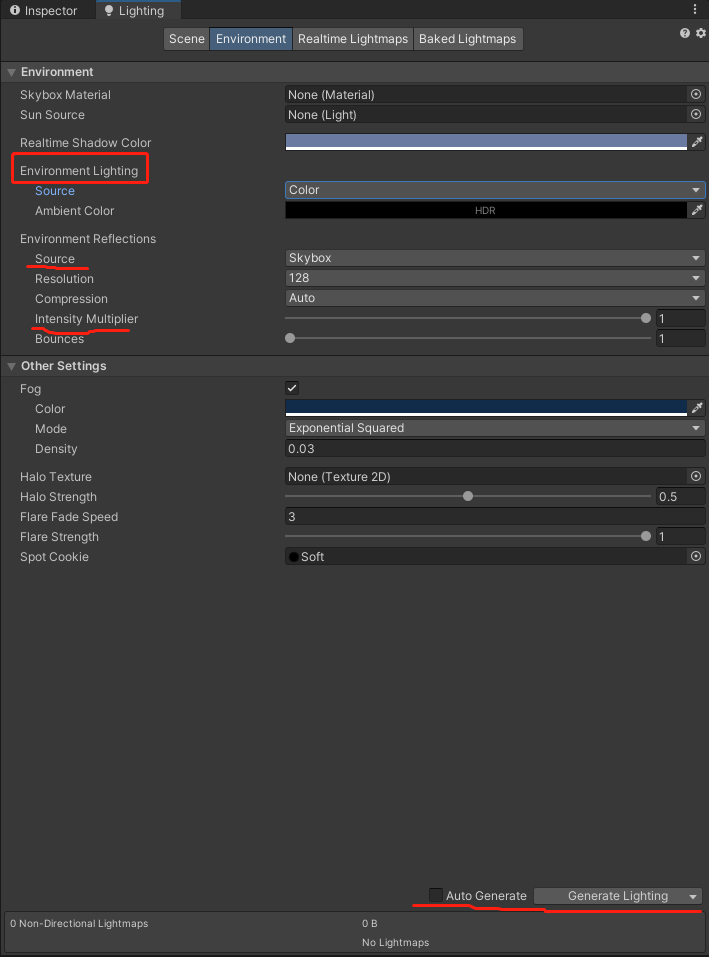
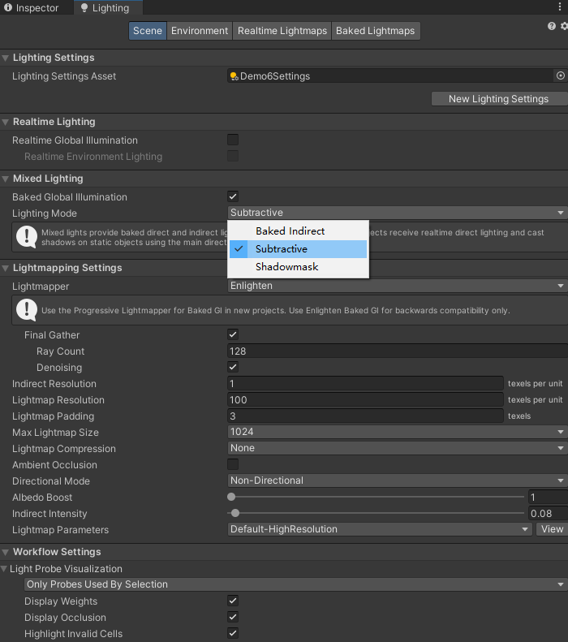
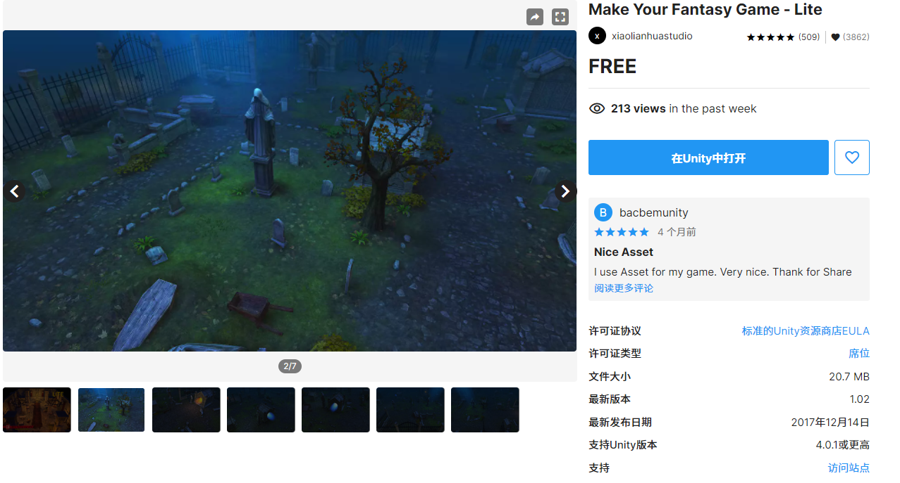
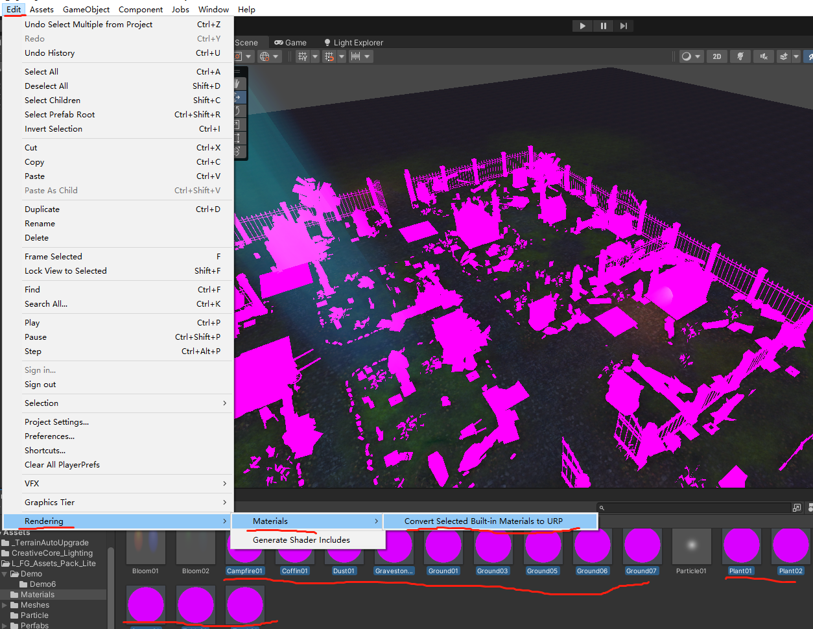

# 光照常用设置&经验总结--初级

光照效果对游戏画面的影响巨大，光照漂亮的游戏，即便使用非常简单的贴图和材质，也能出现赏心悦目的效果。

对比一下守望先锋和天涯明月刀，造成巨大视觉差别的原因就是光照的使用，特别是间接光、补光

上图，守望先锋（2016）中加强了对暗部（如墙壁背光面、阴影处等）效果的表现，可以看到游戏中的地面部分阴影为紫色，而墙上的阴影受樱花树、地面 光线反弹 的影响，则呈现为粉红色。

下图天涯明月刀（2015）：画面内物体暗部颜色和阴影颜色基本混在一起。显得比较单调。看起来有点脏

在自然环境中，光从太阳照射到地面，不是简单的只照亮物体表面，而是会在物体之间相互反射，从而影响整个环境。通常直接照亮物体的光线被称为直接光，发生反射后照亮物体的光线被称为间接光，二者综合为全局光照。

## 1. 使用直接光照的一些经验设置

### 1.1 光照类型选择

* Directional ： 日光、月光，无限远的光源，不会随距离而衰竭
* spot ： 锥形的方向光，从添加点向一个方向照射，适合模拟：路灯、台灯、手电、舞台灯、车灯等等锥形光源；
* point ： 全方向的一个点光源，适合模拟：萤火虫、蜡烛、夜光宝石等等
* area ： 面光源，不能是实时的，可以模拟一个静态发光面，适合模拟：荧光灯、led 平面灯 等等

还有一些在设计动画时，为了营造特殊效果，而设计出的“效果光照”，通常用 spot light。这种光源并没有什么现实中的物理意义，只是为了营造效果

所以，光源的使用并没有什么雷打不动的死规则，除了场景中表示物理光源的光照外，可以根据氛围需要，灵活选择需要的光照。

### 1.2 光照模式说明

* Realtime：在该模式下，光照和阴影会参与实时计算，任何的场景中无论是光影变化还是色彩变化，都会实时的显示变更后的内容。

* Mixed：混合模式，在实时模式下，因为光影环境等信息会实时做出计算，所以对性能开销会有一定影响，例如在一些配置比较低的硬件上，或者手机上，因为特殊机能限制无法承受较大的性能开销，所以混合模式，会将场景中静态不动的物体，例如地面，或者墙面，烘焙成一张光照贴图，当烘焙成光照贴图后，这些物体不再参与光影计算，而场景中动态的物体，例如角色，或者一些怪物，他们会在场景里动来动去，那么只有动态的物体，才会参与实时的光影计算，因为毕竟你角色移动，影子和照射在角色身上的光影信息也是变化的。

* Baked：相比Mixed混合光照更适合一些对性能要求更低的情况，这个模式下，只有静态的物体会表现正确的光影信息，如果非静态物体，那么它既不会受光照影响，也不会产生影子。

Mixed和Baked都是烘焙技术方案，同时不管是Mixed还是Baked，都可以灯光探针影响，也就是说在Baked模式下表现不了光影信息，也可以加上探针来让物体有光信息，但没什么实质性作用，只是说告诉大家探针可以让它产生光照信息。

### 1.3 常用属性设置建议

* Directional 光源设置：室外必备光源，还可以添加多个，提高整体光照效果，夜晚应该降低光照强度
* Range 光照范围：光在场景中的传播距离。但要受到光源形状的限制，比如 spot light 聚光灯，将值增加到超过该上限，就把不会导致任何进一步的范围增加。
* Intensity 光照强度：一般夜晚的光源，在比较符合现实的游戏氛围中，电灯其强度应该设置为 200-600 之间；蜡烛、火把等前度应该介于 50 -100 之间。但这只是建议，根据你的需求可以随意更改，适合的才是最好的
*  Indirect Multiplier 间接光乘数：此光源提供的间接光的强度（在被传感器接收之前多次反弹的光）。
   *  低于1时，间接光在每次从物体反弹时都会变暗。这是真实光照的行为方式，但您可能希望覆盖该行为以实现特定的光照效果。
   *  高于1 ，间接光会随着每次反弹而变亮。这并不自然，但如果您试图照亮场景中的黑暗封闭空间，它会非常有用。
   *  一般默认为1
* color : 光的颜色很重要，合理使用好光色，可以更好地凸显游戏氛围

## 2. color space 色彩空间

色彩空间将影响照明的渲染方式，unity 中有两种不同的色彩空间：

* Gamma 伽马，3D 模板中的默认值
* Linear 线性，URP 模板中的默认值

linear 线性色彩空间工作流程可实现更精确的渲染，增强颜色深度（色彩范围），因此通常是您使用的首选。

## 3. 环境光设置

环境光是存在于场景中但没有特定来源的光。这对于提高可见度或通过照明创建特定的风格效果非常有用。

Unity 的环境实时光照被计算并存储在光照贴图中。

### 3.1 Environment Lighting 环境光照重要属性常用设置：

* Source 源: 
  * skybox：默认如果有天空盒，那就是天空盒 skybox 作为环境光照明，这在白天通常比较有效。
  * color： 如果是夜晚，不想要地光、或者场景中的物体太过明亮，就可以将这个换成别的，比如比较暗的纯色。 
  * Gradient ： 将Source属性设置为Gradient 。现在您可以使用颜色选择器为场景中的天空、赤道和地面环境照明设置特定颜色。
* Intensity Multiplier： 属性控制场景中环境光  的亮度，可以是0到1之间的值（默认值为1 ），同样，晚上需要调得低些

> 注意！！！：  
> 游戏对象需要标记为静态才能包含在光照贴图中以用于环境照明。这是因为光照贴图数据是预先计算的，并且只能为运行时不移动的游戏对象计算。当您为此场景烘焙照明时，您将了解更多相关信息。

## 4. 光照贴图 LightMapping

### 4.1 光照贴图

光照烘焙后，会产生光照贴图 LightMapping。设置全局光照处理方式时，不同的光照模式，会产生数量不同的光照贴图。

烘焙过后，其实是将光影信息，烘焙成一张贴图，然后贴在了场景中物体的表面。

旧版本的 Unity 中，通常将一个烘焙贴图分为三个子部分，分别是：

* Intensity：是光照信息图，这张图保存的信息是光照的颜色、亮度；
* Directionality：保存的是光照的方向
* Shadowmask：保存的是我们光照后受光的阴影

新版本的 Unity 中，烘焙贴图可以包含更多信息，点击 open Preview 可以进行查看：

> 注意！！！：  
> 烘焙后的贴图位置固定，所以不能再移动物体，否则贴图会跟物体分离，毁掉真个场景光影效果

### 4.2 烘焙光照模式

烘焙的三个光照模式

* Subtractive: 
  * 从质量上来讲，Subtractive是最廉价的烘焙模式，它带来的就是产生质量较低的光照贴图，换来比较高的运算性能;
  * 所有颜色和阴影都烘死在光照图上，运行时静态物件不参与阴影图渲染，结果是不管光源怎么变，静态物件的受光和阴影都不变。
* Shadowmask: 
  * 其实是有2个，一个是Shadowmask、一个是Distance Shadowmask，他是一种性能兼质量为一起的光照模式
  * Shadowmask：静态物件的阴影不变，但是受光情况可以随光源变化而变。
  * Distance Shadowmask：静态物件的阴影和受光都可以变。
* Baked indirect：
  * 烘焙质量最高的光照模式。
  * 仅烘焙间接光照（也就是物体之间漫反射导致的表面明暗效果），其它东西（如阴影）全部在运行时计算，跟实时差不多了

## 5. 室外光照实例项目设置

unity 原先的 CC 教程中，那个广场用来做室外光照设计的练习，实在是缺少创作灵感，在这咱们换一个更有意思的。

通过营造一个墓地夜晚的灯光效果，来练习对各种光源组件，以及相应光照设置的使用。

### 5.1 导入墓地素材

我们这里使用的是一个Asset store 中免费素材：[Make Your Fantasy Game - Lite](https://assetstore.unity.com/packages/3d/environments/fantasy/make-your-fantasy-game-lite-8312)

使用步骤：

1. 下载并导入当前项目；
2. 如果出现素材紫色外观，通常是着色器的问题，更改 Material 中的 shader，使其适应当前项目；
  
3. 运行 Demo6 中的 Demo6 场景，查看原先场景光照设计；
4. 删除所有原先场景中的光照，自行设计一套新的

### 5.2 导入火炬

一般这种场景，加入一个动态光源会更有意思，更能测试出最终效果，所以我们找来一套火炬素材：  

链接：https://pan.xunlei.com/s/VN0hvBGcoI5gdpUmFSyZYpDIA1?pwd=j8r4# 提取码：j8r4

> 注： 
> 此素材来源于 youtube up 主 Game Factory，源视频链接：https://www.youtube.com/watch?v=QDAjrrLRyTk

使用步骤：

1. 下载并导入当前项目；
2. 如果出现素材紫色外观，通常是着色器的问题，更改 Material 中的 shader，使其适应当前项目；
3. 找到 prefab 中自己满意的火炬，添加到当前场景中
4. 如果想要火炬移动，可以选择加入移动代码，用按键控制火炬在场景中移动，测试移动的动态光源在场景中的光影效果。

> 参考资料：
> 
> * [youtube - Brackeys - REALTIME LIGHTING in Unity](https://www.youtube.com/watch?v=wwm98VdzD8s)
> * [https://zhuanlan.zhihu.com/p/72158521](https://zhuanlan.zhihu.com/p/72158521)
> * [http://youxiputao.com/articles/10216](http://youxiputao.com/articles/10216)
> * [游戏中的光影设计](https://www.gameres.com/856500.html)
> * [youtube -Game Factory - How I Created Advance Fire Torch like Assassin's Creed in Unity](https://www.youtube.com/watch?v=QDAjrrLRyTk)
> * [聊聊游戏中的灯光（一）](https://zhuanlan.zhihu.com/p/146207190)

 

 

配套视频教程：
[https://space.bilibili.com/43644141/channel/seriesdetail?sid=299912](https://space.bilibili.com/43644141/channel/seriesdetail?sid=299912)

文章也同时同步微信公众号，喜欢使用手机观看文章的可以关注

