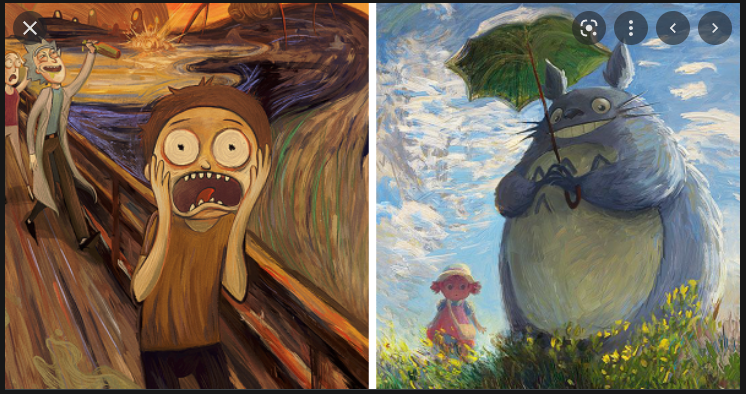

# 游戏中光影艺术设计原则入门

吃货苏说过，只恐夜深花睡去，故烧红烛照红妆；小黑胖子也提过诗：灯下看美人，越看越精神~

这个是打光失败的小龙女

这个是正确打光的结果

免费再赠送大家一张，满满的回忆啊，暴露年龄了....

最后一张，我数1、2、3，大家一起舔屏~

不合适的灯光对美人都能造成成吨的伤害，更别说游戏了。

好的游戏光影设计，技术只是工具，真正想做出赏心悦目效果，还得用光影艺术设计原则来做指导思想。

好的游戏设计师，除了程序员的geek技能，还得有一个艺术家那样敏感的心~

实际上，每位做游戏的程序设计师，特别是独立游戏制作者，应该把自己定位为 “会编程的艺术家” 。

## 1. 设计原则

### 1.1 定光色

定光色，即根据设定的情绪目标先敲定色调作为基准

好的艺术作品触动受众，引发受众产生情绪共鸣，能将作者的情感，通过作品传达给受众。

要想用好颜色，必须从源头学起。

在 CC 系列教程中，给出了四个不错的学习资源：

* 可汗学院的[Pixar in a Box色彩科学课程单元](https://www.khanacademy.org/computing/pixar/color/color-101/v/color-science-1)：一本基础入门书，将带您更深入地了解色彩科学，而不是这次学习体验
* Draw Paint Academy 的[艺术家色彩理论指南](https://drawpaintacademy.com/a-comprehensive-guide-to-color-theory-for-artists/)：以艺术家视角的色彩理论导览，对于有视觉艺术背景的人来说，这是一个有用的复习。
* 马萨诸塞艺术与设计学院的[色彩理论研究指南](https://massart.libguides.com/color)：帮助您开始自己的研究之旅的起点，进入您最感兴趣的色彩理论方面。
* 比尔·威廉姆斯关于[一般设计方法的舞台灯光设计](https://billwilliams.ca/resources/sld/sld-200.htm)：虽然写作的重点是剧院灯光设计，但基本概念仍然与 3D 数字空间的灯光相关。

当然，还有很多其他的优秀资源，这些仅当做基本的色彩入门。

### 1.2 光照类型

### 1.3 光影范围

> 参考资料：
>
> * [简谈游戏场景灯光配置方案](https://www.cnblogs.com/123ing/p/3986490.html)