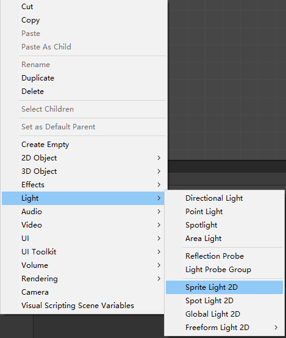
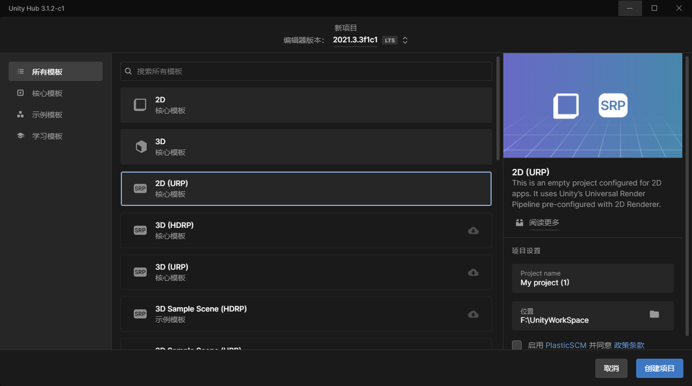
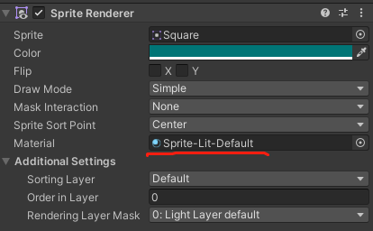
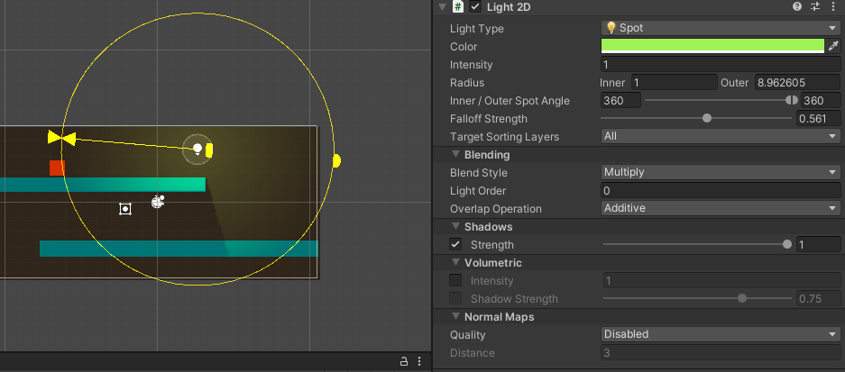
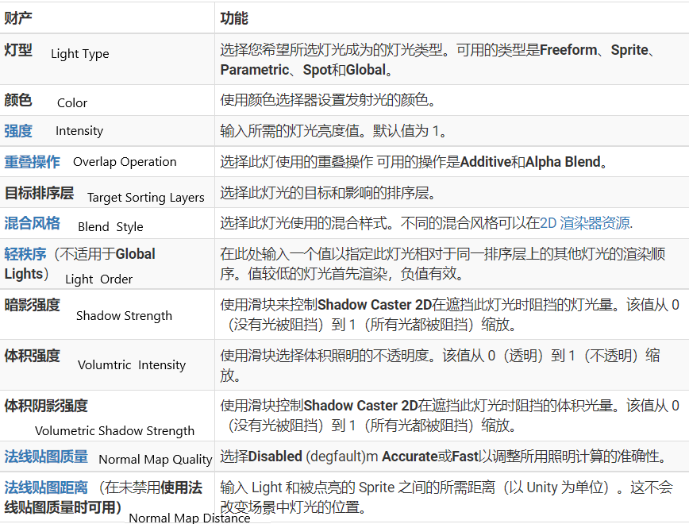
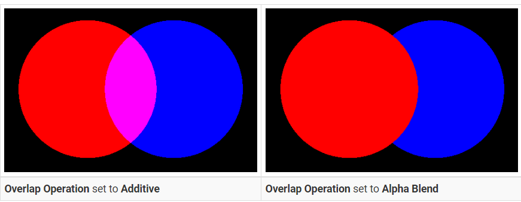
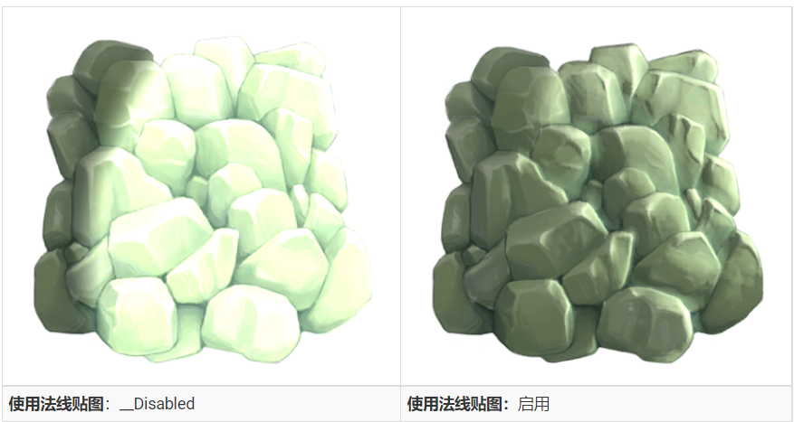
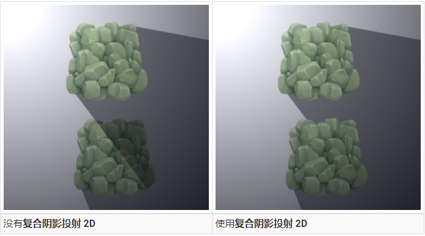

# 2D 光影

## 1. 2D Light

### 1.1 2D 光照系统

2D 光照系统包括其自己的一组 2D 光照组件、Shader Graph子目标和专门为 2D 光照和渲染设计的自定义 2D 渲染通道。用于 2D 灯光和通道配置的编辑器工具也包含在包中。

### 1.2 2D 光照特点：共面、无深度分离、不基于物理

* 2D 光照模型专门设计用于处理共面和多层的 2D 世界。2D 灯光不需要在它和它所照明的对象之间进行深度分离。
* 2D 阴影系统也可以共面工作，不需要深度分离。
* 2D Lights 中的光照计算不像 3D Lights 那样基于物理
* 目前 3D 和 2D 灯光只能分别影响 3D 和 2D 渲染器，互不影响，不可交互。但允许在同一场景中共同存在

### 1.3 2D Lighting 图形管线的技术原理（选学，不熟悉计算机图形学的可跳过）

2D Lighting 图形管线渲染过程可以分为 2 个不同的阶段：
1) 绘制光照渲染纹理 ：光渲染纹理是包含有关屏幕空间中灯光颜色和形状信息的渲染纹理
2) 绘制渲染器（renderer）

#### 1.3.0 阶段0：前期：计算排序层批处理

在继续渲染阶段之前，2D Lighting 图形管道首先分析场景，以评估哪些图层可以在单个绘制操作中被批处理在一起。

以下是确定图层是否一起批处理的标准：
* 它们是连续的层。
* 它们共享完全相同的一组灯光。

强烈建议批处理尽可能多的图层，以最大限度地减少光渲染纹理绘制操作的数量并提高性能。

#### 1.3.1 阶段 1：绘制光渲染纹理

在预阶段批处理之后，管道然后为该批处理绘制光照纹理。

这基本上将灯光的形状绘制到渲染纹理上。

根据灯光的设置，可以使用 Additive 或 Alpha Blended 将灯光的颜色和形状混合到目标 Light Render Texture 上。

值得注意的是，仅当至少有一个 2D 光以它为目标时才会创建光渲染纹理。

例如，如果一个图层的所有灯光都只使用Blendstyle #1，那么只会创建一个灯光渲染纹理。

#### 1.3.2 第 2 阶段：绘制渲染器

绘制完所有光照渲染纹理后，渲染管线将继续绘制渲染器。系统将跟踪哪组渲染器是由哪组光渲染纹理绘制的。它们在前期阶段的批处理过程中关联。

绘制渲染器时，它将可以访问所有（每种混合样式一个）可用的光渲染纹理。在着色器中，通过使用指定操作将输入颜色与来自 Light Render Texture 的颜色组合来计算最终颜色。

具有四种活动混合样式的设置示例，说明了多种混合样式如何组合在一起。在大多数情况下，您通常只需要两种混合样式即可获得所需的效果。

## 2 使用自定义 shader graph 创建自定义阴影

早先的 Unity 中，是不支持 2D shadow 的，开发者需要自己处理 2D shadows，比较通用的方式，就是通过自定义的  shader graph ，在 Render pipline 中添加 2d shadow 的功能

[youtube Sprite Shadows in Unity ](https://www.youtube.com/watch?v=d_OBjV7c1CY)

## 3 使用 Shadow Caster 2D 配合 URP 生成 2D 阴影效果

使用步骤：

1. 创建经典 2D 项目；
2. 为项目添加 URP 包；
3. 创建 URP Asset(with 2D Renderer);
4. 设置项目的 Graphics 属性面板，将刚创建的 URP Asset 作为项目的渲染管线配置
5. 在场景中，添加 2D light ，根据自己的需要，选择不同的光照组件类型
   
6. 为需要产生阴影的物体，添加 Shadow Caster 2D 组件

> 注意：  
> * 前面的 1-4 步骤，也可以直接通过在新版本的 Unity Hub 中，选择新建 2D（URP）项目来直接解决
> 
> * 如果在经典的 2D 项目中，无法找到添加 2D light 的选项，建议更改更新的 Unity 版本，或者直接创建 2D UPR 项目
> * 必须确保所有的 2D 素材的 Sprite Render 组件，使用的 Material 不是 Sprite-Default，而是 Sprite-Lit-Default  
   

## 4. 2D 光照分类 & 属性设置

### 4.1 2D 光照分类

* Freeform light 2d 自由形式2D光照：可以使用样条线编辑器编辑此灯光类型的形状。
* Sprite ：您可以选择一个 Sprite 来创建此 Light 类型。
* Spot ：您可以控制此 Light 类型的内外半径、方向和角度。
* Global 全局：此 2D 光照会影响所有目标排序层上的所有渲染 Sprite。

### 4.2 2D 光照通用属性

### 4.3 Overlap Operation 重叠操作

此属性控制选定灯光与其他渲染灯光交互的方式。您可以通过启用或禁用此属性在两种模式之间切换。两种模式的效果如下例所示：

* 当Overlap Operation设置为Additive时，Light 与其他 Lights 相加混合，其中相交 Lights 的像素值相加在一起。这是默认的灯光混合行为。

* 当Overlap Operation设置为Alpha Blend时，灯光会根据它们的 Alpha 值混合在一起。这可以用来在它们相交的地方用另一个完全覆盖一个灯光，但是灯光的渲染顺序也取决于不同灯光的灯光顺序。

### 4.4 Normal Map 2D仿3D效果

除了全局灯光之外的所有灯光都可以切换为使用精灵材质中的法线贴图。

这可以让2D素材出现仿3D效果

## 5.  Shadow Caster 2D & Composite Shadow Caster 2D

### 5.1 Shadow Caster 2D

这个组件可以设置到包含 2D 素材（主要是需要 Sprite Renderer 组件）的游戏对象上，根据 2D 素材来产生阴影、接受阴影

该组件核心属性如下：  

* Use Renderer Silhouette 使用渲染器剪影：启用此选项和​​Self Shadows以将 GameObject Renderer 的轮廓作为阴影的一部分包含在内。启用此选项并禁用自身阴影以从阴影中排除渲染器的轮廓。此选项仅在存在有效渲染器时可用。
* Casts Shadows 投射阴影： 启用它可以让渲染器投射阴影。
* Self Shadows 自我阴影：启用它可以让渲染器在自身上投射阴影。
* Target Sorting Layers ： 在哪些排序层上生效（产生阴影）
* Edit Shape ：编辑形状

### 5.2 Composite Shadow Caster 2D

Composite Shadow Caster 2D将多个Shadow Caster 2D的形状合并为一个Shadow Caster 2D。通过转到菜单将Composite Shadow Caster 2D组件添加到游戏对象： Component > Rendering > 2D > Composite Shadow Caster 2D ，然后将具有Shadow Caster 2D组件的父游戏对象添加到它。Composite 组件合并此层次结构中的所有 Shadow Caster 2D，包括父级上的所有 Shadow Caster 2D。

> 参考资料：
> * [URP 2D 光影 官方文档](https://docs.unity3d.com/Packages/com.unity.render-pipelines.universal@14.0/manual/Lights-2D-intro.html)

 

 

配套视频教程：
[https://space.bilibili.com/43644141/channel/seriesdetail?sid=299912](https://space.bilibili.com/43644141/channel/seriesdetail?sid=299912)

文章也同时同步微信公众号，喜欢使用手机观看文章的可以关注

