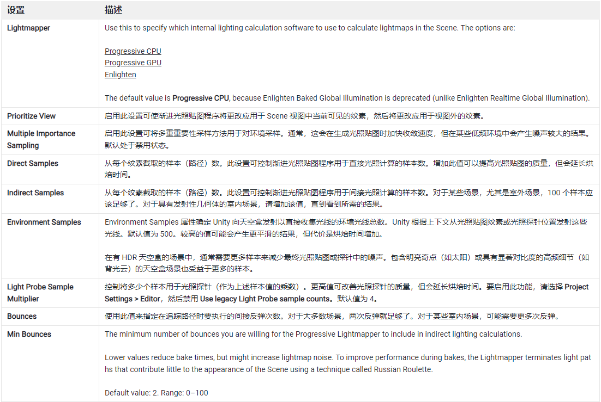
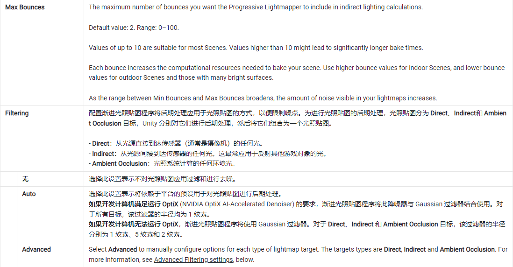
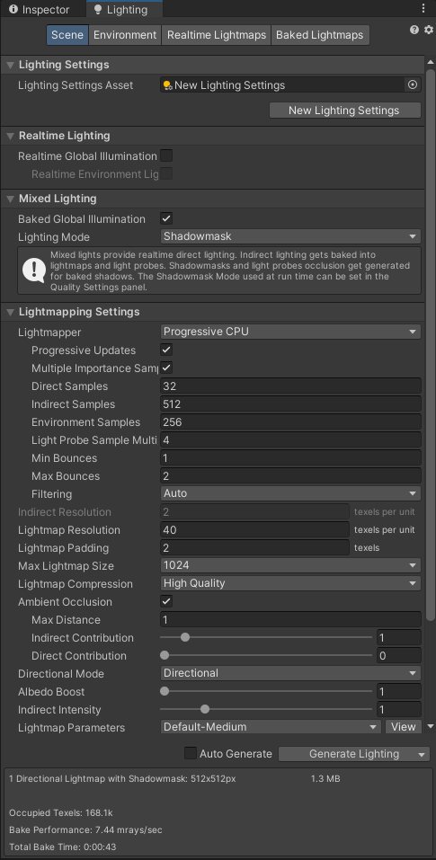

# 光照贴图

## 1. 概念

光照贴图过程将预先计算场景中表面的亮度，并将结果存储在称为“光照贴图”的纹理中供以后使用。

光照贴图可以包含直射光和间接光。该光照纹理可与颜色（反照率）和浮雕（法线）之类的对象表面信息材质相关联的着色器一起使用。

### 关键点

* 光照信息会被烘焙入光照贴图（生成二维贴图文件），所以在运行时，不能再去更改贴图中的信息
* 实时光照效果，可以覆盖在已经加载好光照贴图的场景之上，但不能改变已经生成的好的光照贴图本身

### 核心功效

在保证效果的同时，大幅提升游戏性能：通过降低实时光计算量潜在提高性能，适应性能较低的硬件，如移动平台。

### 分类
1. Progressive Lightmapper ：渐进光照贴图
2. Enlighten Baked Global Illumination：开启烘焙全局照明

> 注意！！！：  
> 烘焙后的贴图位置固定，所以不能再移动物体，否则贴图会跟物体分离，毁掉真个场景光影效果

## 2. Progressive Lightmapper 渐进光照贴图

渐进光照贴图程序 (Progressive Lightmapper) 是一种基于路径追踪的光照贴图系统，提供了能在 Editor 中逐渐刷新的烘焙光照贴图和光照探针。

### 特点：
* 渐进光照贴图程序采取了一个短暂的准备步骤来处理几何体与实例的更新，同时生成 G-buffer 和图表遮罩。然后，它会立即生成输出，并随着时间的推移逐步细化输出，以实现更完善的交互式照明工作流。此外，烘焙时间更加可预测，因为渐进光照贴图程序在烘焙时提供估计时间。
* 渐进光照贴图程序还可单独为每个纹素分别以光照贴图分辨率烘焙全局光照 (GI)，无需采用上采样方案或依赖任何辐照度缓存或其他全局数据结构。因此，渐进光照贴图程序具有强大的功能，并允许您烘焙光照贴图的选定部分，从而更快测试和迭代场景。

### 相关设置

## 3. 使用 Enlighten Baked Global Illumination 的光照贴图

Enlighten Baked Global Illumination 依靠预先计算的实时全局光照数据来生成间接光照。

## 特点:
* 更改场景中的光源对象后，能够相对来说更快地生成光照贴图
* Enlighten Baked Global Illumination 比 Progressive Lightmapper 施加了更多的 UV 布局限制。

## 结论

不推荐使用  Enlighten Baked Global Illumination ，这个是旧版本，和新的渐进式相比，没任何优点，只是为了兼容老项目才保留的。

## 4. 光照贴图使用步骤&建议

1. 场景中不动的物体，设置为静态；
2. 光照设置中，场景总体设置为 Lighting - Scene - Mixed Lighting ： Baked Global Illumination ; Light Mode -- Shadowmask；
3. LightMapping Settings - Lightmapper : Progressive CPU/GPU
4. 取消 Auto Generate，每次改动光照设置后，点击 Generate LightMapping 手动生成光照贴图
5. 其他选项，初学时都可以设置为默认，也可以自行阅读文档或inspector 中的提示信息，尝试更改设置并观察结果

 

 

> 参考资料：
> * [光照贴图文档 - Unity 官方](https://docs.unity3d.com/cn/current/Manual/Lightmappers.html)
> * [https://zhuanlan.zhihu.com/p/157992819](https://zhuanlan.zhihu.com/p/157992819)
> * [https://www.youtube.com/watch?v=BRapbR6vPII](https://www.youtube.com/watch?v=BRapbR6vPII)

 

 

配套视频教程：
[https://space.bilibili.com/43644141/channel/seriesdetail?sid=299912](https://space.bilibili.com/43644141/channel/seriesdetail?sid=299912)

文章也同时同步微信公众号，喜欢使用手机观看文章的可以关注

