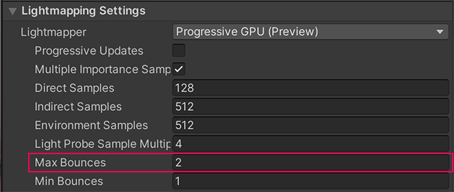
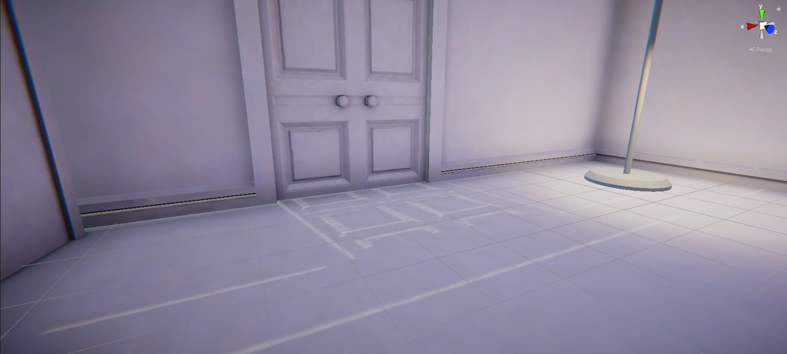
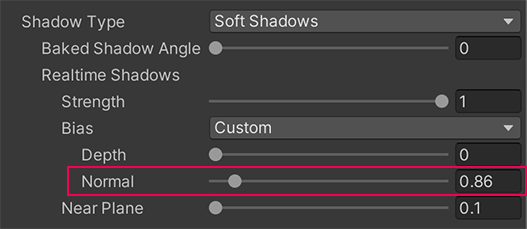
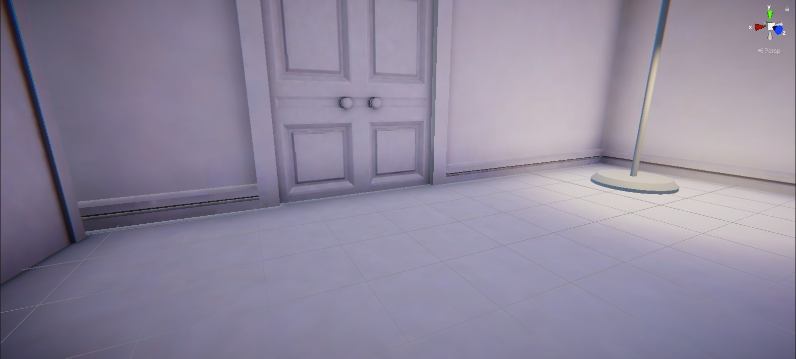
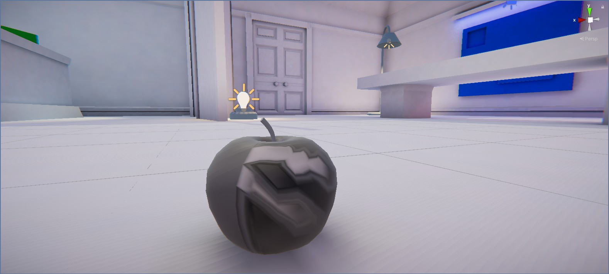
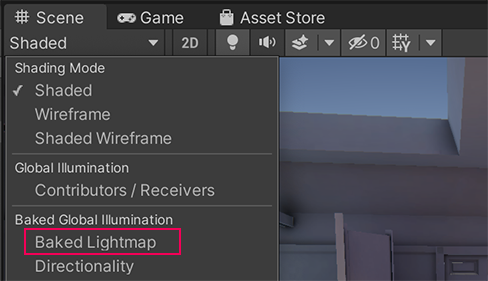
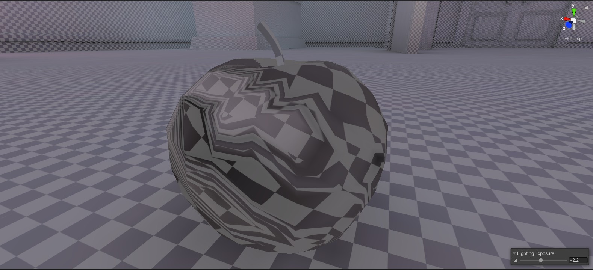
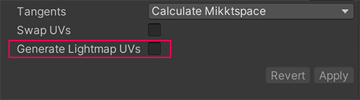

# 室内光照设计

结合官方教程中的 CClighting 项目，通过两个室内光照场景的对比：一个是初始状态，另个一个是优化设置后的 完整状态，进而学习如何在室内场景中设计和配置光照系统。

## 1. 识别室内光源

1. 对比两个场景
2. 查看场景中的不同光源类型

在室内场景中，您应该能够识别以下光源：
* 中央天窗，目前正在使画廊空间充满光线。
* 显示底座上的聚光灯。
* 彩色区域灯，作为墙上艺术品上的小灯带。
* 空间中的一些灯具道具：一盏高大的立灯和一盏短外露的灯泡灯。

## 2. 优化和设置室内光照

在这个步骤中，打开 TutorialScene_Lighting_Indoor 场景，通过对他的优化和配置，得出 FinalScene_Lighting_Indoor 的效果

### 2.1 复杂场景内快速定位指定光照

1. 开启 Light Explorer 灯光资源管理器：菜单：Window > Rendering > Light Explorer 
2. 选中要查看的灯光，鼠标移动到场景中，F 键居中显示

### 2.2 环境光照重要属性常用设置

在 Lighting 窗口中，选择Environment选项卡并检查天空盒和环境照明是如何设置的。

检查烘焙设置。

检查阴影设置。

## 3. 影响室内照明效果的关键因素

0. 场景物体设置：不动的设置为静态
1. 场景光照设置：包括全局光照、阴影、环境光 等等；
2. 场景中各光源类型、位置、设置；
3. 间接光照也是需要注意的点，它的相关设置，主要在场景光照设置中；
4. 自发光材质设置；
5. 光照探针放置和配置；
6. 细心检查，细节优化。

## 4. 作业

完善 TutorialScene_Lighting_Indoor 中的光照设计，怎么漂亮怎么来。

> 说明：
>
> 光照设置本身操作比较繁杂，而且属于艺术创作，所以并没有设么标准答案，结合技术，发挥自己创造力，放手去做，量变会引发质变。

## 5. 室内光照故障排除

通过前面的设置，整个室内已经有了较为合理的照明，但是一些细节位置还存留些 bug ，需要我们一一排除

### 5.1 调节模型 Cast Shadows 设置

* 在 Hierarchy 中，展开Environment GameObject ，然后是GalleryInterior GameObject 。选择GalleryInterior中的所有子游戏对象。
* 在 Inspector 中，找到 Mesh Renderer 组件并转到Lighting部分。
*  将Cast Shadows属性设置为Two Sided

这意味着环境游戏对象将从其游戏对象网格的任一侧投射阴影，这将使其看起来更逼真 - 如果您使用平面等单面形状来代替更多，不使用此设置可能会导致阴影正确显示的问题构建环境时的复杂网格。

* 选择Windows游戏对象（GalleryInterior的子对象）
* 在 Inspector 中，将Cast Shadows设置为Off 
* 在 Lighting Window 中，选择Generate Lighting以更新光照贴图。

### 5.2 增加室内光线

在前面的操作中，为了营造一个尽量接近真实的效果，我们把所有光源对象的 Indirect Intensity 设置为 0.75。

但是，在一些游戏环境中，我们为了营造特殊的氛围效果，想让室内光线更加突出，色彩更加鲜艳，可以适当增强室内光线，特别是间接光照，具体做法如下：

1. 提升光线反弹次数：在 菜单并选择Window > Rendering > Lighting 中，将Max Bounces属性设置为4 。这种增加将在计算场景的烘焙间接照明时包含更多反弹，而不会过多地延长烘焙时间。
    
2.  将Indirect Intensity设置为2到2.5之间的值。这种强度的增加将使画廊空间看起来更明亮。
3. 选择Generate Lighting重新烘焙光照贴图。

> 注意：
> 
> 不要将 Max Bounces 增加到超过 10，因为这样几乎不会提供额外的光线，还会导致更长的烘焙时间。

### 5.3 改善漏光

漏光是指游戏对象周围存在不应该存在的光。当光通过它不应该去的地方时，就会发生这种情况——例如，穿过墙壁或其他几何形状之间。

目前有一些光线从高脚灯旁边的门和墙壁漏出：

要减少场景中的漏光：

1.  在场景视图中，在门前导航，以便观察您的操作如何影响漏光。
2.  在 Hierarchy 中，选择 Directional Light 。
3.  在 Inspector 中，使用滑块将Bias Normal值慢慢降低到0 ，同时观察 Scene 视图中发生的情况。
偏置属性位于阴影类型子设置中。
    

    调整该值，直到减少或完全消除通过门泄漏的光。
4.  试验Depth 、Normal和Near Plane属性值滑块。尽量减少漏光，但要找到适合您和您的场景的平衡点。
    提示：设置偏差值时，不要将它们设置得太高。这可能会导致阴影与其投射的对象不匹配或看起来断开连接，以及使漏光可见。
5. 在 Lighting 窗口中，选择Generate Lighting重新烘焙光照贴图。
    
这通常是一个迭代和增量的过程，因此如果您需要一点时间来调整阴影并解决漏光问题，请不要担心。

### 解决其他项目中的漏光问题

在这个项目中，Realtime Shadow Bias值在Directional Light GameObject 中进行控制，因为我们已将Bias属性设置为Custom。这意味着这些值仅特定于该场景。

默认情况下，这些设置在渲染管线资源的阴影设置部分中处理。但是，该资产可以应用于整个项目——如果资产的设置存在问题，它将影响此学习体验中的所有场景。

要查看项目中的资源，请转到Assets > CreativeCore_Lighting > Settings > Rendering并选择UniversalRP-HighQuality资源。

如果尝试解决另一个项目的一个场景中的漏光问题，可能会发现在 Directional Light 中配置特定于场景的Bias值也很有帮助。

### 5.4 修复导入新模型时的光照贴图错误

当整个场景中的模型及光照都设置好后，再导入新的模型进入场景， 重新烘焙场景的光照贴图后，新导入的模型通常会出现光照贴图错误：

这是因为模型没有正确的光照贴图 UV。如果不解决，这可能会导致场景中的照明出现问题。

### 检查出错原因

1.  在场景视图控制栏中，使用Draw Mode下拉菜单（左上角）选择Baked Lightmap 
    
2. 会发现场景视图中出现了一个叠加层：
   

   烘焙光照贴图绘制模式视图将应用于场景几何体（网格）的烘焙光照贴图显示为方格叠加。此诊断视图可以帮助您识别模型问题。可以使用Lighting Exposure控件来更轻松地查看场景中的棋盘效果。

   放大到刚刚添加的模型，可以看到到，新苹果模型上的棋盘图案明显变形。  

   

### 修复新导入模型的光照贴图

可以使用这个官方文档中提供的苹果模型：[Apple_BrokenLightmapUVs.fbx](https://connect-cdn-public-prd.unitychina.cn/h1/20211124/2a865f48-d818-4ff2-8106-fcd6dbfa63d9/Apple_BrokenLightmapUVs.fbx)

1.  在项目窗口中，选择您导入的模型。
2.  在 Inspector 的 Model Import Settings 中找到Generate Lightmap UVs属性。这是“模型”选项卡中列出的最终属性。
    
3.   启用Generate Lightmap UVs然后选择Apply 。
4.  大家可以看到，场景视图中模型上选中的覆盖图案现在看起来符合预期。在场景视图控制栏中，完成后将绘制模式设置回着色。
5.  重新烘焙光照贴图并保存更改。

> 重要提示：
> 生成光照贴图 UV功能虽然有用，但不会取代艺术家。产生的结果可以提供改进的基准，但您应该始终让 UV 艺术家审查并在可能的情况下修复纹理。

 

 

> 参考资料：
> 
> * [室内灯光设计 - Unity 官方创意核心教程](https://learn.unity.com/tutorial/examine-and-complete-the-indoor-scene)

 

 

配套视频教程：
[https://space.bilibili.com/43644141/channel/seriesdetail?sid=299912](https://space.bilibili.com/43644141/channel/seriesdetail?sid=299912)

文章也同时同步微信公众号，喜欢使用手机观看文章的可以关注

