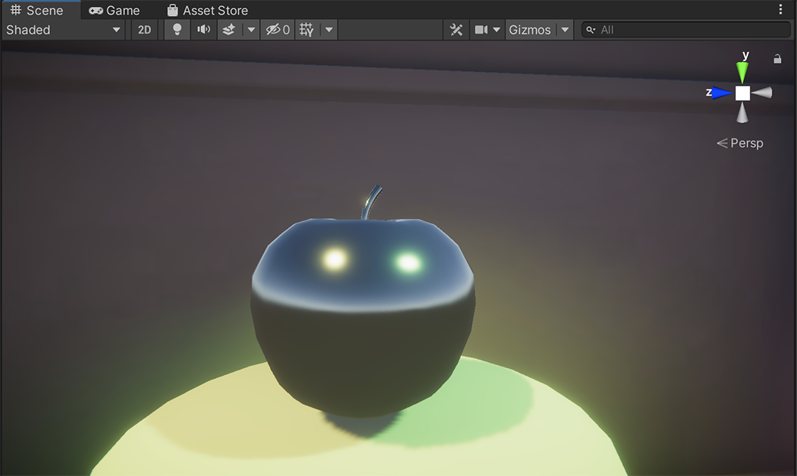
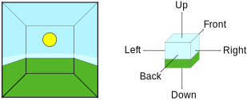
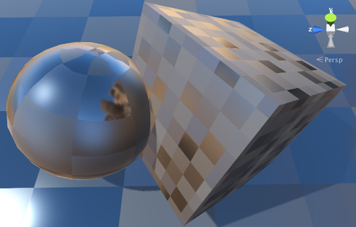
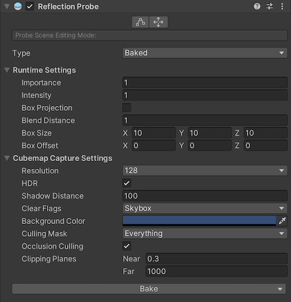
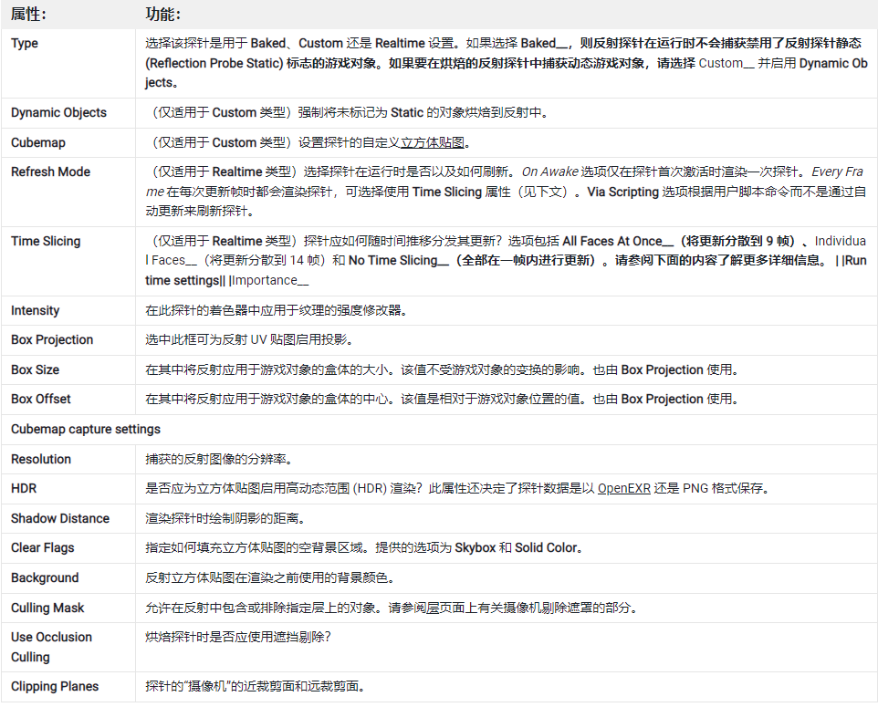
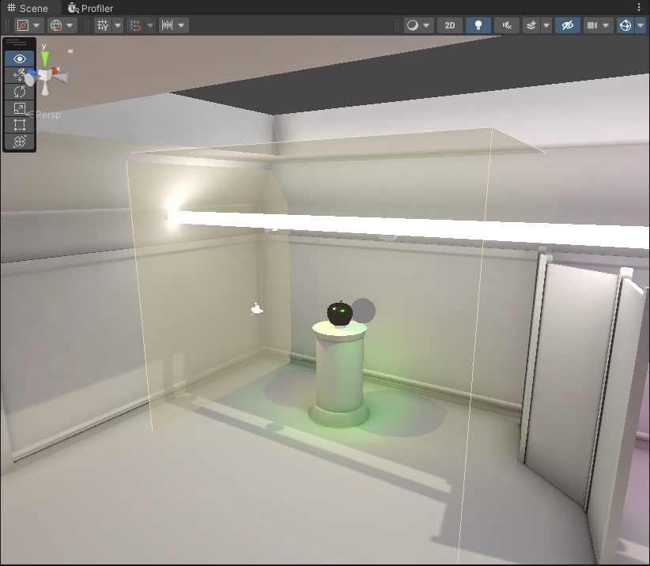
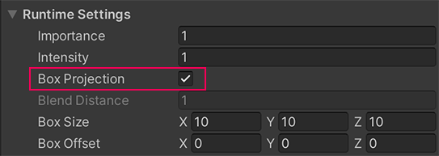
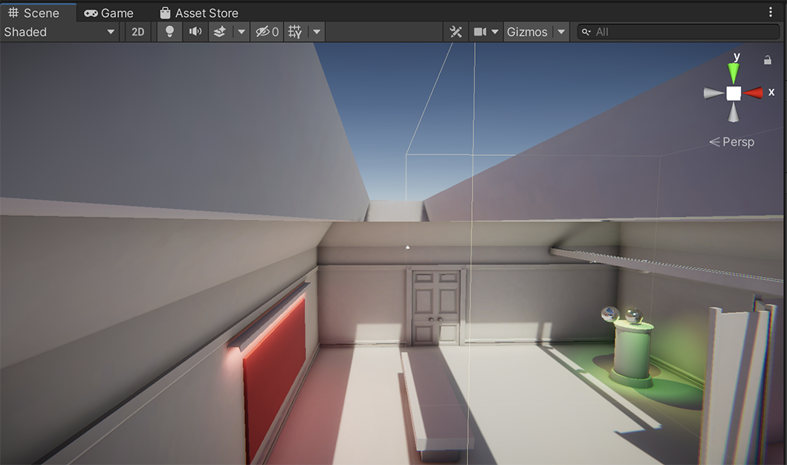
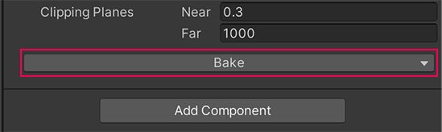
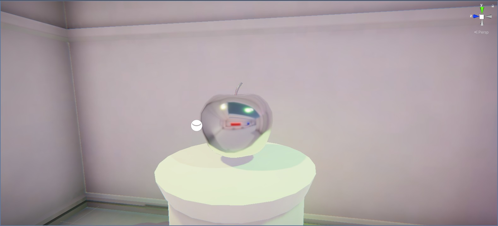

# 光线反射设置&反射探针

在前面的室内场景中，有一个漂浮的金属质地苹果，它反射了画廊中位于其上方的两个彩色聚光灯，但它也反射了室内空间之外的天空盒。看起来非常违和，是因为它上面的反射根本就是错误的！

在本节中，将介绍反射探针的概念及用法，到最后，大家会学会如何设置反射探针，并将上面的苹果反射修正。

## 1. 反射探针概念

现实中，具有镜面特征的物体表面，可以映出周围的景象，比如，镜子、窗户玻璃、车窗、高光墨镜、金属物体、平静的水面等。

CG 电影和动画通常具有高度逼真的反射，这对于在场景中的对象之间提供“连接”感非常重要。 然而，这些反射的准确性伴随着处理器时间的高成本，虽然这对电影来说不是问题，但它严重限制了反射物体在实时游戏中的使用。

显然，直接建立对象间连接，生成生成静态或动态投影的方式，在游戏中代价太高，特别是动态的。虽然在一些高级硬件中，配合特定算法，已经能够实现反射动态投影，但不适合大多数游戏和硬件。

以前传统的处理方式：游戏使用一种称为_反射贴图_的技术来模拟来自对象的反射，同时将处理开销保持在可接受的水平。此技术假定场景中的所有反射对象都可以“看到”（因此会反射）完全相同的周围环境。

Unity 通过使用__反射探针__改进了基本反射贴图，这种探针可在场景中的关键点对视觉环境进行采样。通常情况下，应将这些探针放置在反射对象外观发生明显变化的每个点上（例如，隧道、建筑物附近区域和地面颜色变化的地方）。当反射对象靠近探针时，探针采样的反射可用于对象的反射贴图。此外，当几个探针位于彼此附近时，Unity 可在它们之间进行插值，从而实现反射的逐渐变化。因此，使用反射探针可以产生非常逼真的反射，同时将处理开销控制在可接受的水平。

反射探针在场景中也有一个不可见的框，用作效果区域。可以配置此框的大小。

在反射探测器区域内通过的反射对象的反射立方体贴图由该反射探测器临时提供。当对象从一个区域移动到另一个区域时，立方体贴图会相应地发生变化。

## 2. 反射探针的工作原理

场景中某个点的视觉环境可由立方体贴图表示。立方体贴图在概念上很像一个在内部表面绘有六个方向（上、下、左、右、前、后）平面图像的盒子。

为了让对象显示反射，其着色器必须能够访问表示立方体贴图的图像。对象表面的每个点都可在表面朝向的方向（即表面法向矢量的方向）上“看到”立方体贴图的一小块区域。着色器在此处使用立方体贴图的颜色来计算对象表面应该是什么颜色；镜面材质可能会准确反射颜色，而闪亮的汽车可能会略微褪色和着色。

## 3. 反射探针组件

__反射探针__非常像一个捕捉周围各个方向的球形视图的摄像机。然后，捕捉的图像将存储为立方体贴图，可供具有反射材质的对象使用。可在给定场景中使用多个反射探针，并可将对象设置为使用由最近探针生成的立方体贴图。带来的结果是对象上的反射可根据环境发生令人信服的变化。

### 属性

不同的渲染管线，反射探针的属性也不同，下面是内置渲染管线的

探针的 Type 属性可确定如何创建和更新反射数据：

* 烘焙 (Baked) 探针可存储 Editor 中烘焙的静态反射立方体贴图。
* 自定义 (Custom) 探针可存储通过烘焙生成的或由用户手动设置的静态立方体贴图。
* 实时 (Realtime) 探针在运行时更新立方体贴图，因此可对场景中的动态对象做出反应。

其他两种渲染管线中的反射探针具体属性文档，可以从下面的链接中找到：

#### URP 渲染管线文档：https://docs.unity3d.com/Packages/com.unity.render-pipelines.universal@latest/
#### HDRP 渲染管线文档：https://docs.unity3d.com/Packages/com.unity.render-pipelines.high-definition@latest/

## 4. 3D 场景中的默认光照探针

Unity 不仅使用天空盒来生成和配置环境光，而且还会在使用了天空盒（SkyBox）的 3D 场景中自动生成 AmbientProbe —— 环境（光）探针 和 反射探针。

管理这些功能和对象的管理器，被 Unity 称为 SkyManager，它的设置大多数都在 Lighting - Enviroment 窗口中。

### AmbientProbe —— 环境（光）探针

由 SkyManager 自动生成的环境探测器，用于捕获环境照明。

### 禁用 SkyManager

了防止场景中自动生成环境光和环境反射，影响场景的照明结果或游戏对象显示效果，可以禁用 SkyManager 中自动生成的 环境光探针和反射探针

要禁用这些探测器，请导航到 Window > Rendering > Lighting Settings > Environment，然后进行以下更改之一：

* 选项 1：将强度乘数设置为 0。
* 选项 2：使用黑色天空盒材料。
* 选项 3：将 Source 设置为 Color 或 Gradient，并将颜色设置为黑色。

## 5. 反射探针使用步骤

### 添加反射探针：

1. [可选]：禁用 SkyManager
2. 添加反射探针 Reflection Probe
3. 将新探针放在所需位置并设置其 Offset 点及其效果区域的大小
4. 调整探针属性到合适的值
5. 继续添加探针，直到分配完所有必需的位置。

### 添加具有镜面效果表面的反射对象：
1. 将一个简单对象（如球体）添加到场景中
2. 创建新材质（菜单：__Assets__ > Create > Material__）并保留默认的 Standard__ 着色器。
3. 通过将 Metallic 和 Smoothness 属性均设置为 1.0 使材质具有反射性。
4. 将新创建的材质拖动到球体对象上以进行分配。
5. 单击反射探针检视面板中的 Bake 按钮以更新探针。

### 反射探针添加位置

探针的位置主要由反射对象的位置决定：
* 静态反射对象：反射探针矩形包括静态反射对象；
* 动态反射对象：全套探针的区域应共同覆盖场景中反射对象可能通过的所有区域。

## 6. 改正室内光照场景中的金属苹果反射

1. 使用上面的步骤 禁用 SkyManager；
2. 在 Hierarchy 中，选择Add ( + )，然后选择Light > Reflection Probe
3. 将反射探头放在苹果前面的底座上，苹果现在显示是黑色的，这是因为它位于反射探头的作用区域内。反射探针是一个矩形，灰色圆球代表其轴心，越接近苹果的实际位置，反射就越准确。如果要调整打下，可以拖拽每个面上的黄色点（控制柄）
   
4. Reflection Probe 组件 Type 属性设置为Baked 
5. 在Runtime Settings部分，启用Box Projection属性。 
   
   
    这意味着苹果上的反射将根据苹果在反射探针的影响区域内的位置进行模拟。
6. 调整Box Size轴的值，直到代表 Reflection Probe 效果区域的框填满了苹果所在画廊的大部分后半部分。
    
7. 选择烘焙以烘焙反射探针——它位于反射探针组件的底部。
   
8. 进入播放模式,检查最终效果
   

 

 

> 参考资料：
>
> * [反射探针官方文档](https://docs.unity3d.com/cn/current/Manual/ReflectionProbes.html)
> * [室内反射探针使用 - Unity 官方创意核心教程](https://learn.unity.com/tutorial/improve-reflections-in-your-scene)

 

 

配套视频教程：
[https://space.bilibili.com/43644141/channel/seriesdetail?sid=299912](https://space.bilibili.com/43644141/channel/seriesdetail?sid=299912)

文章也同时同步微信公众号，喜欢使用手机观看文章的可以关注

