# 在 Unity  中动画曲线

## 1. 使用曲线优化动画

我们在创作动画时，只需要考虑关键帧，其他帧是由 Unity 等动画制作工具帮助我们来 “补帧” 完成的。

对于一些匀速运动的动画来说，默认的补帧可以轻松满足；但对于非匀速运动，默认平均分配时间的补帧就力所难及了。这时，就需要使用到“曲线”。

在 Animation 窗口中，左侧动画剪辑子窗口的最下面，有两个分页，控制着右侧窗口的内容：

* 关键帧清单 (Dopesheet)：右侧窗口默认模式，显示时间轴和关键帧
  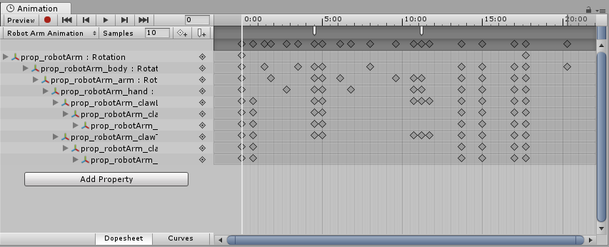
* 曲线 (Curves)：显示时间轴和曲线
  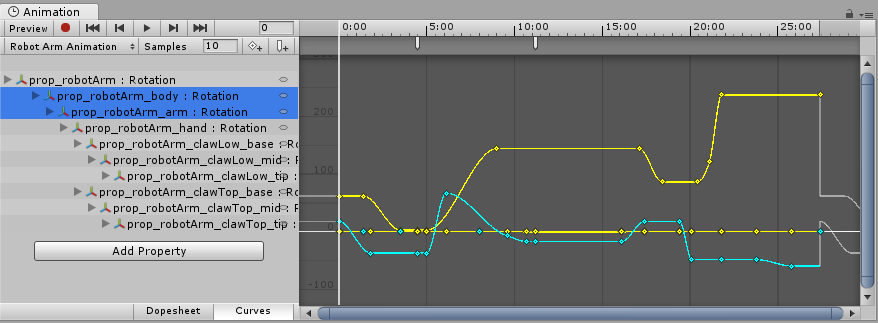
  其中包含每个动画属性的值如何随时间变化的视图。所有选定属性都叠加显示在同一图形中。在此模式下，您可以很好地控制属性值的查看和编辑，以及如何在两者之间进行插值。

编辑器中，左侧的每一个属性，都对应一个动画曲线。

曲线横坐标就是时间轴上的帧数，纵坐标是属性在该时刻的值。

曲线是在设置的关键帧之间发生的补间的直观表示，特别是它们的变化率。

在 Dopesheet 模式下，补间生成的属性值变化是均匀、线性的；而在 Curves 模式下，可以对该曲线进行任意更改.

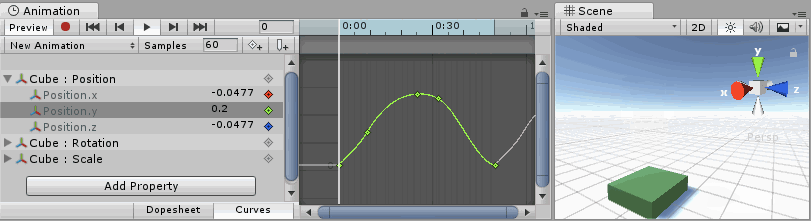

## 2. 曲线、关键点和关键帧

动画曲线__具有多个__关键点__，这些关键点是曲线路径上的控制点。

这些点在__曲线编辑器__中显示为曲线上的小菱形。如果一个帧在一条或多条曲线中具有__关键点__，则该帧称为__关键帧。

如果某个属性在当前预览的帧中具有__关键点__，则曲线轨迹上将有一个菱形标记，并且属性列表也将在该值旁边出现一个菱形标记。

下图中，Rotation.y 属性在当前预览的帧中具有__关键点__。

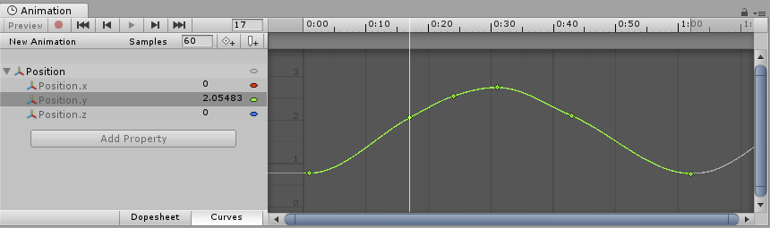

## 3. 在曲线上操作关键帧（关键点）

### 添加

* 可通过单击 Keyframe 按钮在当前预览的帧中添加__关键帧。此操作将为所有当前选定的曲线添加关键帧。
* 还有一种方法可将关键帧添加到任何给定帧的单条曲线，只需双击应该添加新__关键帧__的曲线。
* 此外，也可以通过右键单击__关键帧线__并从上下文菜单中选择 Add Keyframe__ 来添加__关键帧。

### 选择、移动

* 添加__关键帧__后，可使用鼠标将其四处拖动。另外，还可选择一次拖动多个__关键帧。
* 要一次选择多个__关键点__，请在按住 Shift 的同时单击关键点。
* 要取消选择所选的__关键点__，请在按住 Ctrl 的同时再次单击该关键点。
* 要选择矩形区域内的所有__关键点__，单击一个空白位置，然后拖出矩形选框。
* 通过按住 __Shift__，也可以将矩形选框内的关键点添加到现有选定关键点。
* 要在拖动时将__关键点__贴靠到网格，请在拖动时按住 Command 键（Mac 系统）/Control 键（Windows 系统）。
  
### 删除

通过选中__关键帧__并按 Delete 或者通过右键单击关键帧并从上下文菜单中选择 __Delete Keyframe__，即可删除关键帧。

### 编辑

* 使用 Enter/Return 或上下文菜单开始编辑选定的关键点，
* 使用 Tab 在字段之间切换，
* 使用 Enter/Return 提交更改，
* 使用 Escape 取消编辑。

### 在曲线视图中导航

* 随时都可以按 F 来完全框选显示的曲线或选定的关键点。
* 可以使用鼠标中键拖动或在用鼠标左键拖动时按住 Alt 键来__平移__曲线视图。
* 可以使用鼠标的滚轮、触控板的缩放功能或者在用鼠标右键拖动时按住 Alt 键来__缩放__曲线视图。
* 可以拖动滚动条的端点来缩小或扩展曲线视图中显示的区域。
* 只能在水平轴或垂直轴上进行缩放：
  * 在 Mac 上按住 Command 键/在 Windows 上按住 Control 键进行的__缩放__是水平缩放。
  * 按住 Shift 键进行__缩放__是垂直缩放。

## 4. 编辑切线

一个关键点有两条__切线__：
* 一条在左侧用于向内的斜坡，
* 另一条在右侧用于向外的斜坡。

切线可控制关键点之间的曲线形状。可从许多不同的切线类型中进行选择一种类型，用于控制曲线离开一个关键点并到达下一个关键点的方式。右键单击一个关键点可以选择该关键点的切线类型。

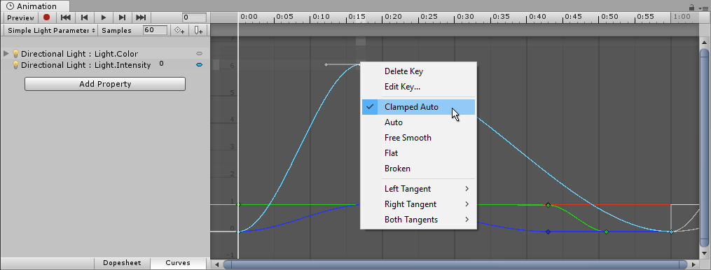

要使动画值在通过关键点时实现平滑变化，左右切线必须共线。以下切线类型可确保平滑：

* Clamped Auto__：这是默认切线模式。系统会自动设置切线，使曲线通过关键点时保持平滑。编辑关键点的位置或时间时，切线会进行调整以防止曲线“超出”目标值。如果在 Clamped Auto (夹具式曲线自动) 模式下手动调整关键点的切线，则会切换到 Free Smooth__ 模式。在下面的示例中，切线自动进入斜坡并在移动关键点时趋于平稳：
  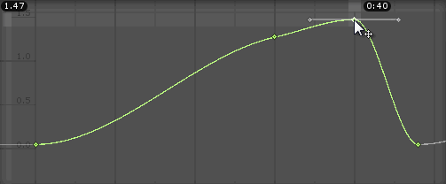
* Auto__：这是旧版切线模式，但此选项仍然保留着以便与旧项目向后兼容。除非有特别原因要使用此模式，否则请使用默认的 Clamped Auto。当关键点设置为此模式时，系统会自动设置切线，使曲线通过关键点时保持平滑。但是，与 Clamped Auto__ 模式相比有两个不同之处： 
  * 1.当编辑关键点的位置或时间时，切线不会自动调整；切线仅在最初将关键点设置为此模式时进行调整。 
  * 2.Unity 在计算切线时，不会考虑避免“超出”关键点的目标值。
* __Free Smooth__：拖动切线控制柄来自由设置切线。它们被锁定为共线以确保平滑。
  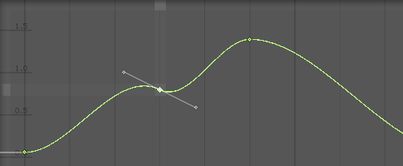 
* Flat__：切线设置为水平（这是 Free Smooth__ 的特例）。
  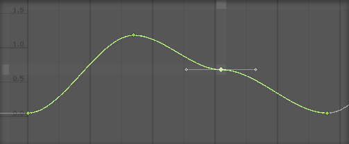
* Broken: 有时可能不希望曲线在通过关键点时是平滑的。要在曲线中产生急剧变化，请选择 Broken 切线模式  
* 使用中断的切线时，可以单独设置左右切线。左右切线中的每一条切线都可以设置为以下类型之一：
  * __Broken - Free__：拖动切线控制柄来自由设置切线。
    
  * Broken - Linear__：切线指向临近的关键点。要创建线性曲线段，请将两端的切线设置为 Linear。在下面的示例中，所有三个关键点都已设置为 Broken - Linear__，从而形成从关键点到关键点的直线。
    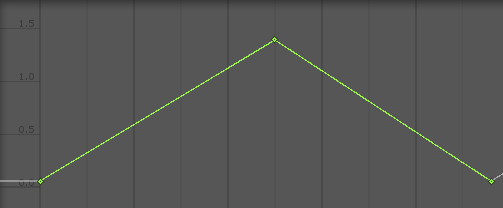
  * __Broken - Constant__：曲线在两个关键点之间保持常量值。左关键点的值决定了曲线段的值。
    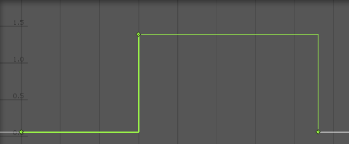

## 5. 曲线模式，操作注意事项

使用__曲线__模式来查看动画时，必须了解有时每个属性的各种范围会有很大差异。例如，考虑一个用于旋转弹跳立方体的简单动画剪辑。弹跳 Y 位置值可在 0 到 2 的范围之间变化（意味着在动画期间立方体弹跳高度为 2 个单位）；但是，旋转值的范围是从 0 到 360（表示其旋转度数）。同时查看这两条曲线时，位置值的动画曲线将很难显示出来，因为视图将缩小以适应窗口内旋转值的 0–360 范围：

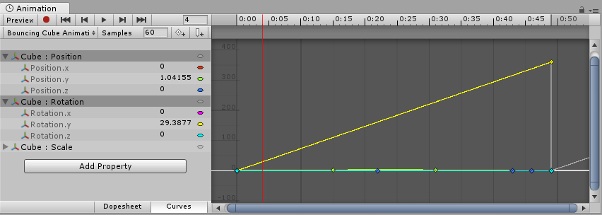

按键盘上的 F 即可将视图缩放到当前选定的关键帧。这是一种有用的快捷方式，能够在一部分动画时间轴上聚焦和重新缩放窗口以便于编辑。

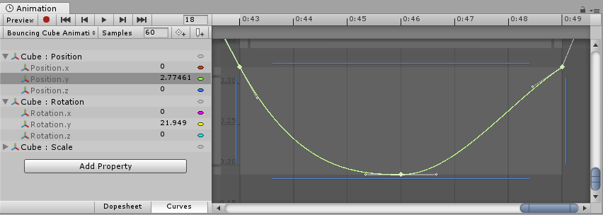

单击列表中的各个属性，然后按键盘上的 F 可自动重新缩放视图以适合该值的范围。此外，还可使用视图滚动条滑块每端的拖动控制柄来手动调整 Curves 窗口的缩放。下图为放大后的 Animation 窗口以便查看弹跳的 Y 位置动画。黄色旋转曲线的起点仍然可见，但曲线现在已超出视图顶部位置：

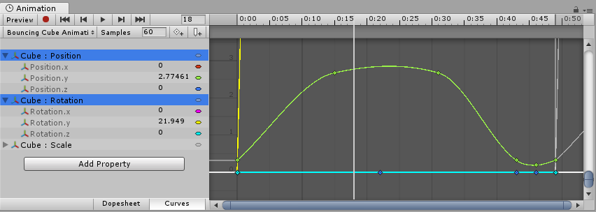

按键盘上的 A 可适应并重新缩放窗口，从而显示剪辑中的所有关键帧（无论选择哪些帧）。如果要在保留当前选择的同时查看整个时间轴，此操作非常有用：

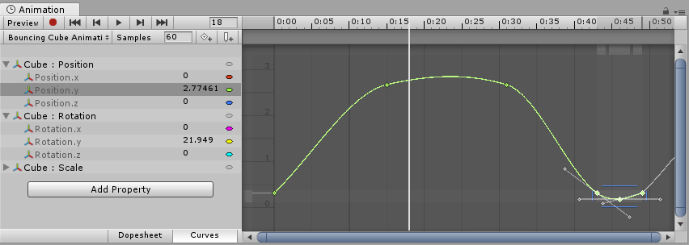

## 6. Unity 中支持的 可动画属性

Animation 视图__可用于动画化更多属性，而不仅限于__游戏对象__的位置、旋转和缩放。您可以动画化任何__组件__和__材质__的属性，甚至是您自己的脚本组件的公共变量。若要生成具有复杂视觉效果和行为的动画，只需为相关属性添加__动画曲线。

动画系统支持以下类型的属性：

* Float
* Color
* Vector2
* Vector3
* Vector4
* Quaternion
* Boolean

> 参考资料：
>
> * [CC 动画 教程 官方文档](https://learn.unity.com/tutorial/refine-your-animation)
> * [Unity 动画曲线 - Unity 官方文档](https://docs.unity3d.com/cn/2022.1/Manual/animeditor-AnimationCurves.html)

 

 

配套视频教程：
[https://space.bilibili.com/43644141/channel/seriesdetail?sid=299912](https://space.bilibili.com/43644141/channel/seriesdetail?sid=299912)

文章也同时同步微信公众号，喜欢使用手机观看文章的可以关注

