# Unity 动画控制器 Animation Controller

## 1. Animation Controller 动画控制器

Animator Controller允许您安排和维护一组动画剪辑和相关的动画过渡

对于一个角色或对象。在大多数情况下，有多个动画并在某些游戏条件发生时在它们之间切换是正常的。

例如，您可以从步行切换动画剪辑，每当按下空格键时跳转到动画剪辑。但是，即使您只有一个动画剪辑，您仍然需要将其放入 Animator Controller 中才能在游戏对象

Animator Controller 引用了其中使用的动画剪辑，并使用状态机，它可以被认为是动画剪辑和过渡的流程图，或者是在 Unity 中用可视化编程语言编写的简单程序。

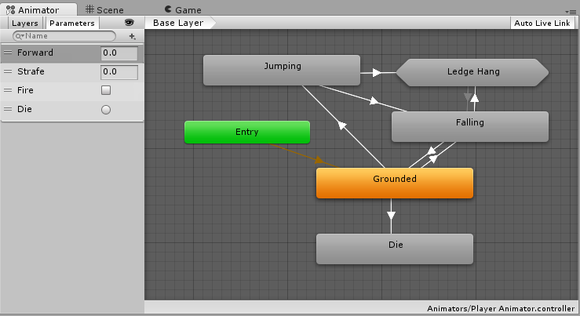

当您开始使用动画窗口为游戏对象设置动画时，或者当您将动画剪辑附加到游戏对象时，Unity 会自动创建一个动画控制器。

要手动创建 Animator Controller，请右键单击 Project 窗口，然后单击Create > Animator Controller。

## 2. Animation State 动画状态 和 Animation State Machine 动画状态机

动画状态  Animation Stat 是动画状态机 Animation State Machine 的基本构建模块

当角色处于一个状态下时，每个状态都包含一个动画序列（或混合树）在播放

下图中是动画状态属性面板：

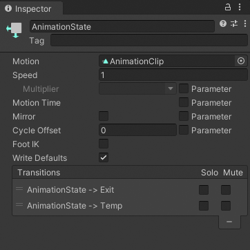

* Motion (动作、运动): 当前状态下挂接的动画片段（Animation clip）或 混合树（blend tree）
* Speed （速度）： 默认为1 ，当前 Motion 的播放速度，可以设置为负数，比如 -1 就是倒放 。另外，启用参数以使用脚本中的自定义值修改速度。例如，您可以将速度与自定义值相乘以减慢或加快播放速度。
* Motion Time（运动时间）：用于播放此状态的动作的时间。启用参数以使用脚本中的自定义值控制运动时间。
* Mirror （镜像）：此属性仅适用于具有人形动画. 启用以镜像此状态的动画。启用参数以启用或禁用脚本的镜像。
* Cycle Offset （周期偏移）：添加到运动状态时间的偏移量。此偏移不影响运动时间。启用参数以指定脚本的循环偏移。
* Foot IK （足部反向动力学）：此属性仅适用于具有类人动画的状态。启用此状态的 Foot IK。
* Write Defaults（写入默认值）：AnimatorStates 是否为不通过其运动设置动画的属性写入默认值。
* Transitions（过渡）：源自此状态的转换列表。

## 3. Animation Transaction 动画过渡

动画过渡允许状态机从一种动画状态切换或混合到另一种。

转换不仅定义了状态之间的混合应该花费多长时间，而且还定义了它们应该在什么条件下激活。

在动画控制器中，可以将转换设置为仅在某些条件为真时发生。

例如，您的角色可能具有“巡逻”状态和“睡眠”状态。您可以将巡逻和睡眠之间的转换设置为仅在“警觉”参数值低于某个水平时发生。

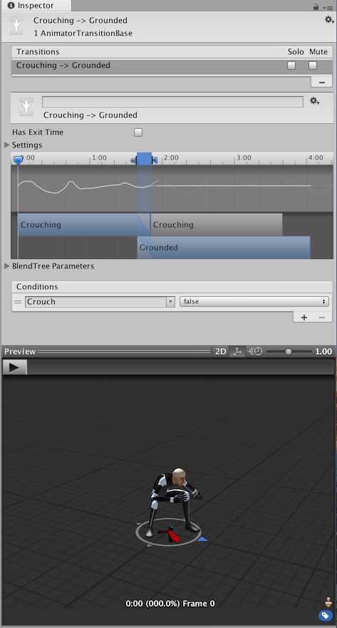

### 过渡属性

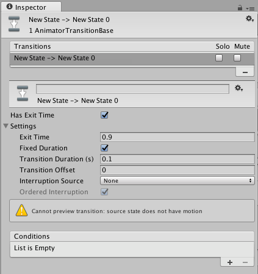

* Has Exit Time :退出时间是一种不依赖于参数的特殊转换。相反，它依赖于状态的标准化时间。检查以使转换在Exit Time中指定的特定时间发生。
* Settings: 包含以下详细过渡设置的折叠式菜单。
* Exit Time: 
    如果选中Has Exit Time，则此值表示转换可以生效的确切时间。  
    这以标准化时间表示（例如，退出时间为 0.75 表示在播放了 75% 动画的第一帧上，退出时间条件为真）。在下一帧，条件为假。
    对于循环动画，每个循环都会评估退出时间小于 1 的过渡，因此您可以使用它来为每个循环的动画中的适当时间安排过渡。

    具有退出时间的转换大于 1 只计算一次，因此它们可用于在固定数量的循环后在特定时间退出。例如，退出时间为 3.5 的转换在三个半循环后评估一次。
* Fixed Duration 固定时间:  
  如果选中Fixed Duration框，则转换时间以秒为单位进行解释。如果未选中“固定持续时间”框，则转换时间被解释为源状态标准化时间的一小部分。
* Transition Duration 过渡时间：  
  转换的持续时间，以标准化时间或秒为单位，取决于固定持续时间模式，相对于当前状态的持续时间。
  
  这在过渡图中可视为两个蓝色标记之间的部分。
* Transition Offset 过渡偏移:  
  在转换到的目标状态下开始播放的时间偏移量。  
  例如，值 0.5 表示目标状态在其时间线的 50% 处开始播放。
* Interruption Source （中断源）:  
  使用它来控制可能中断此转换的情况。  
  从概念上讲，中断顺序的工作方式就像转换排队，然后解析从插入的第一个转换到最后一个转换的有效转换。
  * None : 不要再添加任何过渡。
  * current State:从当前状态排队转换。
  * Next State :排队从下一个状态的转换。
  * Current State then Next State:将当前状态的转换排队，然后将下一个状态的转换排队。
  * Next State the Current State:将下一个状态的转换排队，然后将当前状态的转换排队。
* Ordered Interruption （有序中断）:  
  确定当前转换是否可以被其他转换打断，与它们的顺序无关
  * Checked:  已找到有效的转换或当前转换。
  * Unchecked: 已找到有效的转换。
* Conditions （条件）:  
  转换可以有一个条件、多个条件或根本没有条件。如果您的过渡没有条件，Unity 编辑器仅考虑Exit Time，并且在达到退出时间时发生过渡。如果您的转换有一个或多个条件，则必须在触发转换之前满足所有条件。

    条件包括：

    - 事件参数（条件中考虑的值）。
    - 条件谓词（如果需要，例如，浮点数的“小于”或“大于”）。
    - 参数值（如果需要）。

    如果您为过渡选择了Has Exit Time并且有一个或多个条件，请注意 Unity 编辑器会在退出时间。这使您可以确保在动画的某个部分发生过渡。

> 注意：
> * 从一种状态到另一种状态的转换完成后，Animator 中的触发参数会立即禁用，这意味着您可以安全地在门打开和关闭等情况下重复使用相同的参数。这意味着以后，用于检测玩家角色是否靠近门的脚本只需要引用一个参数即可。

### 过渡图形

要手动调整上面列出的设置，您可以直接在字段中输入数字或使用转换图。当操作视觉元素时，转换图会修改上述值。

使用以下方向更改图表视图中的转换属性：

* 拖动持续时间“out”标记以更改过渡的持续时间。
* 拖动Duration “in”标记以更改过渡的持续时间和Exit Time。
* 拖动目标状态以调整Transition Offset。
* 拖动预览播放标记以在检查器底部的预览窗口中拖动动画混合。

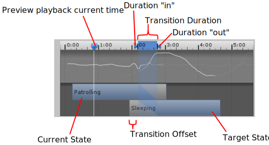

### 混合树状态过渡

如果属于此转换的当前或下一个状态是混合树状态，则混合树参数出现在检查器中。调整这些值以预览在将混合树值设置为不同配置时过渡的外观。如果您的混合树包含不同长度的剪辑，您应该测试同时显示短剪辑和长剪辑时的过渡效果。调整这些值不会影响过渡在运行时的行为方式；它们仅用于帮助您预览过渡在不同情况下的外观。

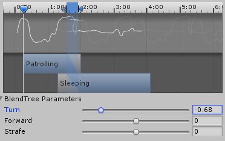

## 4. Blend Tree 混合树状态过渡

### 概念

Blend Tree 混合树可以平滑混合多个不同的动画片段；通过 Animator Controller 中的参数可以控制混合树中动画片段（不同状态）间的转换

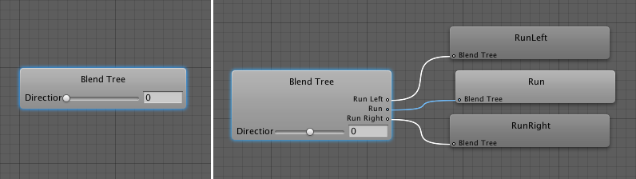

使用动画剪辑和输入参数来设置混合树时，Inspector 窗口通过图形显示动画如何随着参数值变化而进行组合（拖动滑动条时，树根中的箭头会改变其着色以显示其控制的动画剪辑）。

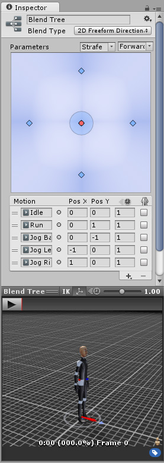

> 注意：
> * 为了使混合后的运动合理，要混合的运动必须具有相似的性质和时机。
> * 混合树是动画状态机中的一种特殊状态类型。

### 分类

* 1D 混合：根据单个参数来混合子状态
* 2D 混合：根据两个参数来混合子状态  
  * __2D Simple Directional__: 在运动表示不同方向（例如“向前走”、“向后退”、“向左走”和“向右走”或者“向上瞄准”、“向下瞄准”、“向左瞄准”和“向右瞄准”）时使用。根据需要可以包括位置 (0, 0) 处的单个运动，例如“空闲”或“瞄准”。在 Simple Directional 类型中，在同一方向上_不_应该有多个运动，例如“向前走”和“向前跑”
  * __2D Freeform Directional__：运动表示不同方向时，也使用此混合类型，但是您可以在同一方向上有多个运动，例如“向前走”和“向前跑”。在 Freeform Directional 类型中，运动集应始终包括位置 (0, 0) 处的单个运动，例如“空闲”。
  * __2D Freeform Cartesian__：最好在运动不表示不同方向时使用。凭借 Freeform Cartesian，X 参数和 Y 参数可以表示不同概念，例如角速度和线速度。一个示例是诸如“向前走不转弯”、“向前跑不转弯”、“向前走右转”、“向前跑右转”之类的运动。
* 直接混合 Direct：直接控制所有子状态机,为每个动作分配一个相应参数以直接控制其在树中的混合权重
  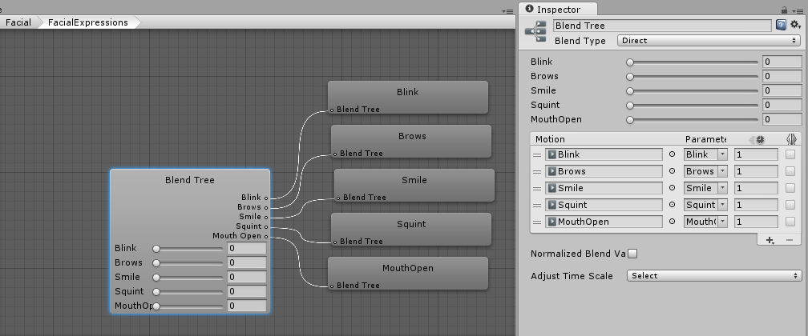  
  在混合面部表情的混合形状动画时，或者在将附加动画混合在一起时，这可能特别有用。  
  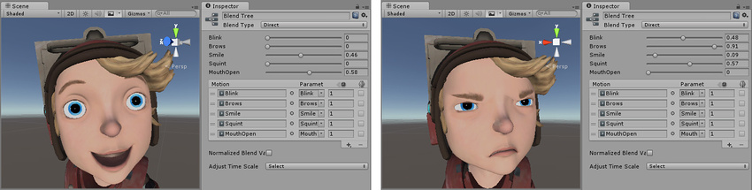

### 核心参数

* 混合图像  
  参数在最小值和最大值之间变化时，混合图显示每个子运动的影响。每个运动都显示为一个蓝色小金字塔（第一个和最后一个仅显示一半），如果您在其中一个上单击并按住鼠标左键，相应运动将在下面的运动列表中突出显示。每个金字塔的顶峰定义运动具有最大影响的参数值，表示其动画权重为 1，而其他动画的权重为 0。这也称为运动的__阈值__。
  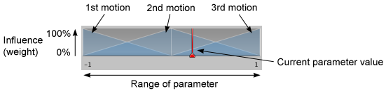  
  红色竖条表示__参数 (Parameter)__ 的值。如果在 Inspector 底部的 Preview 中按 Play 并左右拖动图中的红色条，可以看到参数值如何控制不同运动的混合。

* 阈值 Thresholds
   阈值就是在 blendTree 中参数的范围极限值。  
   可以通过单击图中的对应蓝色金字塔并将其向左或向右拖动来更改运动的阈值。如果未启用“Automate Thresholds”开关，还可通过在 Threshold 列的数字字段中输入数字来编辑运动列表中某个运动的阈值。  
   运动列表下方是 Automate Thresholds 复选框。启用此复选框将在参数范围内均匀分布运动的阈值。例如，如果有五个剪辑且参数范围为 –90 到 +90，则阈值将按顺序设置为 –90、–45、0、+45 和 +90。  
    Compute Thresholds 计算阈值 ：  
      下拉选单将根据您选择的数据设置阈值；这些数据是从动画剪辑的根运动中获得的。可供选择的数据是速度 (Speed)、速度 (Velocity) x、y 或 z 以及以角度或弧度表示的角速度 (Angular Speed)。如果您的__参数__对应于这些属性之一，则可使用 Compute Thresholds 下拉选单来计算阈值。

  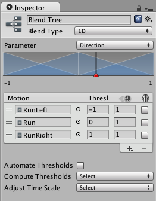

* 时间尺度 Time Scale  
  您可以使用动画速度数字字段（带有时钟图标的列）更改动画剪辑的“自然”速度。例如，您可以通过指定值 2.0 将步行剪辑的速度加倍。Adjust Time Scale > Homogeneous Speed按钮重新调整剪辑的速度，使它们与所选参数的最小值和最大值相对应，但保持与最初的相对速度相同。  
  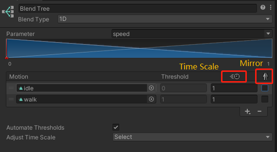

* 镜像 Mirror  
  启用镜像复选框以镜像任何人形动画。剪辑在动作列表中。镜像使用与其未镜像的原始动画相同的动画，而不会使内存和空间增加一倍。  
  但是，在混合树中镜像动画不会创建完全对称的动画。Unity 会自动添加偏移量，以确保跑步循环、步行循环和脚步等动画与其他动画剪辑和混合树正确混合。例如，如果您的混合树中有一个人形机器人向左运行，并且您启用 Mirror 以将人形机器人切换为向右运行，则脚循环需要匹配，以便左脚同时接触地面。这可确保镜像的混合树与周围的剪辑和其他尚未镜像的混合树正确混合。

* 2D 混合图  
  运动以蓝点显示。未分配动画剪辑或混合树的运动对混合没有影响，并显示为灰点。您可以通过单击图中的运动点来选择该运动。选择运动后，该运动对混合空间中每个点的影响便会可视化为蓝色区域。此区域位于该运动的位置正下方时最强，此情况下运动具有完全影响，意味着其动画权重为 1 而其他动画的权重为 0。逐渐远离该位置后，此运动的影响将减弱，而其他运动的影响将增强。
  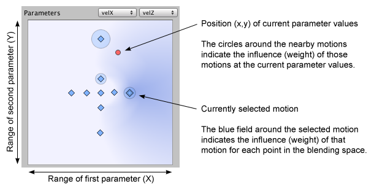  
  红点表示两个__参数__的值。如果在 Inspector 底部的 Preview 中按 Play 并在图中四处拖动红点，可看到参数值如何控制不同运动的混合。在图中，您还可以看到每个运动的影响（表示为围绕每个运动的圆圈）。您将看到，如果将红点移动到表示运动的其中一个蓝点上，则该运动的圆圈将获得其最大半径，而其他所有运动的圆圈将缩小到看不见。在几个运动之间的位置，附近的多个运动将对混合产生影响。如果选择其中一个运动以查看该运动的蓝色影响区域，您可以看到在四处移动红点时，运动的圆形大小与影响区域在不同位置的强度完全对应。  
  未选择任何运动时，该图显示所有影响区域的混合，在单个运动主导的位置，颜色会更蓝，而在许多运动对混合有影响的位置，蓝色会更淡。

 

 

> 参考资料：
> * [CC 动画官方教程](https://learn.unity.com/tutorial/control-animation-with-an-animator)
>
> * [动画控制器官方文档](https://docs.unity3d.com/2023.1/Documentation/Manual/class-AnimatorController.html)
> * [动画过渡官方文档](https://docs.unity3d.com/2023.1/Documentation/Manual/class-Transition.html)
> * [状态机转换中断----官方博客文章](https://blog.unity.com/technology/wait-ive-changed-my-mind-state-machine-transition-interruptions)

 

 

配套视频教程：
[https://space.bilibili.com/43644141/channel/seriesdetail?sid=299912](https://space.bilibili.com/43644141/channel/seriesdetail?sid=299912)

文章也同时同步微信公众号，喜欢使用手机观看文章的可以关注

