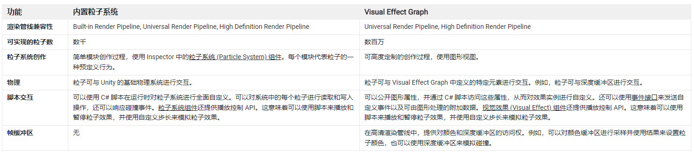

# Visual effect Graph 入门

## 1. 什么是 Visual effect Graph

Visual effect Graph 是 Unity 推出的新型特效系统，通过可视化编程来创建，通过 Gpu 来进行运算，可以实现百万级粒子的特效。

新旧两种特效系统区别：



## 2. 核心概念

### 系统 System

每个系统实际上就是一个子特效。由虚线轮廓保围，并包含一系列上下文子系统

### Context 上下文

上下文是系统中定义处理阶段的部分。上下文连接在一起以定义一个系统。是用来确定粒子如何产生和模拟的核心功能模块。

视觉效果图中最常见的四个上下文是：

1. spawn 生成：如果激活，Unity 会在每一帧调用它，并计算要生成的粒子数量。
2. initialize 初始化： Unity 在每个粒子的“诞生”时称其为，这定义了粒子的初始状态。
3. update 更新：Unity 对所有粒子的每一帧都调用它，并使用它来执行模拟，例如力和碰撞。
4. output 输出：Unity 对每个粒子的每一帧都调用它。这决定了粒子的形状，并执行预渲染转换。

* 注意：某些上下文（例如输出网格 Mesh Output System）不连接到任何其他上下文，因为它们与其他系统无关。


### Block 块

块是可以堆叠到上下文中的节点。每个 Block 负责一个操作。例如，它可以对速度施加力、与球体碰撞或设置随机颜色。

当你创建一个块时，你可以在它当前的上下文中重新排序它，或者将它移动到另一个兼容的上下文中。

## 3. Context 上下文

上下文可以：

* 计算效果产生的粒子数
* 创建新粒子
* 更新所有活粒子
* 输出并绘制粒子

上下文具体有下面几种：

### Event 事件上下文

事件定义了视觉效果图处理工作流的输入，事件上下文只显示它们的名称，它是一个字符串。

要触发事件上下文并从中激活工作流，需要在脚本中用组件 API 代码，调用用事件上下文的名称。

简单说来，就是用代码控制特效的入口，通过字符串作为事件名称来匹配

通过事件，VFX Graph 可以：

* 开始和停止生成粒子。
* 读取从 C# 脚本发送的事件属性值。


两个默认事件：

* OnPlay：启用粒子的生成
* OnStop：禁用粒子的生成

### Spawn 生成上下文

和它的名称意义相同，就是用来生成粒子的，其中可以添加不同的块 block ，来实现不同的生成方式

### GPU Event  Gpu 事件上下文

GPU 事件上下文是实验性上下文，它将输入连接到来自其他系统的输出 GPU 事件。

它们允许您基于其他粒子生成粒子。

要启用此选项，请启用Visual Effect Preferences中的Experimental Operators/Blocks复选框。


其实就是用来链接前一个子特效中的 GPU 事件，作为当前子特效激活条件。例如，前一个特效中的粒子死亡时，激活当前特效系统

以下更新块可以发送 GPU 事件数据：

* 死亡触发事件：当一个粒子死亡时，在另一个系统上生成 N 个粒子。
* 触发事件率：每秒（或每行进距离）产生 N 个粒子，基于来自系统的粒子。
* 始终触发事件：每帧生成 N 个粒子。

### Initialize 初始化上下文

Initialize Contexts 根据SpawnEvent数据初始化新粒子，Unity 从 Event、Spawn Contexts 或 GPU Event Contexts 计算这些数据。

例如：如果 Spawn Context 声明效果应该创建 200 个新粒子，则 Initialize Context 会为所有 200 个新粒子处理其块。

### Update 更新上下文

更新上下文根据粒子数据更新系统中的所有有效粒子，粒子数据由 Unity 从初始化和更新上下文计算。

Unity 执行更新上下文，从而更新每个粒子、每个帧。

粒子更新上下文还自动处理粒子的一些计算，以简化常见的编辑任务。

更新上下文常见功能块：

* 更新位置：指定 Unity 是否将速度积分应用于粒子。启用后，Unity 将简单的欧拉速度积分应用于每帧每个粒子的位置。禁用时，Unity 不会应用任何速度积分。
* 更新旋转： 指定 Unity 是否对粒子应用角度积分。启用后，Unity 将简单的欧拉积分应用于每个粒子的每帧旋转。禁用时，Unity 不会应用任何角度积分。
* Age Particles：如果 Context 使用 Age 属性，这将控制 Update Context 是否使粒子随时间老化。
* Reap Particles：如果 Context 使用 Age 和 Lifetime 属性，这将控制 Update Context 在粒子的年龄大于其生命周期时是否移除粒子。


### Output 输出上下文

输出上下文渲染系统中的粒子。它们根据来自同一系统中初始化和更新上下文的粒子数据，以不同的模式和设置渲染粒子。然后它将配置呈现为特定的形状。

实际上就是控制最终粒子外观，如何被渲染的功能模块

* Output Mesh 输出网格

渲染一个常规的静态网格，并完全独立于粒子系统发挥作用。效果通常由不同的元素组成，例如粒子系统和网格。此输出允许您直接在视觉效果资源中渲染网格，并使用节点控制它们的着色器和变换属性。


* Output Distortion 输出变形

Output [Strip/Particle] Distortion [Quad/Mesh]

特定于高清渲染管线 (HDRP) 的上下文节点。他们利用 HDRP 的 Distortion pass 来模拟光的弯曲。扭曲输出可用于粒子和粒子条数据类型，粒子扭曲上下文支持四边形和网格扭曲。失真输出对于模拟火灾造成的热失真等效果非常有用。

* Output decals 输出贴花

Output Particle Forward Decal 粒子前向贴花

使用贴花（2d 纹理）渲染粒子系统。贴花是 Visual Effect Graph 将 2d 纹理投影形成的框（）

然后 Unity 在沿其 xy 平面的任何相交几何体上渲染纹理。这意味着不与任何几何体相交的贴花粒子不可见。请注意，尽管它们不可见，但它们仍然有助于模拟和渲染系统所需的资源强度。

不支持 Shader Graph，不能使用 lit 光照相关的shader, 且只能使用简单的 2d 纹理贴图

* Output Line 输出线

此输出渲染的对象是线。

线由两个端点定义，并且无论粒子到相机的距离或粒子的大小和比例属性如何，它们始终是单个像素宽度。

有两种模式可用于设置线的终点。第一个点总是在粒子位置：

* 在粒子空间中使用目标偏移。通过在粒子空间中定义的偏移指定第二个点。
* 使用目标位置属性。指定具有目标位置属性的第二个点。

此输出不支持纹理或Shader Graph

* Output particle Mesh 输出粒子网格

允许您使用网格渲染粒子。

* Output point 输出点

使用点来渲染粒子系统。

无论粒子与相机的距离或每个粒子的大小和比例属性如何，它总是将点绘制为单个像素。

此输出不支持纹理或Shader Graph。

* Output Primitive 输出原型

 Output Particle [Primitive] (Output Particle (Lit) Quad, Output Particle (Lit) Triangle, Output Particle (Lit) Octagon)

是最常用的输出类型，非常适合各种效果。

此上下文支持以下平面图元：

* Quad 四方：标准的矩形粒子，在大多数情况下都很有用。
* 三角形：与四边形粒子相比，几何形状只有一半，三角形基元可用于快速移动效果或渲染许多粒子的效果。
* 八边形：有助于以推动额外几何体为代价减少过度绘制，八边形基元可用于紧密贴合粒子纹理并避免渲染不必要的透明区域。

## 4. 代码驱动 VFX graph

两种方式：
1. 使用代码，控制脚本向 VFX graph 中传递事件；
``` C# 
vfx.SendEvent("OnPlay");
vfx.SendEvent("OnStop");
```
2. 使用 Event Binders 组件，直接通过组件设置，调用VFX Graph  
    例如，下图是一个鼠标事件的绑定器：
      
    当鼠标被按下时，执行指定特效的OnPlay事件


<br>
<hr>
<br>


> 参考资料：
>
> Vfx Graph 官方文档：https://docs.unity3d.com/Packages/com.unity.visualeffectgraph@15.0/manual/sample-content.html  
>
> Unity VFX Graph Sample: https://github.com/Unity-Technologies/VisualEffectGraph-Samples ， 配套文章 ：https://blog.unity.com/technology/visual-effect-graph-samples
> 
> Unity HDRP VFX Graph 示例：https://github.com/Unity-Technologies/SpaceshipDemo
> 
> VFX Graph youtube 教程：
> * https://www.youtube.com/watch?v=7bMOhNUA1bI&list=PLpPd_BKEUoYhN8CiOoNLTSVh-7U5yjg3n
>
> VFX 蝴蝶特效教程：https://www.raywenderlich.com/20964535-making-hearts-fly-with-unity-vfx-graph
>
> VFX 的一些延展使用方式：https://zhuanlan.zhihu.com/p/143173978

<br>
<hr>
<br>

配套视频教程：
[https://space.bilibili.com/43644141/channel/seriesdetail?sid=299912](https://space.bilibili.com/43644141/channel/seriesdetail?sid=299912)

文章也同时同步微信公众号，喜欢使用手机观看文章的可以关注

