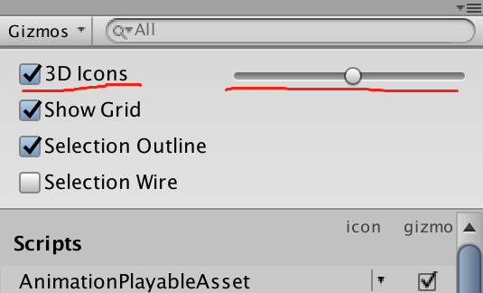
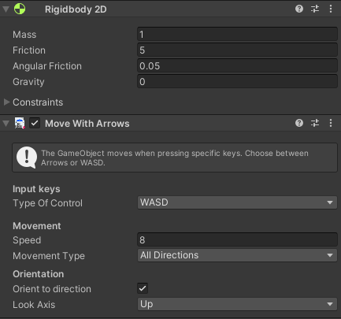
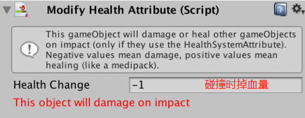
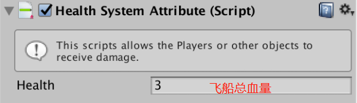

# 使用 Playground 创作第一个游戏

> - [Playground 项目 unity 论坛链接](https://forum.unity.com/threads/unity-playground-official-thread.609982/)
> - [Playground 官方教程链接](https://learn.unity.com/project/unity-playground?language=en&courseId=5d532306edbc2a1334dd9aa8)
> - [项目资源及安装](../官方教程01_Unity软件界面介绍/01-安装教程所需资源.md)

Unity Playground 提供了一系列易于使用和整合的单任务组件，因此不要求具有编码技能。通过将这些组件整合在一起，便可以创作出多种游戏风格的 2D 物理游戏。还可以使用 Playground 来了解游戏设计或关卡设计。

> 注意：  
> 官方文档中，使用的是 Unity 2017 ,版本比较旧，跟新的 Unity 界面有所区别，建议用新版本的同学，还是按此文档来操作，避免出现问题

## 1. 制作你的第一个游戏

制作教程中第一个小游戏：飞船躲陨石

### 1.1 创建玩家

1. 打开项目：  
   打开前面课程中已经准备好的 playground 项目
2. 创建新场景：  
   project 窗口 --> Assets/scenes 文件件，右键 create scene ，创建只带有一个 camera 对象的场景，重命名为 PlaneAsteroid
3. 添加玩家飞船：
   - project 窗口 --> Assets/Images/SpaceShips/ 拖拽其中一个飞机到 Hierarchy 中，让飞船对象成为 PlaneAsteroid scene 的子对象；
   - 选中飞船，在 inspector 窗口中，将对象命名为 Ship ，并将 Tag 选中为 Player

> 注意：  
> 尽可能拖拽素材到 Hierarchy 中，可以直接确定对象间父子关系；当然，如果为了定位方便，将素材拖拽到 scene 中，也可以，但记住要调整对象嵌套关系

4. 让飞船动起来：
   - 添加组件，将脚本：Move with Arrows 绑定到飞船对象上
   - 一旦你添加了 Move 脚本，还会自动添加一个 Rigidbody2D 组件。这是因为 Move 需要 Rigidbody2D 才能起作用。
   - 调整 Gizmos 中的脚本图标大小，将其缩小：使用 Scene 视图中的下拉表单辅助图标进行缩小。将 3D Icons 滑动条向左拖动，直到图标大小合适。

> 相关概念：
>
> - tag（标签）： 利用标签，我们可以将对象分为几类，以便脚本仅在碰触到正确的对象时才能执行操作。没有标签，就无法区分对象。可以在项目配置中，增减标签
> - script（脚本）： Unity 中的游戏代码
> - sprite(精灵)： Unity 中的 2D 游戏对象素材

### 1.2 调整物理值

RigidBody2D 组件和移动脚本组件上，暴露出很多物理引擎相关的参数值，通过调整，可以改善游戏体验

- 在 RigidBody2D 组件上，我们要将 Gravity 修改为 0
- Orient to direction：船头朝向移动方向
- Friction ：摩擦力，设置为 5 可以消除漂移
- Speed ： 更改速度
- mass ：质量，影响惯性

> 注意：  
> 如果在运行模式下编辑组件值，则在游戏停止后，你所做的更改将丢失。切记要在非运行模式下进行更改！仅当测试某些即使丢失也没关系的临时值时，才应该在运行模式下进行更改。

> 相关概念：
>
> - 物理引擎：  
>   Unity 中，包含了完整的物理引擎，可以让开发者非常方便地模拟显示中的物理现象，比如：质量、惯性、重力、速度、加速度、碰撞、反弹等等。  
>   [物理系统 官方文档](https://docs.unity3d.com/cn/2021.1/Manual/PhysicsSection.html)

> - RigidBody（刚体）：  
>   是实现游戏对象的物理行为的主要组件。如果想让一个游戏对像能被物理引擎所影响，就必须为其添加 RigidBody 组件，分为 2D 和 3D，分别针对不同的游戏类型。刚体可以接受力和扭矩（通过脚本编写代码来实现），向刚体施加力/扭矩实际上会改变对象的变换组件位置和旋转。  
>    [2D 刚体官方文档](https://docs.unity3d.com/cn/2021.1/Manual/class-Rigidbody2D.html)

### 1.3 添加障碍物和碰撞

1. 添加小行星：
2. 添加两个组件到小行星：Rigidbody2D 和 PolygonCollider2D
3. 添加 PolygonCollider2D 给飞船：必须都有该组件，才能正常碰撞
4. 设置小行星重力为 0
5. 调整小行星参数：Angular Friction 为旋转阻力

   > 注意：
   > 让我们将 Mass 参数设置的大一些，比如 10，这样便会增加小行星的重量，在碰到飞船时才不至于快速飞出边界。

6. 碰撞后掉血：向小行星添加一个名为 ModifyHealthAttribute 的脚本

   

7. 向飞船添加另外一个名为 HealthSystemAttribute 的脚本，这样飞船能够检测到这种伤害

   

8. 通过将小行星拖拽到 project/Assets/Prefabs 中，将其设置为预制件(Prefab)；并进行复制（Windows 上的快捷键为 Ctrl+D，Mac 上的快捷键为 Command+D），从而在飞船周围创建一个小的小行星场。

> 相关概念：
>
> - Collider（碰撞体）：  
>   [官方文档](https://docs.unity3d.com/cn/2021.1/Manual/class-PolygonCollider2D.html)  
>   2D 多边形碰撞体，碰撞体的形状由线段组成的自由形状边缘定义，因此可对其进行高精度调整以适应精灵图形的形状。
> - Prefab (预制件):  
>    [预制件 官方文档](https://docs.unity3d.com/cn/2021.1/Manual/Prefabs.html)  
>   Unity 的预制件系统允许创建、配置和存储游戏对象及其所有组件、属性值和子游戏对象作为可重用资源。预制件资源充当模板，在此模板的基础之上可以在场景中创建新的预制件实例。  
>    说白了，就是“可重用资源模板”

### 1.4 添加用户界面

通过用户界面（user interface）给玩家回馈信息

将 UserInterface 预制件从 /Prefabs 文件夹拖入到场景中。在你查看 Game 视图时，系统会自动显示一个 UI 弹出窗口，其中包含 Score 和 Health 属性。

### 1.5 添加游戏目标

游戏规则：这个游戏的目标是什么呢？假设我们希望飞船收集一些星星，但不能撞到小行星。一旦收集到所有星星，便赢得了比赛。但如果发生碰撞的次数太多，游戏便结束！

1. 添加星星：  
   将这个星星从 /Images 文件夹拖入到场景中。
2. 添加分数脚本：  
   为星星添加 Collectable 脚本，将星星变成一个可收集物品，收集到一个星星便会奖励玩家一个点数。
3. 添加碰撞体，让星星能被飞船收集：  
   为星星添加 PolygonCollider2D 组件，并启用 Is Trigger 属性

> 相关概念：
>
> - 触发器：  
>    用于触发事件。如果启用 Is Trigger 属性，则该碰撞体将用于触发事件，并被物理引擎忽略。
>   触发后，可以让对象变为无形（比如：被吃掉的金币，被拾取的装备等），Unity 会检测到两个对象相互接触的情况，继而执行设定好的事件（执行事件函数）。

### 1.6 添加获胜条件

完善游戏，添加获胜条件

1. 将星星作为预制件，复制 5 个；将这些星星分布到周围，让一些星星很容易获得，但其他一些星星很难获得。通过这样的方式，我们也可以让我们的小游戏难度逐渐增大。
2. 选择 UI 游戏对象，然后在 UI 脚本上确保游戏类型为 Score，并且所需得分为 5。

> 注意：  
> 星星个数需要 大于等于 Score 值，否则永远无法胜利

## 2. 发挥自己想象力

发挥想象力，重复利用 PlayGround 中的各项资源，创作属于自己的小游戏！

在学习如何制作游戏时，模仿 80 年代老游戏（例如小行星、打砖块、太空侵略者、青蛙等等……）的玩法一般来说是很不错的做法，因为这些游戏很简单。然后，随着你的水平不断提升，你可以添加越来越多的细节并优化互动方式。

如果你需要灵感，请打开 Examples 文件夹并启动其中一个游戏。检查游戏对象，看看我们是如何制作这些游戏对象的，然后尝试创建类似的游戏对象。

 

 

配套视频教程：
[https://space.bilibili.com/43644141/channel/seriesdetail?sid=299912](https://space.bilibili.com/43644141/channel/seriesdetail?sid=299912)

文章也同时同步微信公众号，喜欢使用手机观看文章的可以关注

