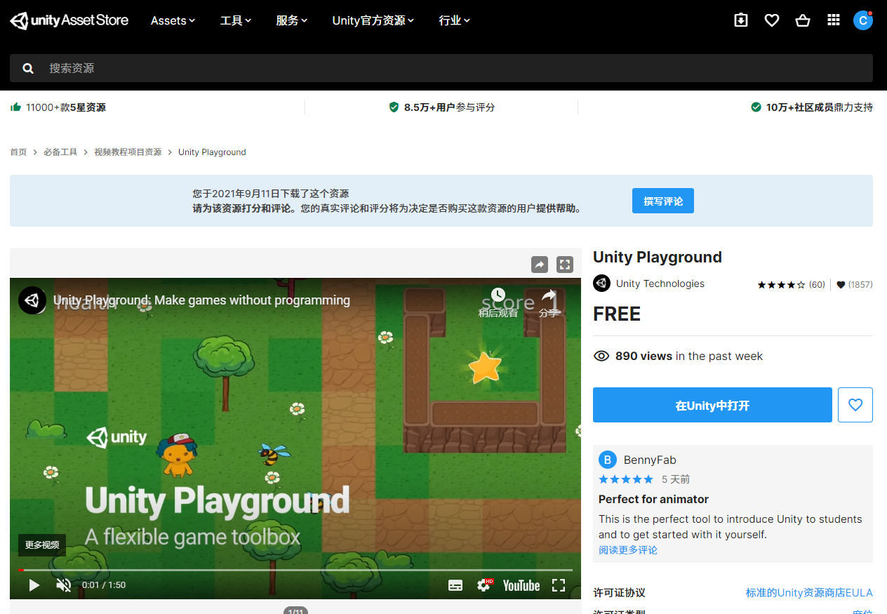
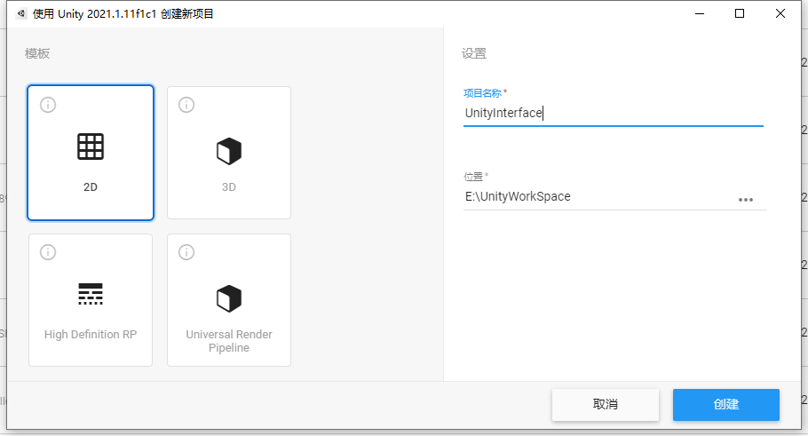
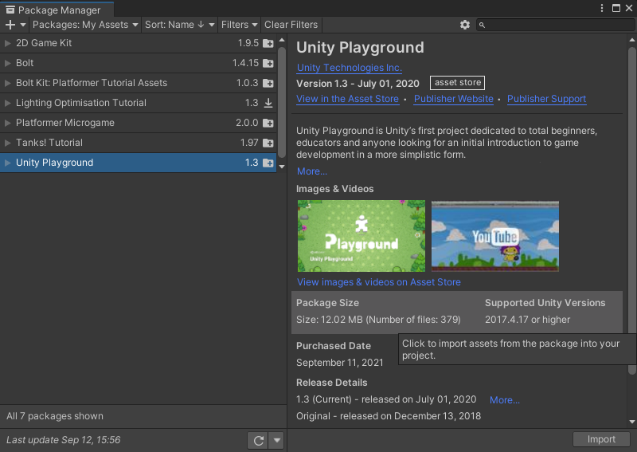

# 安装教程所需资源

> 内容索引：  
> 由于此官方教程中，对应的测试项目已经过期，unity 不再提供下载，所以这次课程讲解所需资源，更换成 unity playground。
>
> - 使用 Unity Asset Store 查找资源
> - 使用 Unity Hub 创建项目
> - 使用 Unity 资源管理器管理资源
> - Unity 界面总体介绍

## 1. 通过商店下载教程使用的资源

1. 进入 unity 的资源商店：assetstore.unity.com ，搜索 unity playground

   [unity playground 商店链接](https://assetstore.unity.com/packages/essentials/tutorial-projects/unity-playground-109917)

2. 选中正确的包，打开页面，点击右侧按钮 添加至我的资源 --> 接受
   

3. 打开 unity hub ，使用 2D 模板新建一个空项目，打开项目
   
4. 在 unity 中，打开 package manager (包管理) 窗口 , 在上面的 Packages：下拉列表中，选中 My Assets , 选中 Unity Playground ，点击右下角 download 按钮下载包
5. 下载完成后，点击右下角 import 按钮导入包，选择导入所有
   

## 2. 直接通过包本地安装

如果有些同学从 unity 资源商店下载速度太慢，总是失败，我把我下载好的包放到百度云和迅雷云，大家可以直接下载包，进行本地安装

- 百度云：[Unity Playground](https://pan.baidu.com/s/1zn47C9WaCwbXovDy5SZxkQ) 提取码: 4xr5
- 迅雷云：[Unity Playground](https://pan.xunlei.com/s/VMjO4SYupAn7cvjTUa-TNrtvA1) 提取码：2pqr

1. 下载包文件
2. 打开 unity hub ，使用 2D 模板新建一个空项目，打开项目
3. 在硬盘中双击包 Unity Playground.unitypackage，进行导入

> 注意：
>
> 如果提示这个错误：  
> Deterministic compilation failed. You can disable Deterministic builds in Player Settings
> Library\PackageCache\com.unity.multiplayer-hlapi@1.0.4\Editor\Tools\Weaver\AssemblyInfo.cs(22,28): error CS8357: The specified version string contains wildcards, which are not compatible with determinism. Either remove wildcards from the version string, or disable determinism for this compilation  
> 解决方法：更新 Multiplayer HLAPI

配套视频教程：[https://space.bilibili.com/43644141/channel/seriesdetail?sid=299912](https://space.bilibili.com/43644141/channel/seriesdetail?sid=299912)

文章也同时同步微信公众号，喜欢使用手机观看文章的可以关注

