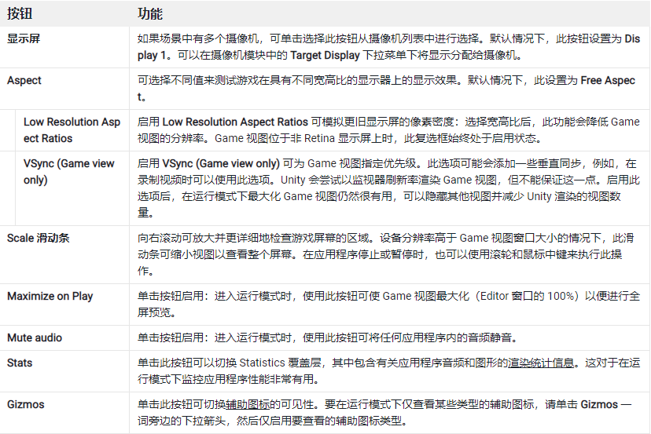
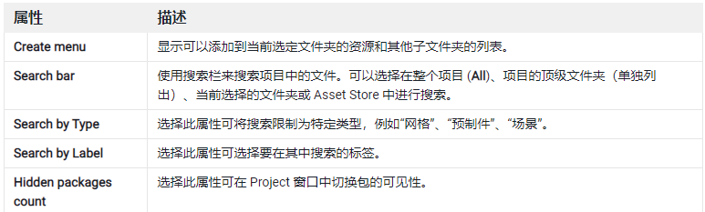
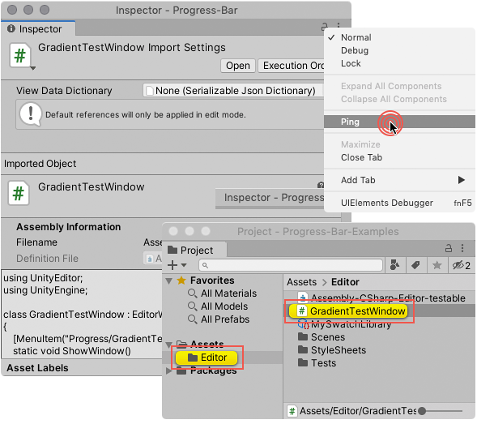

# Game 视图、 Hierachy、project、inspector 窗口

## 1. Game 视图

> 官方文档：  
> [https://docs.unity3d.com/cn/2021.1/Manual/GameView.html](https://docs.unity3d.com/cn/2021.1/Manual/GameView.html)

### 1.1 Game 运行控制按钮

- 运行游戏（ctrl+p）
- 暂停(ctrl+shift+p)
- 按帧运行(ctrl+alt+p)

> 注意：  
> 在运行模式下，所做的任何更改都是暂时的，在退出运行模式后将会重置。

### 1.2 Game 视图控制栏

## 2. Hierachy 窗口

> 官方文档：  
> [https://docs.unity3d.com/cn/2021.1/Manual/Hierarchy.html](https://docs.unity3d.com/cn/2021.1/Manual/Hierarchy.html)

说白了就是：场景中游戏对象的管理器（选择器）

Hierarchy 窗口显示场景中的每个游戏对象，如模型、摄像机或预制件。可以使用 Hierarchy 窗口对场景中使用的游戏对象进行排序和分组。在 Scene 视图中添加或移除游戏对象时，也会从 Hierarchy 窗口添加或移除它们。

主要功能：

1. 父子包含关系：  
   将游戏对象链接在一起以帮助移动、缩放或变换游戏对象的集合。移动顶层对象或父游戏对象时，也会移动所有子游戏对象。
2. 管理游戏对象：
   - 创建、复制粘贴、选取、删除
   - 更改嵌套关系
   - 是否可选，是否可见
   - 排序
3. 多场景编辑

> 注意：  
> Hierarchy 窗口中，虽然允许编辑多个场景，但根节点通常都是场景对象（scene），其他的游戏对象都包含在某个场景中。

## 3. project 窗口

> 官方文档：  
> [https://docs.unity3d.com/cn/2021.1/Manual/ProjectView.html](https://docs.unity3d.com/cn/2021.1/Manual/ProjectView.html)

虽然叫项目（project）窗口，但把他理解为“资源”窗口，会更贴切些，所以在本教程中，我通常会将其称为“资源管理器”

Project 窗口显示与项目相关的所有文件，该窗口是在应用程序中导航和查找资源以及其他项目文件的主要方法。

### 3.1 project 工具栏

project 常用操作工具按钮栏

### 3.2 资源管理区域

1. 左侧树状目录：

   - Assets ： 资源文件
   - Packages： 库文件（运行游戏所需要的程序库）

2. 右侧文件操作区域：  
   就像 windows 中的文件操作方式一样

## 4. inspector 窗口

> 官方文档：  
> [https://docs.unity3d.com/cn/2021.1/Manual/UsingTheInspector.html](https://docs.unity3d.com/cn/2021.1/Manual/UsingTheInspector.html)

说白了，就是被选中游戏对象的属性窗口，可以在其中查看、编辑属性

使用 Inspector 窗口可对 Unity 编辑器中几乎所有内容（包括游戏对象、Unity 组件、资源、材质）查看和编辑属性和设置，以及查看和编辑编辑器内的设置和首选项。

选择相同类型的多个资源时，Inspector 窗口会显示它们共有的所有属性。选择不同类型的多个资源时，Inspector 会显示一个列表，其中显示选择的每种类型资源的数量。单击该列表中的任何项可检查该类型的所有资源。

### 4.1 查找源

在 Inspector 窗口中打开游戏对象或资源时，可以使用 Ping 命令在 Scene 视图或 Project 视图中查找它。

从 Inspector 窗口的 More Items (⋮) 菜单，选择 Ping。Unity 在 Hierarchy 视图或 Project 视图中突出显示该项目。

 

 

配套视频教程：
[https://space.bilibili.com/43644141/channel/seriesdetail?sid=299912](https://space.bilibili.com/43644141/channel/seriesdetail?sid=299912)

文章也同时同步微信公众号，喜欢使用手机观看文章的可以关注

