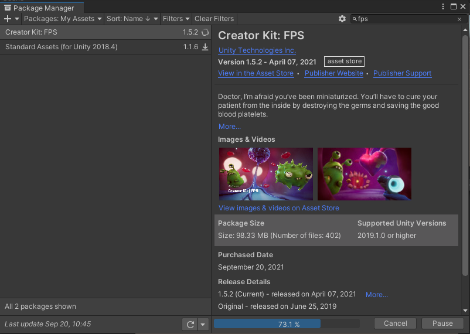
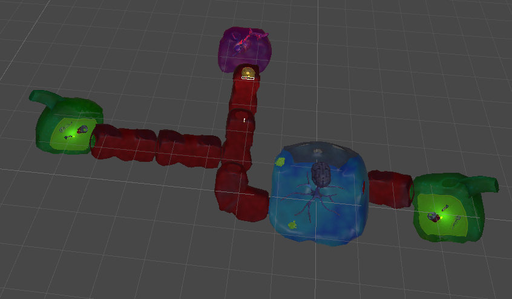
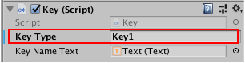
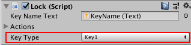
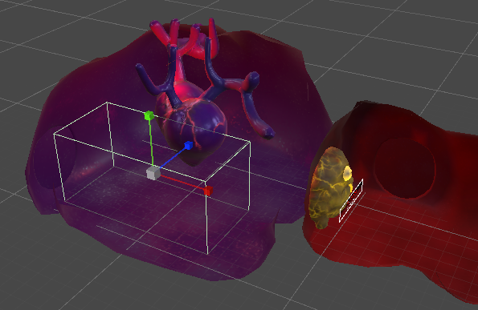

# 使用 Creator kit FPS

> - [官方教程地址-创作者套件：FPS](https://learn.unity.com/project/chuang-zuo-zhe-tao-jian-fps?uv=2020.3)
> - [AssetStore 地址](https://assetstore.unity.com/packages/templates/tutorials/creator-kit-fps-149310?_ga=2.85655312.885135272.1631762446-522971275.1624332126)
> - [百度网盘地址](https://pan.baidu.com/s/1frsqKKhqSMOYjMF6CD7AzA) 提取码: b8ym
> - [迅雷云盘地址](https://pan.xunlei.com/s/VMk08AooAFpxmtm7yZKyxUv6A1) 提取码：d9tf

> 本地 unitypackage 文件使用：  
> 新建项目 --> 打开项目 --> 将 unitypackage 文件拖入已打开 unity 的界面的 Project 窗口中 --> 选择需要导入的资源，import 导入

## 项目介绍

欢迎学习 3D FPS 创作者套件 (FPS Creator Kit)！此细分套件以神奇的魔法将你微型化为医生，让你能够为对抗疾病贡献微小的正义力量。你的任务是游走于患者的身体中，在发现任何邪恶的病菌时消灭它们。

重点：

- 3D 游戏相关操作
- 关卡设置
- 修改武器

> **强调说明**：  
> 这种 Creator Kit 类型的项目，本身结构较为复杂，作为初学者项目，是为了给我们全面展示 Unity 功能和使用方法；而非让初学者必须一开始就把项目中每个元素都搞清楚，千万记住不要在这种项目中钻细节，跟着教程走就行，要做到“**不求甚解！！**”  
> 等未来你掌握了足够的知识（比如编程技术）后，可以再回头学习这个系列，就可以随心所欲地更改这个项目，并能从此项目中吸收更多的经验，用到日后游戏设计中
>  

 

## 1. 试玩游戏

1. 在 Project 窗口中，Assets/Creator Kit - FPS/Scenes 文件夹
2. 双击 ExampleScene 场景
3. 运行

- 按键盘上的 W A S D 键进行移动
- 按空格键进行跳跃
- 按住 Shift 键进行奔跑
- 用鼠标进行武器瞄准
- 瞄准后单击鼠标按钮用药物消灭病菌

## 2. 自定义目标对象

1. 创建场景：  
   在顶部菜单栏中，选择 FPSKIT > Create new Scene。

   > 注意：  
   > FPSKIT 菜单并非是 unity 中的默认菜单，而是通过代码，新增如 Unity 编辑器的自定义功能。 Assets/Creator Kit - FPS/Scripts/Editor  
   > unity 支持定制功能，非常灵活，开发者可以根据自己的需求，打造属于自己的 unity ，从而简化开发过程

2. 添加游戏目标：

   选中 Assets/Creator Kit - FPS/Prefabs/Targets/GermSlimeTarget 预制件，拖入 Hierarchy 中，并在 scene 中，调整其位置

3. 更改目标对象属性：  
   Inspector 窗口 --> Target 组件 --> 更改目标的 Health（小怪的生命） 和 Point Value （杀死后得分）

4. 添加其他目标对象：  
   Assets/Creator Kit - FPS/Art/Models/Characters，选中 GermSpike ，拖入 scene

5. 为新对象添加刚体组件：  
   单击 Add Component 按钮，然后开始在搜索栏中键入“Rigidbody”并添加；禁用 Use Gravity 复选框，启用 Is Kinematic 复选框。  
   禁用 Use Gravity 将使病菌漂浮，而启用 Is Kinematic 会阻止子弹（或其他任何对象）使病菌四处移动。

   > 注意：启用 Is Kinematic，则刚体对象将不会被物理引擎驱动，只能通过**变换 (Transform)** 对其进行操作。

6. 为新对象添加碰撞体:  
   Add Component 并搜索 Sphere Collider。添加该组件。

   Sphere Collider（球形碰撞体）将确保可以击中病菌，有时会将这个碰撞体称为“命中范围”。在 Scene 视图中，你会发现这个碰撞体就是包围病菌的绿色球体。

   调整碰撞体的大小，使其紧紧地包围住整个对象素材。

7. 将新对象设置为目标：  
   单击 Add Component，然后搜索并添加 Target 组件。

   组件会添加一个自定义脚本来使病菌成为目标。添加脚本后，请更改目标的 Health 和 Point Value 值，然后再次测试游戏。完成后，请务必保存更改。

## 3. 设计关卡

1. 关闭音频辅助图标：  
   在 Hierarchy 窗口中，选择 LevelLayout 游戏对象。  
   在 Scene 视图的右上角，单击 Gizmos 按钮旁的向下箭头。
   在菜单中，向下滚动列表并禁用 Built-in Components 部分中的以下两个复选框：AudioReverbZone、AudioSource
2. 添加新房间和走廊：  
   在 Hierarchy 中，确认 LevelLayout 游戏对象仍然为选中状态；  
   在 Inspector 窗口中，找到 Level Layout 组件。单击 Editing Layout。这样会默认启用添加模式。然后，单击 CorridorGroup 以添加走廊，或者单击 RoomGroup 以添加房间。  
   你可以按键盘上的 R 键来旋转房间并更改这个房间尝试贴靠到的门。对位置感到满意后，请单击鼠标按钮来放置房间。

   

   如果操作失误或者要删除房间，请单击组件中的 Remove 按钮。完成此操作后，将光标移到 Scene 视图中的房间和走廊上方就会突出显示这些房间和走廊。单击一个房间即可将这个房间删除。

   完成关卡设计的编辑工作后，再次单击 Inspector 窗口中的 Editing Layout 按钮以禁用关卡编辑器工具。

3. 添加门：  
   选择 Assets/Creator Kit - FPS/Prefabs/Door and Key/FatBlob，拖拽到 scene 中，选择合适的位置，堵住路口，充当门

4. 添加钥匙并匹配门：  
   在 Project 窗口中，选择 Key 预制件，拖拽到 scene 中，选择合适的位置，在 Inspector 中，找到 Key 组件。在 Key Type 字段中，为钥匙提供一个唯一的名称。

   

   在 Hierarchy 中，选择 FatBlob 游戏对象。在 Inspector 中，找到相应的 Lock 组件。使用下拉菜单将 Key Type 值设置为所选的钥匙名称

   

   现在，玩家只要收集到钥匙，就可以开启对应的门

## 4. 修改武器

1. 根据原武器新建自己的新武器：  
   选择 Assets/Creator Kit - FPS/Prefabs/Weapon/GermOBlaster 预制件，按 Ctrl + D (Windows) 或 Cmd + D (macOS) 来复制一个副本，并将武器重命名。
2. 在新武器的预制件中，更改武器属性：  
   双击新武器，进入预制件编辑状态，在 Inspector 中，找到 Weapon 组件。  
   将 Trigger Type 更改为 Manual。现在，仅在按下扳机时，武器才会发射一次，而不是尽可能快地发射。
   Clip Size 的值从 30 更改为 8，以减少单次重新装填弹匣的弹药量。将 Damage 的值从 0.5 更改为 5。  
   保存。
3. 将新武器添加给 Character：  
   在 Hierarchy 中，选择 Character 游戏对象

   在 Inspector 窗口中，找到 Controller 组件。

   选择 Starting Weapons 条目名称左侧的小箭头以展开该条目。将 Size 从 3 更改为 4。这将在关卡开始时为玩家提供四种武器。

   将新武器预制件从 Project 窗口拖到 Inspector 中显示的 Element 3 字段上。

   保存后，运行游戏测试，用鼠标滚轮或 1、2 、3、4 键来切换武器。

## 5. 创建关卡终点

1. 创建 LevelEnd 游戏对象：  
   在 Hierarchy 窗口中右键单击一个空的区域，然后选择 Create Empty，在 Inspector 窗口中，将游戏对象重命名为“LevelEnd”。

2. 添加盒装碰撞体：  
   在 Inspector 中，单击 Add Component 按钮。搜索“Box Collider”，然后将此组件添加到 LevelEnd。启用 Is Trigger 复选框。

   单击 Add Component 按钮。搜索“End Checkpoint”，然后将此组件添加到 LevelEnd。

3. 将碰撞体放在合适位置：  
   使用变换组件工具将该对象放置在所需的关卡结束位置。房间或走廊的尽头就很适合作为关卡终点。

   

## 6. 构建游戏

1. 确保要用于游戏的场景已打开。在顶部菜单中，选择 File > Build Settings。

2. 在对话窗口中，选择空的 Scenes In Build 列表底部的 Add Open Scenes 按钮。此时会将当前打开的场景添加到构建中。

3. 单击 Build 按钮。选择要保存构建版本的文件夹并为其命名。Unity 将创建构建版本，然后打开包含可执行文件的文件夹。通过启动此文件即可玩这个游戏。

4. 压缩含有构建版本的文件夹，然后将其发送给朋友！

 

 

> 探索创作者套件的所有可能性:
>
> 参考[详细手册](https://connect-prd-cdn.unity.com/20200317/7a981784-430a-4a3c-8423-302fe220e6d7/Creator%20Kit%20FPS%20_%20Manual.pdf?_ga=2.86683665.885135272.1631762446-522971275.1624332126)以了解更多信息以及编辑器的背景资料。  
> 这些参考内容包括：
>
> - 此创作者套件中所有武器设置的相关概述。
> - 有关导入你自己的 3D 模型并使用它来创建新型武器的指导。
> - 有关高级游戏功能（例如，创建在销毁目标时触发的门锁系统）的指导。

 

 

配套视频教程：
[https://space.bilibili.com/43644141/channel/seriesdetail?sid=299912](https://space.bilibili.com/43644141/channel/seriesdetail?sid=299912)

文章也同时同步微信公众号，喜欢使用手机观看文章的可以关注

