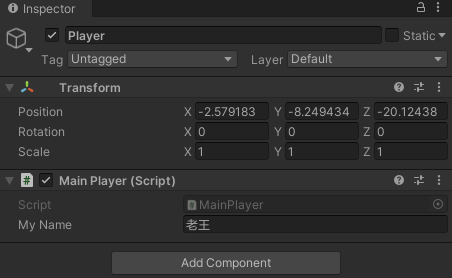
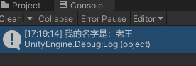
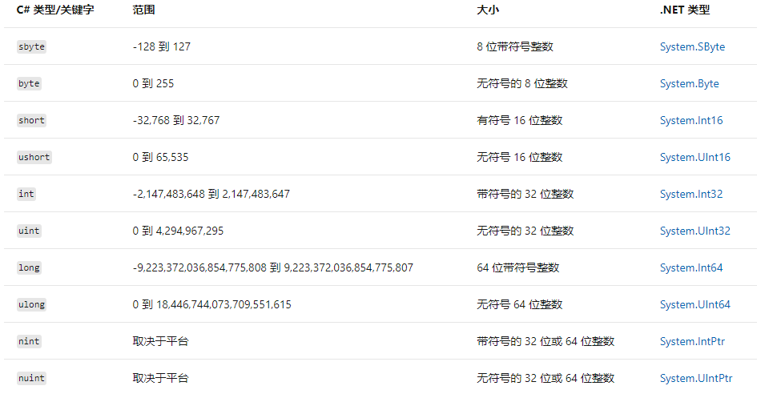
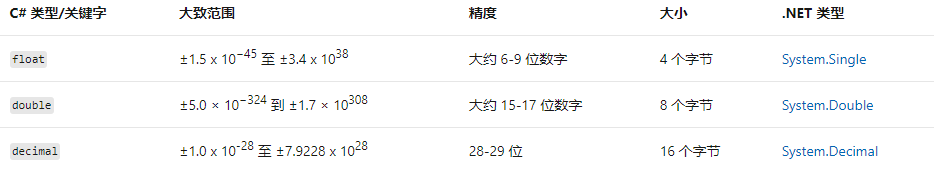

# 在脚本中使用变量

> [官方教程 - 初学者代码脚本](https://learn.unity.com/tutorial/bian-liang-jian-jie?uv=2020.3&projectId=5fad021eedbc2a00225e688f#)  
>  [官方文档 - 变量和 inspector](https://docs.unity3d.com/cn/current/Manual/VariablesAndTheInspector.html)  
> [微软官方 C#文档](https://docs.microsoft.com/zh-cn/dotnet/csharp/)  
> [微软文档最佳学习路线 - C# 编程指南](https://docs.microsoft.com/zh-cn/dotnet/csharp/programming-guide/)

Unity 对应 C# 版本：

- 2020.3 最新长期支持版：  
   [官方文档说明页](https://docs.unity3d.com/2020.3/Documentation/Manual/CSharpCompiler.html)：C# 8.0
- 2021.2 最新正式版:  
   [官方文档说明页](https://docs.unity3d.com/2021.2/Documentation/Manual/CSharpCompiler.html): C# 9.0

> 扩展：  
> 微软原先有两个 C# 的运行环境（简单可以理解为，安装运行环境后，才能运行 C# 程序）：只支持 windows 的 .net framwork 和 开源的全平台 mono（收购 Xamarin 公司的）；  
> .net 功能强大，可以发挥所有 C# 功能，mono 什么操作系统都支持，但有些 C# 功能不能发挥出来。  
> 后来，微软又推出了 .net core 开源框架，实际上就是 mono 的替代品。unity 因为推出时， .net core 还没有正式版，所以使用了 mono ，这也是 unity 会有部分 C# 功能不支持的原因。（虽然 新版本的 mono 也集成了部分 .net core 的功能，但并不完全，因为更新速度跟不上）  
> unity 应该也在考虑将 mono 替换为 .net core（.net 6） ，我们拭目以待

> 结论：
> 刚开始学 C# 的同学，可以直接学习 C# 9.0 版本

<br>
<hr>
<br>

## 1. 变量

### 1.1 概念

在创建脚本时，实际上是在自定义新的组件类型，可以像任何其他组件一样将这种组件附加到游戏对象。

unity C# 脚本中的变量，可以当做是这个脚本组件中的属性。

可以隐藏在代码中，也可以暴露在 inspector 中（将变量的可访问性设置为 public）

从编程角度来讲，变量就像是一个有名字的盒子，存储在内存中，可以通过名字找到它的位置，从中取出它里面的值——“取值”，也可以把想存放的值放（存）进去——“赋值”

### 1.2 创建并使用变量

- 步骤 1：新建一个 scene，命名为 MyScene，放入 Assets/Scenes 下
- 步骤 2：在新的 scene 中，新建一个 empty gameobject(空游戏对象)命名为 Player
- 步骤 3: 为 Player 对象新增脚本组件，放入 Assets/Scripts 下，命名为 MainPlayer
- 步骤 4：在脚本中添加如下代码：

  ```C#
  using UnityEngine;

  public class MainPlayer : MonoBehaviour
  {
      public string myName;
      // Start is called before the first frame update
      void Start()
      {
          Debug.Log("我的名字是：" + myName);
      }

      // Update is called once per frame
      void Update()
      {

      }
  }

  ```

- 步骤 5： 运行，并测试，可以更改 Player 对象 MainPlayer 组件中的 My Name 属性，查看 console 窗口中的输出

  

  

## 2. 在游戏中使用变量

在 SpawnerSample 中，声明新的变量，并使用它

- 步骤 1：阅读代码，不懂的地方查文档
- 步骤 2：制定 TODO：声明一个变量，用来存储新生成的药瓶和生成点距离的值，赋值，测试

```C#

//引入命名空间 UnityEngine
using UnityEngine;

// 生成器示例类
// 这个生成器会在不同位置，生成三个指定的游戏对象
public class SpawnerSample : MonoBehaviour
{
    // 声明 一个attribute（字段），是一个游戏对象，用来获取生成器生成的 gameobject
    public GameObject ObjectToSpawn;
    // 声明一个变量，用来存放距离
    public int radius;
    // start事件方法，是包含此脚本的游戏对象 Start is called just before any of the Update methods is called the first time
    // 在 update 前执行，且在游戏对象生命周期只执行一次
    // Start is only called once in the lifetime of the behaviour.
    void Start()
    {
        // 声明整型变量 angle 并赋值为 15
        int angle = 15;

        //声明一个 3D Vector (矢量) 对象 spawnPosition 并赋值为当前游戏对象的位置
        Vector3 spawnPosition = transform.position;

        // 声明一个 3D Vector (矢量) 对象 direction，并使用 Quaternion（四元数）类的静态方法  Euler（欧拉）返回值 * Vector3(1,0,0)
        // 四元数 Quaternion 是 unity 3d 系统中，用来处理旋转的类
        // 说白了就是创建一个 方向对象，指定一个方向，旋转多少角度，然后生成一个向量坐标
        Vector3 direction = Quaternion.Euler(0, angle, 0) * Vector3.right;
        // 重新计算 spawnPosition 的值，原来的位置坐标 + 一个方向 * 距离
        spawnPosition = transform.position + direction * radius;
        // 用 Object 的 Instantiate（实例化） 静态方法实例化游戏对象
        Instantiate(ObjectToSpawn, spawnPosition, Quaternion.identity);

        // 用一套新值，在新的位置重新生成一个游戏对象
        angle = 55;
        direction = Quaternion.Euler(0, angle, 0) * Vector3.right;
        spawnPosition = transform.position + direction * radius;
        Instantiate(ObjectToSpawn, spawnPosition, Quaternion.identity);

        // 用一套新值，在新的位置重新生成一个游戏对象
        angle = 95;
        direction = Quaternion.Euler(0, angle, 0) * Vector3.right;
        spawnPosition = transform.position + direction * radius;
        Instantiate(ObjectToSpawn, spawnPosition, Quaternion.identity);
    }
}


```

## 3. 数据类型

### 3.1 整型数值类型

[官方文档 - 整型数值类型](https://docs.microsoft.com/zh-cn/dotnet/csharp/language-reference/builtin-types/integral-numeric-types)

整型数值类型 表示整数。



### 3.2 浮点数值类型

[官方文档 - 浮点数值类型](https://docs.microsoft.com/zh-cn/dotnet/csharp/language-reference/builtin-types/floating-point-numeric-types)

浮点数值类型表示实数。



### 3.3 bool char null 和 可空

- bool: 布尔型，值为 true 或 false （真或假）
- char: 字符型, 大小 16 位,值为 '' 括起来的单个字符
- null: 空，表示什么都没有
- 类型?: 可空。 如 int? a; 表示可以为空的变量 a，使用之前需要先判断 a 的值是否为空；直接使用空值会引起异常，导致程序出错，不能运行

### 3.4 var

隐式“类型”var，会根据赋值类型，推断出变量类型

```C#
var a = 5; // 变量 a 的类型会被系统推断为 int
```

## 4. 语句、表达式和运算符

### 4.1 语句

C# 中，以 ; 结束的一行，称为一条语句，是 C# 代码执行时的最小单位

### 4.2 运算符

用作运算的符号

[官方文档 - 运算符](https://docs.microsoft.com/zh-cn/dotnet/csharp/language-reference/operators/arithmetic-operators)

### 4.3 表达式

常量、变量和运算符组成的式子，经过运算，可以得出一个确定的值。

所以，每个表达式就是一个没有被计算出来的值，要对应一个确定的数据类型

<br>

<hr>
<br>

配套视频教程：
[https://space.bilibili.com/43644141/channel/seriesdetail?sid=299912](https://space.bilibili.com/43644141/channel/seriesdetail?sid=299912)

文章也同时同步微信公众号，喜欢使用手机观看文章的可以关注


