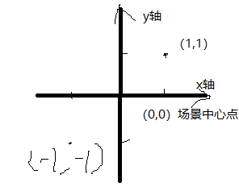

# Ruby's Adventure：2D 初学者

> 资源链接：
>
> - [中文官方教程地址](https://learn.unity.com/project/ruby-s-adventure-2d-chu-xue-zhe)
> - [AssetStore](https://assetstore.unity.com/packages/templates/tutorials/2d-beginner-tutorial-resources-140167?_ga=2.134705203.331241089.1633678521-522971275.1624332126)
> - [Baidu 云盘](https://pan.baidu.com/s/193a7getqsQewRm16UIzqmg) 提取码: iw1x
> - [迅雷云盘](https://pan.xunlei.com/s/VMleChfhqqDLB9q7E3OvLfTWA1) 提取码：d3ed

## 1. 项目简介

2D RPG 游戏制作教程，特点：

- 学习使用 2D 资源
- 学习简单的 2D RPG 游戏制作流程
- 只提供素材
- 学习创建并控制角色（使用脚本代码）
- 学习使用瓦片地图创建世界
- 学习设置动态精灵
- 学习一些简单特效（粒子效果）

## 2. 创建并控制角色

### 2.1 创建角色

#### 2.1.1 使用静态精灵创建角色

精灵 Sprite 是 Unity 中 2D 素材的默认存在形式，是 Unity 中的 2D 图形对象。

在 2D 游戏中，使用 2D 素材的过程：  
PNG（JPG 等）----> Sprite ----> GameObject

### 2.2 移动角色

#### 2.2.1 移动精灵

2D 游戏中，没有 Z 轴来表示深度，只有 X 轴和 Y 轴，以中心点为原点（0,0），左 x 负，右 x 正，上 y 正，下 y 负



Unity 中，通过游戏对象的 Transform 组件，可以获取该对象在场景中的位置 Position，并通过更改 Transform 组件 Position 的值，可以更改其位置，依据的坐标轴就是上面描述的 2D 坐标轴

#### 2.2.2 用脚本移动精灵

在 Update 方法中，更改 Ruby 角色位置

Unity 在每帧执行 Update 内的代码，为了形成动感，游戏（就像电影一样）是高速显示的静止图像。在游戏中通常会在一秒内显示 30 或 60 张图像。其中的一张图像称为一帧。

在此 Update 函数中，你可以编写想要在游戏中连续发生的任何操作（例如，读取玩家的输入、移动游戏对象或计算经过的时间）。

代码版本 1：

```C#
public class RubyController : MonoBehaviour
{
    // 每帧调用一次 Update
    // 让游戏对象每帧右移 0.1
    void Update()
    {
        // 创建一个 Vector2 对象 position，用来获取当前对象的位置
        Vector2 position = transform.position;
        // 更改 position 的 x 坐标值，让其 加上 0.1
        position.x = position.x + 0.1f;
        // 更新当前对象的位置到新位置
        transform.position = position;
    }
}
```

#### 2.2.3 Vector2 二维向量

在数学中，Vector 向量/矢量指的是带方向的线段

在 Unity 中，Transform 值使用 x 表示水平位置，使用 y 表示垂直位置，使用 z 表示深度。这 3 个数值组成一个坐标。由于此游戏是 2D 游戏，你无需存储 z 轴位置，因此你可以在此处使用 Vector2 来仅存储 x 和 y 位置。

Transform 中 position 的类型，也是 Vector2

C# 这种强类型语言，赋值时，左右必须是同一类型才能进行

### 2.3 控制角色

控制角色，是游戏中最基本的用户交互

#### 2.3.1 游戏中的控制方式

控制方式：

- 鼠标键盘
- 手机触屏、重力
- 手柄
- 体感
- 可穿戴设备，比如 VR 、AR 眼镜 常用的瞳孔控制
- 声音控制

#### 2.3.2 键盘控制代码

这里我们用最原始的键盘控制

代码版本 2：

```C#
public class RubyController : MonoBehaviour
{
   // 每帧调用一次 Update
    // 让游戏对象每帧右移 0.1
    void Update()
    {
        // 获取水平输入，按向左，会获得 -1.0 f ; 按向右，会获得 1.0 f
        float horizontal = Input.GetAxis("Horizontal");
        // 获取垂直输入，按向下，会获得 -1.0 f ; 按向上，会获得 1.0 f
        float vertical = Input.GetAxis("Vertical");

        // 获取对象当前位置
        Vector2 position = transform.position;
        // 更改位置
        position.x = position.x + 0.1f * horizontal;
        position.y = position.y + 0.1f * vertical;
        // 新位置给游戏对象
        transform.position = position;
    }
}

```

#### 2.3.3 Unity 默认 Input Manager 设置

在 Unity 项目设置中，可以通过 Input Manager 进行默认的游戏输入控制设置

Edit > Project Settings > Input

键盘按键，以 2 个键来定义轴：

- 负值键 negative button，被按下时将轴设置为 -1
- 正值键 positive button ，被按下时将轴设置为 1

Axis 轴 Axes 是它的负数形式

- Horizontal Axis： 水平轴 对应 X 轴
- Vertical Axis：纵轴 对应 Y 轴

#### 2.3.4 Input 类

[ UnityEngine.Input 官方 API 文档](https://docs.unity3d.com/cn/current/ScriptReference/Input.html)

使用该类来读取传统游戏输入中设置的轴/鼠标/按键，以及访问移动设备上的多点触控/加速度计数据。

若要使用输入来进行任何类型的移动行为，请使用 Input.GetAxis。 它为您提供平滑且可配置的输入 - 可以映射到键盘、游戏杆或鼠标。 请将 Input.GetButton 仅用于事件等操作。不要将它用于移动操作。Input.GetAxis 将使脚本代码更简洁。

代码版本 3：

```C#
public class RubyController : MonoBehaviour
{
   // 每帧调用一次 Update
   // 可以这样做，但不建议
   void Update()
   {
       Vector2 position = transform.position;

       if(Input.GetKey("d")){
           position.x = position.x + 0.1f;
       }
       if(Input.GetKey("a")){
           position.x = position.x - 0.1f;
       }
       if(Input.GetKey("s")){
           position.y = position.y - 0.1f;
       }
       if(Input.GetKey("w")){
           position.y = position.y + 0.1f;
       }

       transform.position = position;
   }
}

```

#### 2.3.5 时间和帧率

当前的代码中，帧数越高，同一时间内，执行 Update 的次数越多，角色移动速度越快。

如果游戏以每秒 60 帧的速度运行，那么 Ruby 将移动 0.1 _ 60，因此每秒移动 6 个单位。但是，如果游戏以每秒 10 帧的速度运行，就像刚刚让游戏运行的那样，那么 Ruby 仅移动 0.1 _ 10，因此每秒移动 1 个单位！

如果一个玩家的计算机非常陈旧，只能以每秒 30 帧的速度运行游戏，而另一个玩家的计算机能以每秒 120 帧的速度运行游戏，那么这两个玩家的主角的移动速度会有很大差异。这样就会使游戏的难易程度提高或降低，具体取决于运行游戏的计算机。

而帧数是由硬件水平影响的（越好越高），不同电脑中，会导致游戏效果完全不同

可以锁帧，但并不推荐
代码版本 4：

```C#
public class RubyController : MonoBehaviour
{
    // 在第一次帧更新之前调用 Start
    void Start()
    {
        // 只有将垂直同步计数设置为0，才能锁帧，否则锁帧的代码无效
        // 垂直同步的作用就是显著减少游戏画面撕裂、跳帧，因为画面的渲染不是整个画面一同渲染的，而是逐行或逐列渲染的，能够让FPS保持与显示屏的刷新率相同。
        QualitySettings.vSyncCount = 0;
        //设定应用程序帧数为10
        Application.targetFrameRate = 10;
    }

    // 每帧调用一次 Update
    void Update()
    {
        float horizontal = Input.GetAxis("Horizontal");
        float vertical = Input.GetAxis("Vertical");

        Vector2 position = transform.position;
        position.x = position.x + 0.1f * horizontal;
        position.y = position.y + 0.1f * vertical;
        transform.position = position;
    }
}
```

> 相关资料：
>
> - [质量设置.垂直同步设置 官方 API](https://docs.unity3d.com/ScriptReference/QualitySettings-vSyncCount.html)
> - [垂直同步什么意思？游戏中垂直同步的作用](https://zhuanlan.zhihu.com/p/67370953)

硬件能达到的情况下（显卡、显示器），锁帧会降低画面效果。

要解决此问题，你需要以单位/秒来表示 Ruby 的移动速度，而不是采用单位/帧（目前采用此设置）。

为此，你需要通过将移动速度乘以 Unity 渲染一帧所需的时间来更改移动速度。如果游戏以每秒 10 帧的速度运行，则每帧耗时 0.1 秒。如果游戏以每秒 60 帧的速度运行，则每帧耗时 0.017 秒。如果将移动速度乘以该时间值，则移动速度将以秒表示。

**代码版本 5**

```C#
public class RubyController : MonoBehaviour
{
    // 将速度暴露出来，使其可调
    public float speed=0.1f;
// 每帧调用一次 Update
   void Update()
   {
       float horizontal = Input.GetAxis("Horizontal");
       float vertical = Input.GetAxis("Vertical");
       Vector2 position = transform.position;
       position.x = position.x + speed * horizontal * Time.deltaTime;
       position.y = position.y + speed * vertical * Time.deltaTime;
       transform.position = position;
   }
}
```

Time.deltaTime 每帧的时间间隔，float 类型

一般将这个值，用在 Update 方法中，乘以移动的距离（或角度），用来获取恒定（不同硬件水平的电脑间）的速度

> 参考资料：
>
> - [Time.deltaTime 官方 API](https://docs.unity3d.com/ScriptReference/Time-deltaTime.html)

<br>

<hr>
<br>

配套视频教程：
[https://space.bilibili.com/43644141/channel/seriesdetail?sid=299912](https://space.bilibili.com/43644141/channel/seriesdetail?sid=299912)

文章也同时同步微信公众号，喜欢使用手机观看文章的可以关注


