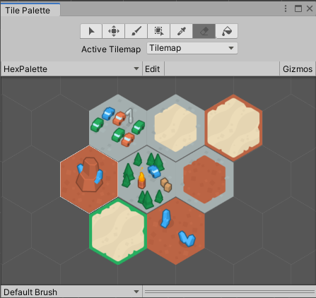
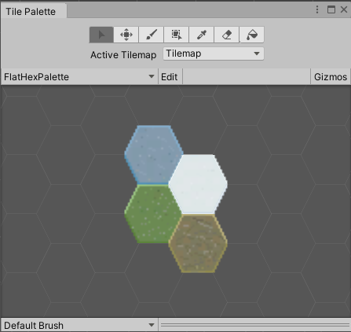
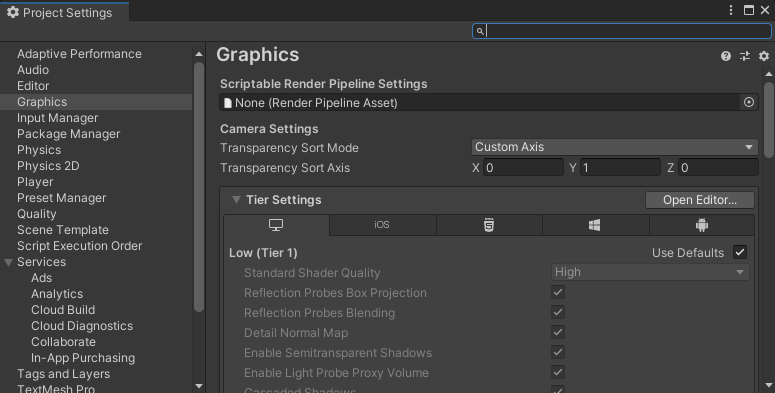

# 使用瓦片地图创建世界

## 1. 瓦片地图 Tilemap 系统

### 1.1 概念

> [Tilemap 官方手册](https://docs.unity3d.com/cn/2021.2/Manual/class-Tilemap.html)

Tilemap 是 2D 游戏中，用来构建世界的工具，这个工具使用技术的好坏，直接影响到你制作 2D 游戏时的工作量

The Tilemap component is a system which stores and handles Tile Assets for creating 2D levels.  
瓦片地图组件，是一个存储和操作 Tile 资源的系统，用来创建 2D 关卡。

It transfers the required information from the Tiles placed on it to other related components such as the Tilemap Renderer and the Tilemap Collider 2D.  
该系统还可以将所需信息通过所包含的 Tiles 传输到其他相关组件，例如 Tilemap Renderer 和 Tilemap Collider 2D。

创建瓦片地图时，Grid 组件自动作为瓦片地图的父级，并在将瓦片布置到瓦片地图上时作为参照

相关概念：

素材相关：

- Sprite(精灵)：纹理的容器。大型纹理图集可以转换为精灵图集(Sprite Sheet)
- Tile(瓦片)：包含一个精灵，以及二个属性，颜色和碰撞体类型。使用瓦片就像在画布上画画一样，画画时可以设置一些颜色和属性

工具相关：

- Tile Palette(瓦片调色板)：当你在画布(Canvas)上画画时，会需要一个位置来保存绘画的结果。类似地，调色板(Palette)的功能就是保存瓦片，将它们绘制到网格上
- Brush(笔刷)：用于将画好的东西绘制到画布上。使用 Tilemap 时，可以在多个笔刷中任意选择，绘制出线条、方块等各种形状

组件相关：

- Tilemap（瓦片地图）：类似 Photoshop 中的图层，我们可以在 Tilemap 上画上 Tile
- Grid(网格)：用于控制网格属性的组件。Tilemap 是 Grid 的子对象。Grid 类似于 UI Canvas(UI 画布)。
- Tilemap Renderer(瓦片地图渲染器)：是 Tilemap 游戏对象的一部分,用于控制 Tile 在 Tilemap 上的渲染，控制诸如排序、材质和遮罩等。

### 1.2 分类

- Rectangler 矩形瓦片地图
- Hexagonal 六边形瓦片地图：除常规瓦片地图外，Unity 还提供 Hexagonal Point Top Tilemap 和 Hexagonal Flat Top Tilemap 瓦片地图。六角形瓦片通常用于战略类桌面游戏，因为它们的中心与边上的任何点之间具有一致的距离，并且相邻的瓦片总是共享边。因此，这些瓦片非常适合构建几乎任何类型的大型游戏区域，并让玩家做出关于移动和定位的战术决策。
    
   点朝顶部的六角形瓦片示例  
    
   平边朝顶部的六角形瓦片示例
- Isometric 等距瓦片地图: 等距透视图显示所有三个 X、Y 和 Z 轴，因此可以将伪深度和高度添加到瓦片地图。  
   等距瓦片地图常用于策略类游戏，因为等距透视图允许模拟 3D 游戏元素，例如不同的海拔和视线。这样可使玩家在游戏过程中做出关于移动和定位的战术决策。

> 参考资料：
>
> - [【Unity】使用 Tilemap 创建等距视角 (Isometric) 的 2D 环境](https://zhuanlan.zhihu.com/p/91186217)

## 2. 瓦片 Tile

**瓦片**是排列在**瓦片地图**上的**资源**，用于构建 2D 环境。每个瓦片引用一个选定的**精灵**，然后在瓦片地图网格上的瓦片位置处渲染该精灵。

- Tile ：新版本中已经看不到，但可以使用
- Scriptable Tile：自编程瓦片
- Rule Tile：规则瓦片
- Animated Tile：动画瓦片

## 3. 瓦片地图工作流程

0. 预处理 sprite 资源：将图片资源拖拽到 project 中，生成 sprite；然后一般需要进行切割 slice ，将其配置成需要的各个 tile;
1. 创建要在其上绘制瓦片的瓦片地图。此过程中还会自动创建 Grid 游戏对象作为瓦片地图的父级。
2. 直接创建瓦片资源，或者通过将用作瓦片素材的精灵带入 Tile Palette 窗口自动生成瓦片。
3. 创建一个包含**瓦片资源**的 Tile Palette，并使用各种笔刷来绘制到**瓦片地图**上。
4. 可以将 Tilemap Collider 2D 组件连接到瓦片地图以便使瓦片地图与 Physics2D 交互。

一般 Tilemap 创建三个，分别为:

- background(地图背景)
- bound(边界)
- foreground(前景，主要是地形)

## 4. 瓦片地图的高级使用

使用普通的瓦片地图，构建整个世界，一个一个格子用笔刷来填充，非常费时，Unity 在不断地升级中，添加了很多种快速构建瓦片地图的方式，掌握了这些方法，能够极大减少绘制地图所用的时间。

### 4.1 编程瓦片 Scriptable Tile

Unity 支持用代码创建自己的 Tile 类，自己书写瓦片的绘制规则。

还可以为瓦片创建自定义编辑器。这与脚本化对象的自定义编辑器的工作方式相同。

创建一个继承自 TileBase（或 TileBase 的任何有用子类，如 Tile）的新类。重写新的 Tile 类所需的所有方法。

### 4.2 编程画笔 Scriptable Brush

Unity 也支持创建自己的 Brush 类，设计适合自己游戏的网格画笔。

创建一个继承自 GridBrushBase（或 GridBrushBase 的任何有用子类，如 GridBrush）的新类。重写新的 Brush 类所需的所有方法。

创建可编程画笔后，画笔将列在 Palette 窗口的 _Brushes 下拉选单 中。默认情况下，可编程画笔脚本的实例将经过实例化并存储在项目的 Library_ 文件夹中。对画笔属性的任何修改都会存储在该实例中。如果希望该画笔有多个具备不同属性的副本，可在项目中将画笔实例化为资源。这些画笔资源将在 Brush 下拉选单中单独列出。

### 4.3 2D Tilemap Extras （2D 瓦片地图扩展）

> [2D 瓦片地图扩展--官方文档](https://docs.unity3d.com/Packages/com.unity.2d.tilemap.extras@2.2/manual/index.html)

#### 4.3.1 Animated Tile 动画瓦片

动画瓦片在游戏运行时，按顺序显示 Sprite 列表以创建逐帧动画

#### 4.3.2 Rule Tile 规则瓦片

可以为每个瓦片创建规则，在绘制时，unity 会自动响应这些规则，绘制地图时更加智能

RuleTile 使用步骤：

- 准备 Tile 素材，配置素材属性，分割素材；
- 新建 RuleTile，为其添加规则，设置每个 Tile 的相邻规则；
- 将设置好的 RuleTile 拖拽到 Tile Palette 中，就可以使用了

#### 4.3.3 Rule Override Tile / Advanced Rule Override Tile 规则覆盖瓦片

可以用已经生成好的 Rule Tile，作为 Rule Override Tile 的规则来源，只替换对应的瓦片素材，而沿用原先的规则，可以快速的创建规则瓦片的方法

> 参考资料：
>
> - [2D TileMap Extras 官方文档](https://docs.unity3d.com/Packages/com.unity.2d.tilemap.extras@2.2/manual/index.html)
> - [使用 Rule Tile 官方教程](https://learn.unity.com/tutorial/using-rule-tiles#5fe9914fedbc2a28d93ce460)

## 5. 场景中图形排序

### 5.1 伪透视图

透视图指的是有深度、距离感的图，一般要三维中的深度轴来表现场景的深度，而二维游戏中没有这个深度，只能通过前后来仿造深度效果，称为“伪透视图”

先前通过调整瓦片的 Order in Layer 属性来解决了瓦片地图的排序问题，但并非总是希望一个游戏对象在另一个游戏对象之上，比如，在同一个瓦片地图中，玩家角色在一个物体之前（比如一棵树）时，应该是玩家遮挡树，而玩家移动到树后时，应该是树遮挡玩家，这就需要“伪造”透视图。

在 2D 游戏中，场景里的 **“前后”** 是由 Y 轴决定的，需要让 Unity 根据游戏对象的 y 坐标来绘制游戏对象

Y 轴 y 坐标值越小，越靠前，应该遮挡 y 坐标值较大的游戏对象，也就是 y 坐标较小的游戏对象后绘制，就会位于上层

在游戏中，如果要设置 2D 伪透视试图，需要在项目设置中进行更改：

Edit > Project Settings > Graphics > Camera Settings > Transparency Sort Mode = Custom Axis > Transparency Sort Axis x = 0 / y = 1 / z = 0

此设置告诉 Unity 在 y 轴上基于精灵的位置来绘制精灵。

按 Play 以进入运行模式并测试你的更改。现在，你的角色比箱子高时，角色应该会绘制在箱子的后面；而角色比箱子低时，绘制在箱子的前面。

### 5.2 Sprite 轴心 pivot

每个 Sprite 都有一个轴心（中心点），Unity 根据 pivot 对 sprite 进行定位，这个 pivot 可以在 sprite editor 中调整，可以将其设置到 sprite 上任意位置

在 2D Rpg 游戏场景中的游戏对象，如果想要实现较为真实的 “伪透视” 效果，最好将游戏对象的 sprite 中 pivot 都设置到素材的最下方正中。

然后将游戏对象的 Sprite Sort Point 由 Center 改为 Pivot 即可

 

 

配套视频教程：
[https://space.bilibili.com/43644141/channel/seriesdetail?sid=299912](https://space.bilibili.com/43644141/channel/seriesdetail?sid=299912)

文章也同时同步微信公众号，喜欢使用手机观看文章的可以关注

