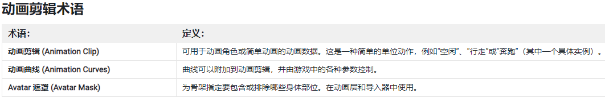
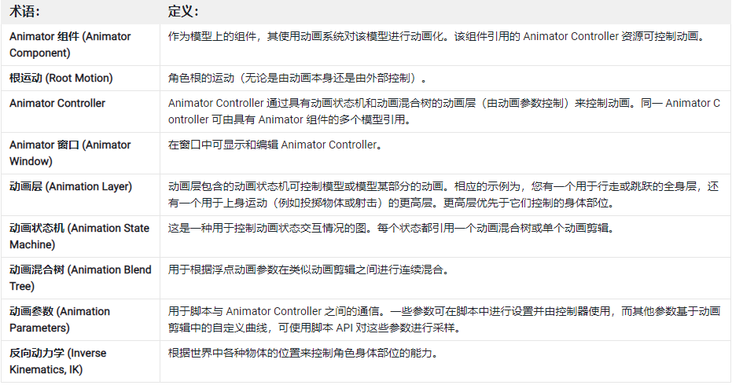
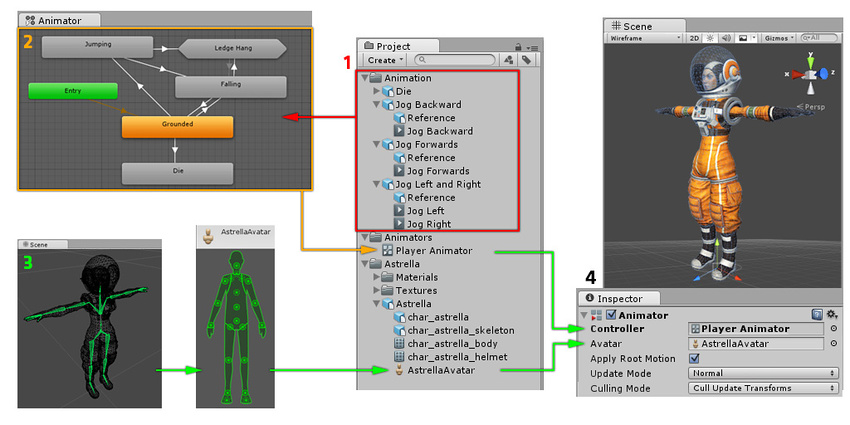
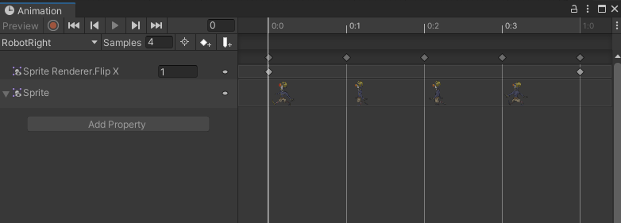
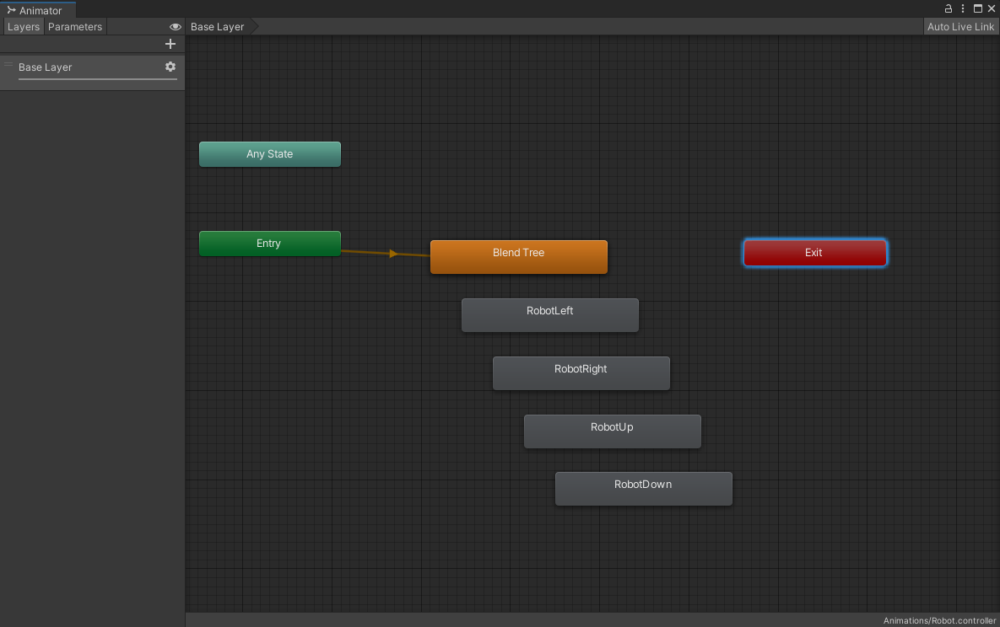

# 2D 精灵动画 2D Sprite Animation

> 相关资源：
>
> - [教程链接](https://learn.unity.com/tutorial/jing-ling-dong-hua?uv=2020.3&projectId=5facf921edbc2a2003a58d3a)
> - [2D Animation 包文档 - 逐帧动画](https://docs.unity3d.com/Packages/com.unity.2d.animation@7.0/manual/FFanimation.html)

动画在 unity 中本身就是一个较为复杂的功能模块，此文档只介绍当前项目中 2D 逐帧动画的制作，其他还有如：3D 动画、2D 骨骼动画等，会放在后期专门讲动画制作的系列中。

## 1. 动画术语

对我这个老猿来说，动画是个完全陌生的领域，所以必须先了解 Unity 中的动画术语（以下截图来自 Unity 官方手册）

**动画剪辑术语**

**Animator 和 Animator Controller 术语**

**其他术语**

- Mecanim (Mecanim Animation System) ：  
  代指 unity 中的整个 “ 动画系统 ”，包含其他所有元素
- Avatar：  
  Unity 动画系统 Mecanim 中的简化骨骼结构和 3d 素材中实际骨骼间建立的映射，称为 Avatar（替身）

## 2. unity 动画工作流程

动画剪辑（Animation clip）是动画的基本组成部分，包含某些对象应如何随时间改变其位置、旋转或其他属性的相关信息。

动画剪辑一般和不同的状态相挂接，比如“静止状态”挂接站立不移动时的动画、“奔跑状态”挂接跑动的动画剪辑....

Animator Controller 用来控制不同状态下动画的播放，以及状态间的转换

所有这些部分（动画剪辑、Animator Controller 和 Avatar）都通过 Animator 组件一起附加到某个游戏对象上。

上图显示了以下内容：

1. 每个蓝色方块代表一个动画剪辑。动画剪辑可以是从外部来源导入或在 Unity 内创建。在此示例中，它们是导入的动作捕捉人形动画。
2. 在 Animator 窗口中会显示 Animator Controller 的视图：图中不同的状态（可表示动画或嵌套的子状态机）显示为通过线条连接的节点。此 Animator Controller 作为资源存在于 Project 窗口中（箭头所指向的 Player Animator）。
3. 骨架角色模型（在本示例中为宇航员“Astrella”）具有映射到 Unity 常见替身格式骨骼的特定配置。此映射作为导入的角色模型的一部分存储为 Avatar 资源，并且在 Project 窗口中显示（如图所示）。
4. 对角色模型进行动画化时，角色模型会附带一个 Animator 组件。在上图所示的 Inspector 视图中，您可以看到一个 Animator 组件，该组件已绑定了 Animator Controller 和替身 Avatar。Animator 将这些一起用于对模型的动画化过程。仅在对人形角色进行动画化时，才需要引用 Avatar。对于其他动画类型，只需 Animator Controller。

## 3. Animation clip 动画剪辑

可以是外部导入，也可以在 Unity 中创建

外部导入的，一般是角色骨骼动画；unity 中创建的，一般是轨迹移动动画，在 Animation 窗口中创建

游戏对象任何组件中的任何属性都可以进行随时间变化的动画处理。比如：随时间推移而变化的颜色，也可以是大小变化

Animation 窗口被分为两个部分：

- 左侧用于动画化属性
- 右侧的时间轴显示每个属性的关键帧

## 4. Animator Controller 动画控制器

用状态机来控制不同的动画剪辑，在 Animator 窗口中编辑

Animator 分为两个部分，左侧是 Layers 和 Parameters，右侧是动画状态机 (Animation State Machine)：

- 第 1 部分：Layers 和 Parameters  
  Layers 可用于 3D 动画，因为你可以将动画用于角色的不同部分。  
  Parameters 由我们的脚本用来向 Controller 提供信息。
- 第 2 部分：动画状态机  
  动画状态机以图形方式显示动画的所有状态以及如何从一段动画过渡到另一段动画。

混合树 (Blend Tree)，这种混合树允许你根据参数来混合多段动画。

## 5. Animator Component 动画组件

Animator 是动画组件，可以理解为一个用来处理动画的功能型容器，所有和动画相关的部分（动画剪辑、Animator Controller 和 Avatar）都通过 Animator 组件一起附加到某个游戏对象上。

 

 

配套视频教程：
[https://space.bilibili.com/43644141/channel/seriesdetail?sid=299912](https://space.bilibili.com/43644141/channel/seriesdetail?sid=299912)

文章也同时同步微信公众号，喜欢使用手机观看文章的可以关注

