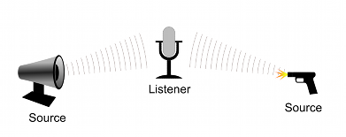
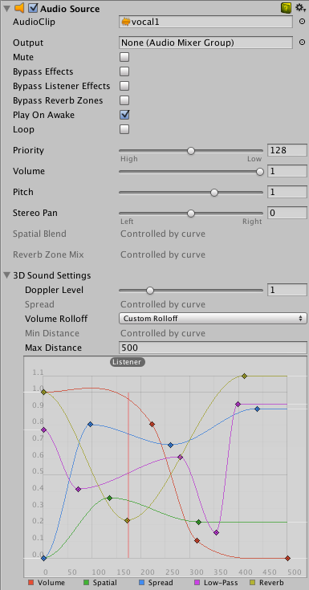

# 音频入门

> [音频官方手册](https://docs.unity3d.com/cn/2021.2/Manual/Audio.html)

## 1. 音频概述

在现实生活中，人们听到的声音是由物体发出来的。倾听者可以粗略地分辨出声音来自哪个方向，根据音量和音色判断距离。

为了模拟位置的影响，Unity 要求声音源来自附加到对象的 **音频源** Audio Source。然后，发出的声音由附加到另一个对象（通常是主摄像机）上的 **音频监听器** Audio Listener 拾取。Unity 然后可以模拟音频源与监听器物体之间的距离和位置的影响，并相应地播放给用户。此外还使用源对象和监听器对象的相对速度来模拟多普勒效应以增加真实感。

Unity 混音器 (Audio Mixer) 允许您混合各种音频源，对音频源应用效果，以及执行母带制作 (mastering)。

Unity 可以导入大多数标准音频文件格式，音频文件在 Unity 中 **音频剪辑** Audio Clip

AIFF、WAV、MP3 和 Ogg 等格式的音频文件，只需要将文件拖入 Project 面板即可。

导入音频文件会创建音频剪辑，然后可以将音频剪辑拖动到音频源中，或通过脚本来使用音频剪辑。

对于音乐，Unity 还支持音轨模块，这些模块使用短音频样本作为“编曲”，然后进行安排以播放曲调。可以从 .xm、.mod、.it 和 .s3m 文件导入音轨模块，但与普通音频剪辑的其他使用方式大致相同。

### 1.1 按功用分类

- 非剧情声音，这种声音没有可识别的音源（比如音轨，背景音乐，应该设置为 2D 格式）
- 剧情声音，这种声音具有可识别的音源（比如枪击声，应该设置为 3D 格式）

## 2. 音频剪辑 Audio Clip

音频剪辑 Audio Clip 就是在 Unity 中实际发声的音频文件

Unity 支持单声道、立体声和多声道音频资源（最多八声道）

Unity 可以导入的音频文件格式包括：.aif、.wav、.mp3 和 .ogg。Unity 还能够导入 .xm、.mod、.it 和 .s3m 格式的音轨模块。

## 3. 音频源 Audio Source

### 3.1 概念

音频源 (Audio Source) 在场景中播放 音频剪辑 Audio Clip。

如果不为音频源指定**音频剪辑**，音频源不起作用。

音频源就像一个控制器，用于启动和停止该剪辑音源的播放，以及修改其他音频属性

### 3.2 配置

核心属性：

- Audio Clip： 将要播放的声音剪辑文件。
- Output： 默认情况下，剪辑将直接输出到场景中的音频监听器 (Audio Listener)
- Mute： 如果启用此选项，则为静音
- Play On Awake： 如果启用此选项，声音将在场景启动时开始播放。如果禁用此选项，需要通过脚本使用 Play() 命令启用播放

* Loop： 启用此选项可在**音频剪辑**结束后循环播放
* Priority： 从场景中存在的所有音频源中确定此音频源的优先级。（Priority 值为 0 表示优先级最高。值为 256， 表示优先级最低。默认值为 128）
* Volume： 设置声音的大小，但请注意，除了这个属性外，玩家听到的声音，与离**音频监听器**的距离成正比，以米为世界单位
* Spatial Blend： 设置 3D 引擎对音频源的影响程度。

## 4. 音频监听器 Audio Listener

音频监听器 (Audio Listener) 充当类似于麦克风的设备。它接收来自场景中任何给定音频源的输入，并通过计算机扬声器播放声音。对于大多数应用程序，最有意义的是将监听器附加到主摄像机。

音频监听器与音频源配合使用，可让您为游戏营造听觉体验。当音频监听器连接到场景中的**游戏对象**时，任何足够接近监听器的源都将被拾取并输出到计算机的扬声器。每个场景只能有 1 个音频监听器才能正常工作。

通常，应该将音频监听器连接到主摄像机或代表玩家的游戏对象。

注意：

- 每个场景只能有一个音频监听器

## 5. Unity 中播放声音的基本使用步骤

### 5.1 通过 Unity 面板可视化控制

1. 为当前场景配置 Audio Listener，可以连接到主摄像机，或玩家游戏对象（第一人称或第三人称追尾游戏）；
2. 将音频文件素材拖拽入 project 窗口，生成 音频剪辑 Audio Clip
3. 创建空游戏对象，并为其添加 音频源 Audio Source 组件，用来配置管理 Audio Clip

### 5.2 使用代码

- 方式一（一对一）：为游戏中每个要播放声音的游戏对象都配置音频源组件，并绑定该音频源的音频剪辑，通过代码来控制该声音源组件来播放其中的音频剪辑；
- 方式二（一对多）：通过一个音频源，用代码控制播放多个不同的音频剪辑，使用 AudioSource 类对象的一个名为 PlayOneShot 的函数来实现

 

 

配套视频教程：
[https://space.bilibili.com/43644141/channel/seriesdetail?sid=299912](https://space.bilibili.com/43644141/channel/seriesdetail?sid=299912)

文章也同时同步微信公众号，喜欢使用手机观看文章的可以关注

