# 光照简介

> 参考资料：
>
> - [官方手册](https://docs.unity3d.com/cn/2021.2/Manual/class-Light.html)

## 1. Unity 光照相关概念简介

 

- 直接和间接光照
  - 直射光是发出后照射到表面一次再被直接反射到传感器（例如眼睛的视网膜或摄像机）中的光。
  - 间接光是当直射光从表面反弹时产生的额外光照,是最终反射到传感器中的所有其他光线，包括多次照射到表面的光线和天光

Unity 使用什么直接还是间接光照技术，取决于项目的配置方式

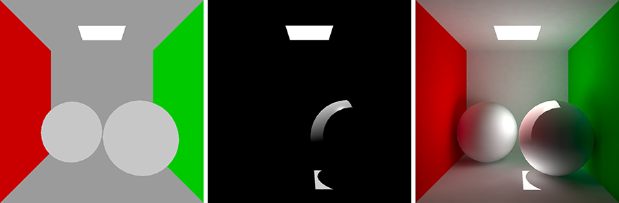
相同的场景：无光照（左）、仅具有“直射光”（居中）以及间接“全局光照”（右）。

 

- 实时光照和烘焙光照
  - 实时光照： 指 Unity 在运行时计算光照。
  - 烘焙光照： 指 Unity 提前执行光照计算并将结果保存为光照数据，然后在运行时应用。
  - 混合光照： 实时光照、烘焙光照两者的混合

在 Unity 中，项目可以使用实时光照、烘焙光照或两者的混合（称为混合光照），用来设置光源的模式（Mode）

## 2. Unity 中的光源的类型 Type

光源： 为了计算受光照影响的游戏对象的阴影效果，Unity 需要知道落在游戏对象上的光的强度、方向和颜色。该信息由光源提供。

### 1.1 Direction light 方向光

这种光源位于无限远的位置，比如太阳光

方向光对于在场景中创建诸如阳光的效果非常有用。方向光在许多方面的表现很像太阳光，可视为存在于无限远处的光源，。方向光没有任何可识别的光源位置，因此光源对象可以放置在场景中的任何位置。场景中的所有对象都被照亮，就像光线始终来自同一方向一样。光源与目标对象的距离是未定义的，因此光线不会减弱。

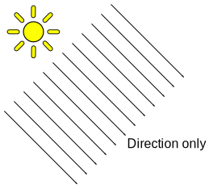

方向光代表来自游戏世界范围之外位置的大型远处光源。在逼真的场景中，方向光可用于模拟太阳或月亮。在抽象的游戏世界中，要为对象添加令人信服的阴影，而无需精确指定光源的来源，方向光是一种很有用的方法。

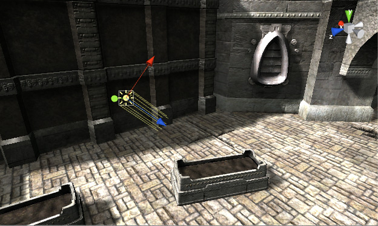

旋转默认方向光（或“太阳”）会导致“天空盒”更新。使光线与侧面成一定角度，与地面平行，便可以实现日落效果。此外，将光源指向上方会使天空变黑，就好像是夜晚一样。如果光线从上到下成一定角度，天空将像白昼。

如果选择天空盒作为环境光源，那么环境光照将根据这些颜色进行更改。

### 1.2 Point ligth 点光源

光源位于场景中的一个点，并在所有方向上均匀发光

点光源位于空间中的一个点，并在所有方向上均匀发光。照射到表面的光线的方向是从接触点返回到光源对象中心的线。强度随着远离光源而衰减，在到达指定距离时变为零。光照强度与距光源距离的平方成反比。这被称为“平方反比定律”，类似于光在现实世界中的情况。

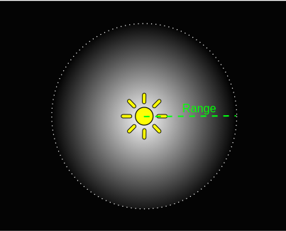

点光源可用于模拟场景中的灯和其他局部光源。您还可以用点光源逼真地模拟火花或爆炸照亮周围环境。

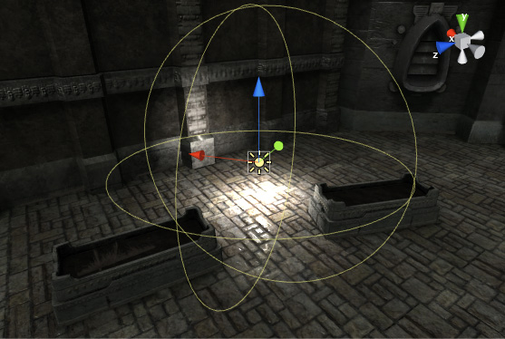

### 1.3 Area light 面光源

这种光源由场景中的矩形定义，并沿表面区域均匀地向所有方向发光，但仅从矩形所在的面发射

面光源是通过空间中的矩形来定义的。光线在表面区域上均匀地向所有方向上发射，但仅从矩形的所在的面发射。无法手动控制面光源的范围，但是当远离光源时，强度将按照距离的平方呈反比衰减。由于光照计算对处理器性能消耗较大，因此面光源不可实时处理，只能烘焙到光照贴图中。

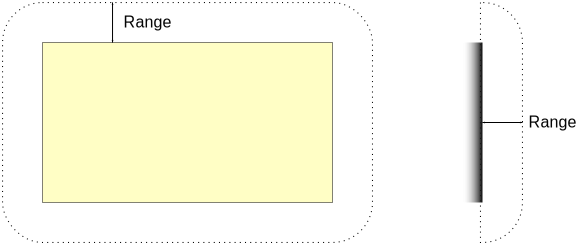

由于面光源同时从几个不同方向照亮对象，因此阴影趋向于比其他光源类型更柔和、细腻。您可以使用这种光源来创建逼真的路灯或靠近玩家的一排灯光。小的面光源可以模拟较小的光源（例如室内光照），但效果比点光源更逼真。

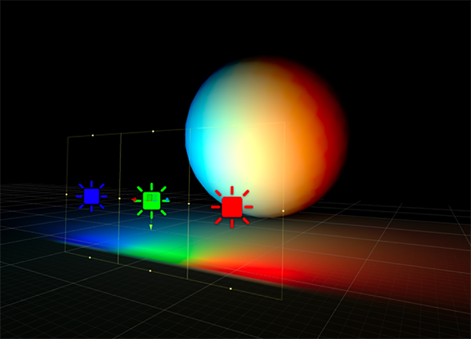

### 1.4 Spot light 聚光灯

这种光源位于场景中的一个点，并以锥体形状发光

像点光源一样，聚光灯具有指定的位置和光线衰减范围。不同的是聚光灯有一个角度约束，形成锥形的光照区域。锥体的中心指向光源对象的发光 (Z) 方向。聚光灯锥体边缘的光线也会减弱。加宽该角度会增加锥体的宽度，并随之增加这种淡化的大小，称为“半影”。

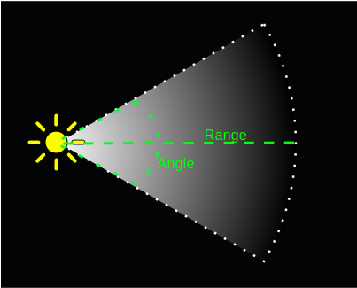

聚光灯通常用于人造光源，例如手电筒、汽车前照灯和探照灯。通过脚本或动画控制方向，移动的聚光灯将照亮场景的一小块区域并产生舞台风格的光照效果。

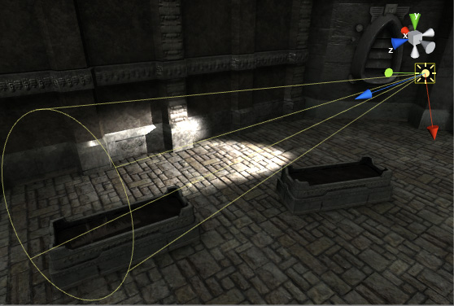

## 3. Light 组件

> [光源组件官方手册文档](https://docs.unity3d.com/cn/2021.2/Manual/class-Light.html)

根据项目使用的渲染管线，Unity 在 Light Inspector 中显示不同的属性。

下图对应的是 内置渲染管线 中的光源组件属性

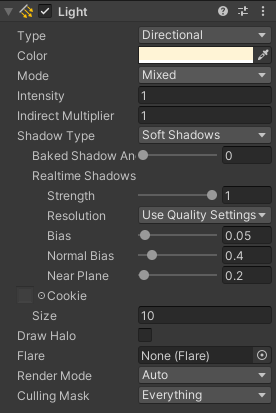

## 4. Lighting 窗口

Lighting 窗口（菜单：**Window** > Rendering > **Lighting**）是 当前项目的总体光照设置。

使用 Lighting 窗口调整与场景中的光照有关的设置，并根据质量、烘焙时间和存储空间来优化预计算的光照数据。

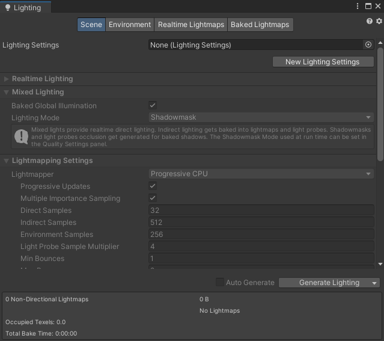

## 5. Light Explorer 窗口

在 Light Explorer 窗口中可选择和编辑光源。要从菜单中打开 Light Explorer 窗口，请导航至 Window > Rendering > Light Explorer。

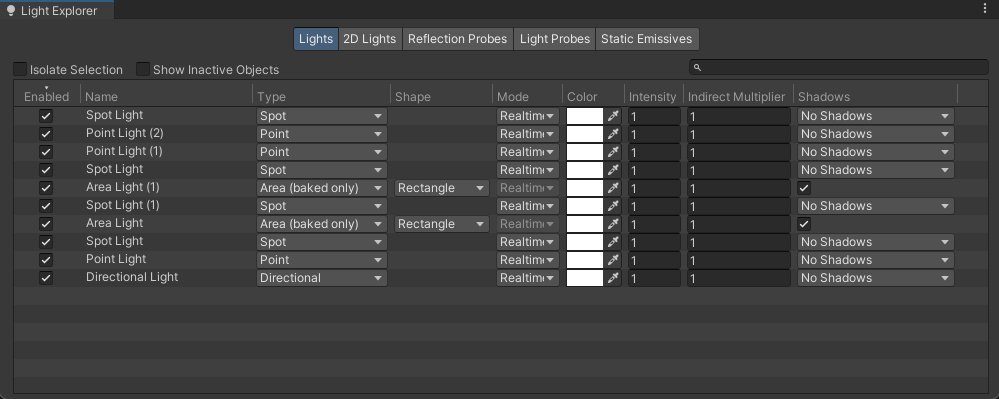

## 6. 光照贴图

光照贴图过程将预先计算场景中表面的亮度，并将结果存储在称为“光照贴图”的纹理中供以后使用。

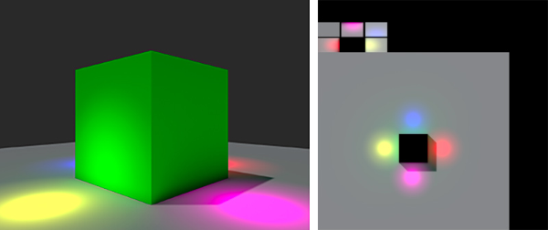

## 7. 光照探针

### 7.1 概念

通过**光照探针**可以捕获并使用穿过场景空白空间的光线的相关信息。

与光照贴图类似，光照探针存储了有关场景中的光照的“烘焙”信息。不同之处在于，光照贴图存储的是有关光线照射到场景中的表面的光照信息，而光照探针存储的是有关光线穿过场景中的空白空间的信息。

光照探针是在烘焙期间测量（探测）光照的场景位置。在运行时，系统将使用距离动态游戏对象最近的探针的值来估算照射到这些对象的间接光。

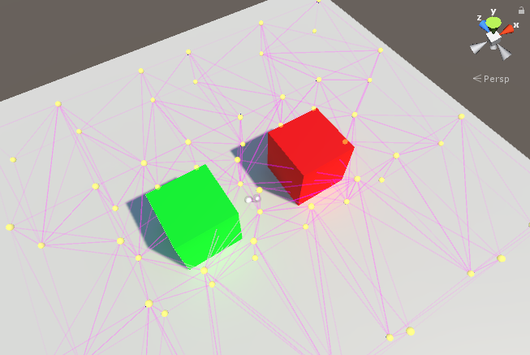

### 7.2 用途

光照探针有两个主要用途：

- 光照探针的主要用途是为场景中的移动对象提供高质量的光照（包括间接反射光）。

- 光照探针的次要用途是在静态景物使用 Unity 的 **LOD（细节级别）系统**时提供该景物的光照信息。

 

 

配套视频教程：
[https://space.bilibili.com/43644141/channel/seriesdetail?sid=299912](https://space.bilibili.com/43644141/channel/seriesdetail?sid=299912)

文章也同时同步微信公众号，喜欢使用手机观看文章的可以关注

