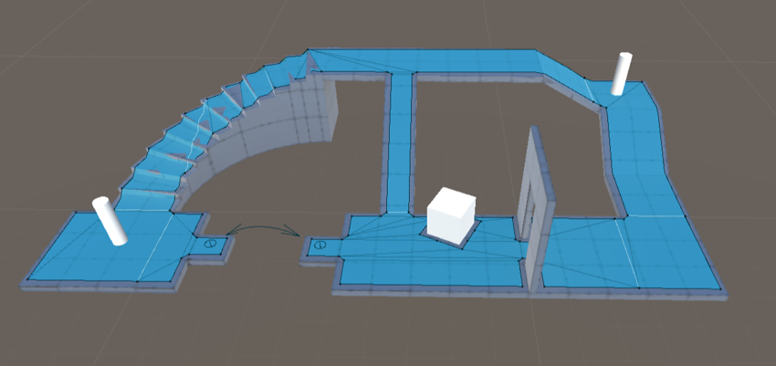
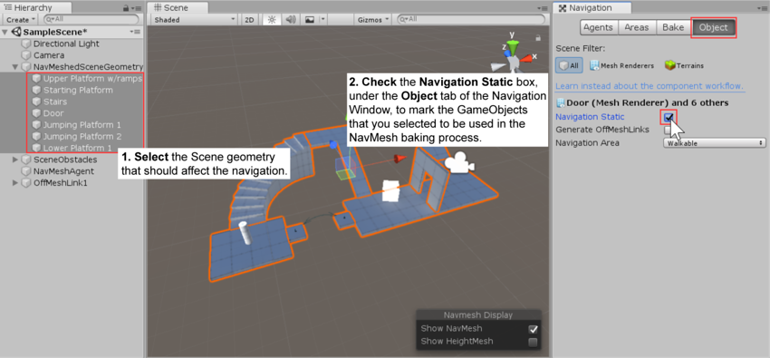
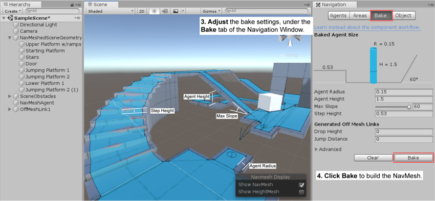

# NavMesh 导航网格实现简单 AI

> 参考资料：
>
> - [导航和寻路官方手册](https://docs.unity3d.com/cn/2021.2/Manual/Navigation.html)

## 1. 简介

导航系统允许使用从场景几何体自动创建的导航网格来创建可在游戏世界中智能移动的角色。动态障碍物可让您在运行时更改角色的导航，而网格外链接 (Off-Mesh Link) 可让您构建特定动作，如打开门或从窗台跳下。

[导航系统的内部工作原理-官方手册文档](https://docs.unity3d.com/cn/2021.2/Manual/nav-InnerWorkings.html)
 

## 2. Unity 中的导航系统组成

 

- 导航网格（即 Navigation Mesh，缩写为 NavMesh）  
   是一种数据结构，用于描述游戏世界的可行走表面，并允许在游戏世界中寻找从一个可行走位置到另一个可行走位置的路径。该数据结构是从关卡几何体自动构建或烘焙的。
- 导航网格代理 (NavMesh Agent) 组件：  
   可帮助您创建在朝目标移动时能够彼此避开的角色。代理使用导航网格来推断游戏世界，并知道如何避开彼此以及移动的障碍物。
- 网格外链接 (Off-Mesh Link) 组件：  
   允许您合并无法使用可行走表面来表示的导航捷径。例如，跳过沟渠或围栏，或在通过门之前打开门，全都可以描述为网格外链接。
- 导航网格障碍物 (NavMesh Obstacle) 组件：  
   可用于描述代理在世界中导航时应避开的障碍物。由物理系统控制的木桶或板条箱便是障碍物的典型例子。障碍物正在移动时，代理将尽力避开它，但是障碍物一旦变为静止状态，便会在导航网格中雕刻一个孔，从而使代理能够改变自己的路径来绕过它，或者如果静止的障碍物阻挡了路径，则代理可寻找其他不同的路线。

 

## 3. 添加导航网格

导航网格 (NavMesh) 是在地面上不可见的形状，定义了一个可以让选定游戏对象在其中移动的区域。

当某个游戏对象标识为 Static 时，Unity 的导航系统会认为该游戏对象不会移动。游戏环境由许多游戏对象和许多 Mesh Renderer（网格渲染器）组件组成。来自 Mesh Renderer 组件（其游戏对象被标记为 Static）的所有网格将组合构成导航网格的基础。

步骤：

1. 选择应影响导航的场景几何体：可行走表面和障碍物。
2. 选中 Navigation Static 复选框以便在导航网格烘焙过程中包括所选对象。
   
3. 调整烘焙设置以匹配代理大小。 - Agent Radius 定义代理中心与墙壁或窗台的接近程度。 - Agent Height 定义代理可以达到的空间有多低。 - Max Slope 定义代理走上坡道的陡峭程度。 - Step Height 定义代理可以踏上的障碍物的高度。
4. 单击 Bake 以构建导航网格。
   

每当 Navigation 窗口打开且可见时，生成的导航网格便会在场景中显示为底层关卡几何体上的蓝色覆盖层。

 

 

配套视频教程：
[https://space.bilibili.com/43644141/channel/seriesdetail?sid=299912](https://space.bilibili.com/43644141/channel/seriesdetail?sid=299912)

文章也同时同步微信公众号，喜欢使用手机观看文章的可以关注

