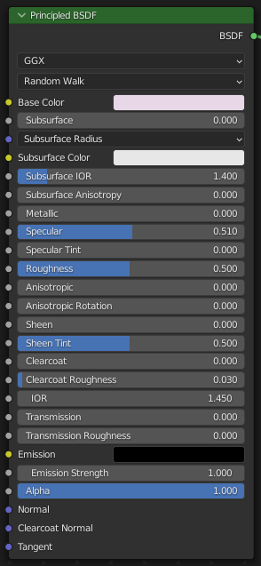

# Shader Editor 简介

## 1. Shader Editor

Shader 着色过程，是整个渲染管线中的一个阶段。

Shader 着色器可视化编辑器，用来编辑各个 Node，组成着色流程逻辑，由 blender 最终转化成可以执行的 Shader 程序。

### 1.1 Object & slot & Material 关系

slot 中，存储的是 Material 到 对象上的 Link 关系。

一个对象，可以通过 不同的 Slot 把多个不同的 Material 挂接到对象表面的不同区域

一个 Material 也可以挂接到不同的对象上

一个对象，可以有多个不同的 Slot，Slot 属于具体的对象；而 Material 是独立的数据集，可以挂接到多个不同的对象，可以重复使用。

删除对象后，它所拥有的 Slot 就不再存在，但是 Material 并不会随之被删掉，可以继续使用，除非直接删除 Material 文件。

## 2. Shader Node

Shader Node 泛指 Shader Editor 中的任意节点 Node ，一个 Node 就是一个矩形面板，在其中可以根据其功能进行各种配置，相当于 Shader 编程中的一个逻辑单元

### 2.1 关键概念

- 着色器流程：指的是整个 Shader Editor 中编辑好的一整个着色逻辑，即选中物体的着色方案
- 输入、输出接口：也可以称为节点接口，即节点上的圆点，左侧为输入，右侧为输出，不同颜色代表不同类型，即接口传输的数据类型

### 2.2 节点分类

Shader Editor 中的节点有很多种类，分别承担不同的功能

### 2.3 默认材质 shader Node

Principled BSDF 是 Blender 默认材质 Shader node

> 官方概念:  
> Principled BSDF 将多个层组合成一个易于使用的节点。 它基于迪士尼原理模型，也称为“PBR”着色器，使其与其他软件兼容，如皮克斯的 Renderman® 和虚幻引擎 ®。 从 SubstancePainter® 等软件绘制或烘焙的图像纹理可以直接链接到此着色器中的相应参数。

BSDF: 双向散射分布函数，指的是一种处理光线散射的算法，用来处理 shader 中的光线散射效果。

通过不同的参数配置，可以得到不同的颜色、光照、纹理等效果，以产生丰富多变的表皮外观

重要参数：

- Base color 基础色 —— 连接到 BSDF 中的 basecolor
- Metallic 金属 —— 数据源为 Non-color data，连接到 BSDF 中的 metallic
- Roughness 粗糙度—— 数据源为 Non-color data，连接到 BSDF 中的 roughness
- Normal 法线 —— 数据源为 Non-color data，新建 Vector - normal map 节点，新建 Vector-bump node 节点，连接到 normal，再连接到 BSDF 中的 normal
- Height/displacement 等高线 —— 数据源为 Non-color data，连接到 BSDF 中的 metallic
- Ambient occlusion 环境光遮蔽—— Blender 已经自动处理了，不过在游戏引擎里需要用到

## 3. Shader 基本操作流程

1. 选择图形对象，通过 slot 添加材质或挂接材质
2. 整个 Shader 操作的核心资源是 Material ，需要配置好材质，比如设置纹理、配置颜色等
3. 灵活使用各种节点，设计 Shader 流程，将设置好的材质最终输出给对象，用于渲染展示

 

 

配套视频教程：
[https://space.bilibili.com/43644141/channel/seriesdetail?sid=299912](https://space.bilibili.com/43644141/channel/seriesdetail?sid=299912)

文章也同时同步微信公众号，喜欢使用手机观看文章的可以关注

