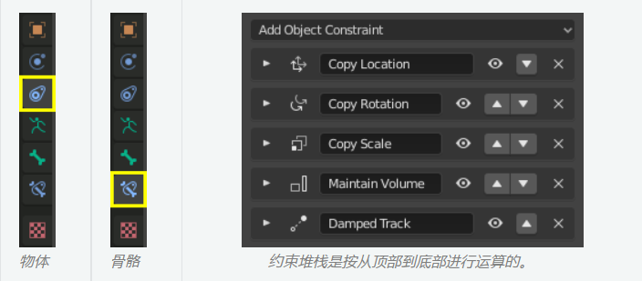
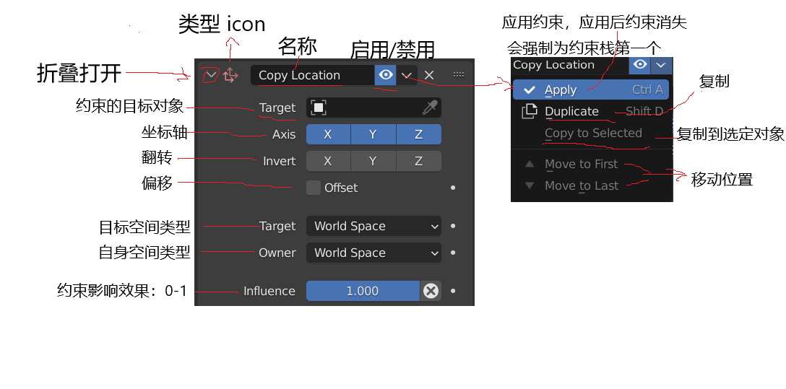
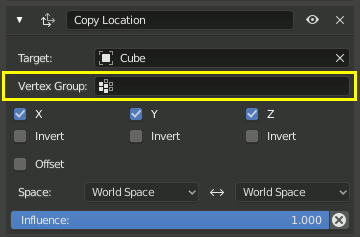
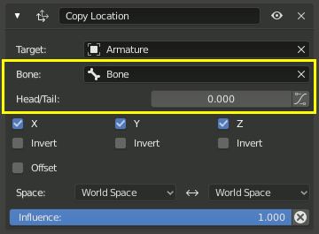
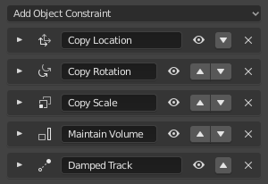

# Constraint 约束

## 1. 简介

### 概念：

约束是通过使用数值 (如 限制位置约束), 或者目标对象(如 复制位置约束)来控制物体属性(例如其位置、旋转、缩放)的方法。

### 用途：

它的主要用途在动画项目中。

约束可以使网球运动员眼睛跟踪网球弹跳地穿过球场、可以让一辆巴士所有车轮一起旋转，也可以帮助一只恐龙的腿抬高时膝盖处自动弯曲，或者轻松地让手握住剑柄并挥动剑。

约束可以相互组合，形成一个约束堆栈。有顺序之分，而且改变顺序会影响效果

### 目标对象分类：

- 对象间约束：Object Constraint
- 骨骼约束： Bone Constraint

两类约束，大部分操作都是相同的，而且还可以互相添加，比如对象约束的目标是骨骼，骨骼的也可以设置目标为普通对象

## 2. 基本操作

- 在 Object Mode 下，选中对象后，在他的 Constraint 属性分页中，可以添加或删除约束
- Object Mode 和 Pose Mode 下，通过菜单 Object ‣ Constraint 也可以操作约束

要注意的是约束是加载到当前选定的对象上，而目标则是控制约束的

即 Target 控制 Constraint 的 Owner，约束在哪个对象身上，谁就受控制

### 2.1 约束 UI

通用操作 UI：

如果 Target 字段链接到 Mesh 或 Lattice 对象，则会出现一个 Vertex Group 字段。 输入顶点组的名称，约束将针对该顶点组的中点而不是对象的原点。

如果目标链接到的是 骨架 ，下面则会同时出现 骨骼 的输入框和 头/尾 滑动框。输入骨骼的名称，约束将以该骨骼为目标，而不是整个骨架的原心。

## 3. 堆栈

影响物体的所有约束的组合被称为约束堆栈

在堆栈中的约束是从顶部到底部计算的。每个约束的顺序对堆栈的最终结果有实质性的影响。更改约束的顺序可以更改整个堆栈的行为。

若要更改约束的顺序在( header 标题栏)中点击向上/向下箭头。

## 4. 功能分类

根据约束的具体功能，可以分为下面四大类：

- 运动追踪
- 变换
- 跟踪
- 关系

 

 
 

> 参考资料：
>
> - [Constraint 官方文档](https://docs.blender.org/manual/zh-hans/latest/animation/constraints/introduction.html)

 

 

配套视频教程：
[https://space.bilibili.com/43644141/channel/seriesdetail?sid=299912](https://space.bilibili.com/43644141/channel/seriesdetail?sid=299912)

文章也同时同步微信公众号，喜欢使用手机观看文章的可以关注

