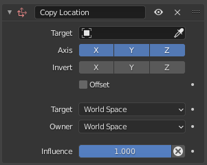
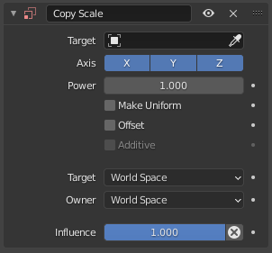
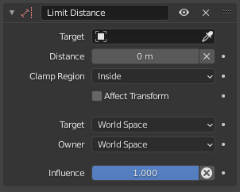
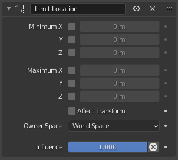
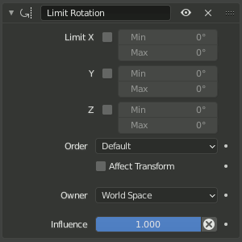

# 基本变换约束

## 1. Copy L/R/S Constraint

### 1.1 Copy Location Constraint 复制位置约束

> 注意：  
> 请注意，如果对 相连的 骨骼使用该约束，将不起作用，因为父级骨骼头部位置决定了该骨骼根部所在位置。

复制位置 ：强制添加约束的对象和 target 对象的位置相同

Offset:偏移量  
启用后，允许约束对象(使用其当前的变换属性)相对于目标位置产生偏移。

### 1.2 Copy Rotation Constraint 复制旋转约束

复制旋转: 强制添加约束的对象匹配目标对象的旋转

混合(Mix):

指定如何混合约束的旋转和自身现有的旋转

- Replace 替换 : 新的旋转值直接替换现有的值
- Add 累加: 新的旋转值与现有的值相加
- Before Original：添加在现有的旋转之前
- After Original：添加在现有的旋转之后
- Offset (Legacy)：这将和旧版“偏移”复选框的行为一样。 它原本打算与 Before Original（在初值之前） 行为类似，但是在多轴旋转中无法正常工作，因此已弃用。

### 1.3 Copy Scale Constraint 复制缩放约束

复制缩放(Copy Rotation)：添加约束对象获得目标对象的缩放

> 注意：  
> 在这里我们谈的是 缩放，而不是 大小！事实上，两个物体，一个比另一个大很多，但两者可以有相同的缩放。这对于骨骼同样成立：在 姿势模式 下，静止位置的骨骼有统一的缩放，代表它们的可见长度。

Power ： 将约束对象获得的目标比例做相乘处理

Make Uniform 一致化 : 不只复制单个轴的比例，而是将统一的比例因子应用于约束所有者的所有轴，以实现相同的整体体积变化

Offset 偏移量 ：
启用后，将目标对象的比例和约束对象自身的比例混合，而不是覆盖掉约束对象的自身比例。

Additive 添加：在 Offset 开启后，才能被选中；
启用后，在 偏移量 选项的运算将使用加法而不是乘法。

## 2. Limit L/R/S Constraint

### 2.1 Limit Distance Constraint 限定距离约束

限定距离： 添加约束的对象与目标对象保持远离、靠近或者一个给定距离。

换句话说，自身的位置被限制在以目标为中心的球体以外，以内或表面

当指定一个(新的)目标时，该 距离值 会自动设置为约束对象和该目标之间的当前距离。

> 注意：
> 请注意，如果对 相连 骨骼使用该约束，将不起作用，因为父级骨骼头部位置决定了该骨骼根部所在位置。

Distance 距离:  
该数字按钮用于设置限定距离，即约束目标为中心的球体(看不见的)半径。  
 Reset Distance X:  
单击后，将重置 距离 值，使之与约束对象与目标之间的实际距离(即应用约束前的距离)一致。

Clamp Region 钳制范围：

- Inside 向内： 将对象约束在球体 内部
- Outside 外向：将对象约束在球体 外部
- On Surface 在表面上：将对象约束在球体 表面

Affect Transform 影响变换：  
变换运算时将考虑约束以立即限制生成的变换属性值

### 2.2 Limit Location Constraint 限定位置约束

此约束可以通过设置上限和下限各自限制约束对象或者 非相连的 骨骼的 X，Y，Z 轴平移量。

对物体的限制从其中心开始计算，而骨骼则是从其根部。

### 2.3 Limit Rotation Constraint 限定旋转约束

此约束可以通过设置上下限来限制物体或者骨骼的 X，Y，Z 轴旋转量。

Order 排序: 旋转排序

### 2.4 Limit Scale Constraint 限定缩放约束

此约束可以将缩放约束设置到物体或骨骼。通过最大、最小值限制 X、Y、Z 轴缩放的范围

X, Y, Z 最小值/最大值:  
这几个复选框分别用于启用约束对象在选定 空间(Space) 的 X, Y, Z 轴向的缩放限制。下方的数值框分别用于控制其上下限。

 

 

配套视频教程：
[https://space.bilibili.com/43644141/channel/seriesdetail?sid=299912](https://space.bilibili.com/43644141/channel/seriesdetail?sid=299912)

文章也同时同步微信公众号，喜欢使用手机观看文章的可以关注

