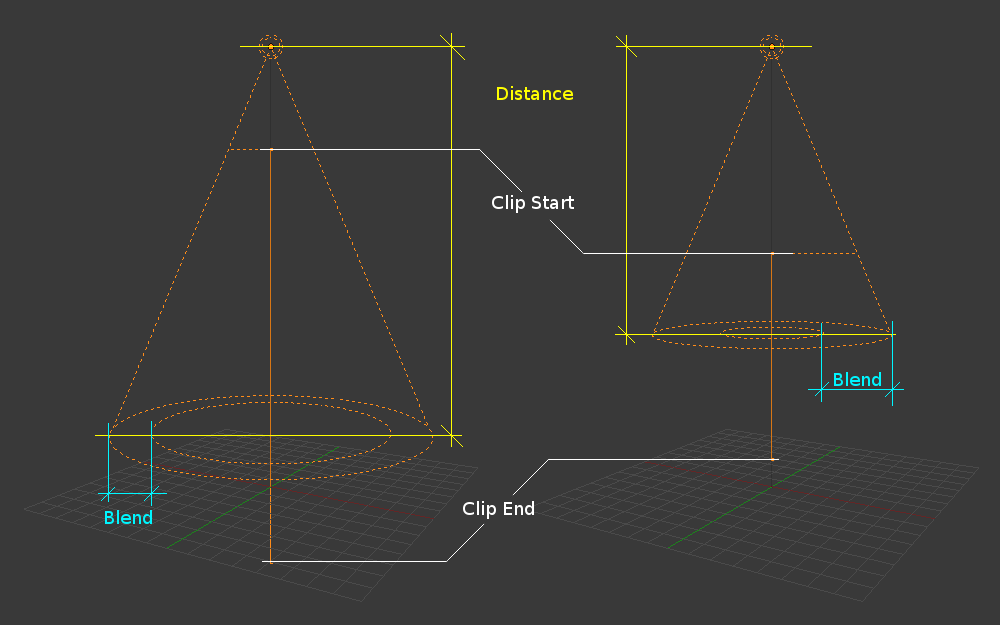

# 光 light

## 1. 渲染引擎

可以在属性窗口，Render 分页中，选择不同的渲染引擎

渲染是将三维场景转换为二维图像的过程(类似于 Unity 中的渲染管线 Render Pipe line)。Blender 内置三个各具优势的渲染引擎:

- Eevee 是基于物理的实时渲染器。

- Cycles 是基于物理的光线追踪渲染器。

- 工作台（Work Bench） 专为布局，建模和预览而设计的。

使用 插件 可以添加更多第三方渲染引擎。每个渲染器都有自己的渲染设置来控制渲染质量和性能。

渲染的效果由 相机， 灯光 和 材质 决定。这些在 Eevee 和 Cycles 之间是通用的，但某些功能仅有其一支持。

不同的 着色窗口（Shading Viewport）模式下，使用不同的渲染引擎：

1. WireFrame 线框模式 和 Solid 模式：WorkBench 引擎
2. Material Preview 材质预览模式： Eevee 引擎
3. Rendered 渲染模式： Eevee 或 Cycles 或 WorkBench

### 1.1 Eevee

eevee 是 blender 的实时渲染引擎，应用 OpenGL 技术来实现，专注于速度和交互性，同时实现了渲染 PBR 材质的目标。

eevee 使用的和 cycles 相同的着色器节点，从而易于渲染现有场景。

和 cycles 不同的是，eevee 并不是光线跟踪引擎。它使用的是通过光栅化的多种算法来估算光线与物体材质作用的方式，并不像 cycles 基于物理光线跟踪来计算每个光线的反弹。尽管 eevee 在设计上使用 PBR 的着色材质，但它并不完善，并且 Cycles 渲染器提供物理上更加精确的渲染，因为 Eevee 使用光栅化渲染所以有很大的 限制 。

简单一句话，在真实度上，Eevee 不如 Cycles ，但它是实时的。

### 1.2 Cycles

Cycles 是 Blender 用于产品级渲染，基于物理的路径跟踪器。它旨在提供易于使用以及准确的物理渲染结果，具有艺术控制和灵活的着色节点以满足生产需求。

要使用 Cycles，需在渲染属性中选择其作为 渲染引擎。在 偏好设置 ‣ 系统 ‣ Cycles 渲染设备 中启用兼容设备，可使用 GPU 加速渲染。

什么都好，但相比 Eevee，需要渲染时间

### 1.3 Workbench

Workbench Engine 是一个针对建模和动画期间的预览进行了快速渲染优化的渲染引擎。 其目的并不是为项目执行最终像素级渲染输出。 其主要任务是在 3D 视图中时显示正在处理的场景.

Workbench 虽说真实度最差，但效率最高

## 2. 光对象

Blender 中的光 Light 对象，模拟现实中的光源，通过配置属性，可以发出不同方向，不同强度，不同颜色的光线，照射到模型上，使模型的 外观和着色生效，在最终呈现时，能被我们看到这些效果。

通用属性：

- Solor 颜色：光色
- Power 光强：光照强度，以瓦特为单位，越大光线越强
- Diffuse 散射：散射强度
- Specular 反射：反射轻度
- Volume : 体积

## 3. 分类

Blender 中共有四种光源，适合于不同的环境

- Point ：点光源
- sun ：日光
- Spot ： 探照灯
- Area ： 面

## 4. 点光源 Point Light

点光源是一种全方位的光点，即一个点向各个方向辐射相同数量的光。 它由一个简单的圆圈点显示。 作为点光源，光线照射到物体表面的方向由连接光线和物体表面上的点的线决定。 它可以用作例如的简单模型 一个灯泡。

- Radius 半径：光源半径，光将从具有指定半径的球面发射。较大尺寸的灯具有更柔和的阴影和镜面高光，并且它们也会显得更暗，因为它们的功率分布在更大的区域上。

## 5. 太阳光 Sun light

太阳光提供从无限远的单一方向发射的恒定强度的光。 它对于均匀清晰的日光开放空间照明非常方便。

白天阳光强度大概在 250 左右，如果是夏日阳光直射时，可以达到 1000

特点是可以调整角度，但移动位置，并不会影响光照效果

## 6. 聚光灯 Spot light

聚光灯从锥体的尖端沿给定方向发射锥形光束。

可以通过 Gizmos 来调整角度

## 7. 面光源 Area Light

区域光模拟源自表面（或类表面）发射器的光。 例如，电视屏幕、办公室霓虹灯、窗户或多云的天空只是区域光的几种类型。 区域光通过沿着用户定义的网格大小对光进行采样来产生具有柔和边界的阴影。 这与产生锐利边界的点状人造光形成鲜明对比。

通过 Shape 属性，可以将面光源设置为不同形状

 
 

 

> 参考资料：

> - [blender 渲染引擎 官方文档](https://docs.blender.org/manual/zh-hans/latest/render/introduction.html)
> - [light 官方文档](https://docs.blender.org/manual/zh-hans/latest/render/lights/light_object.html)

 

 

配套视频教程：
[https://space.bilibili.com/43644141/channel/seriesdetail?sid=299912](https://space.bilibili.com/43644141/channel/seriesdetail?sid=299912)

文章也同时同步微信公众号，喜欢使用手机观看文章的可以关注

