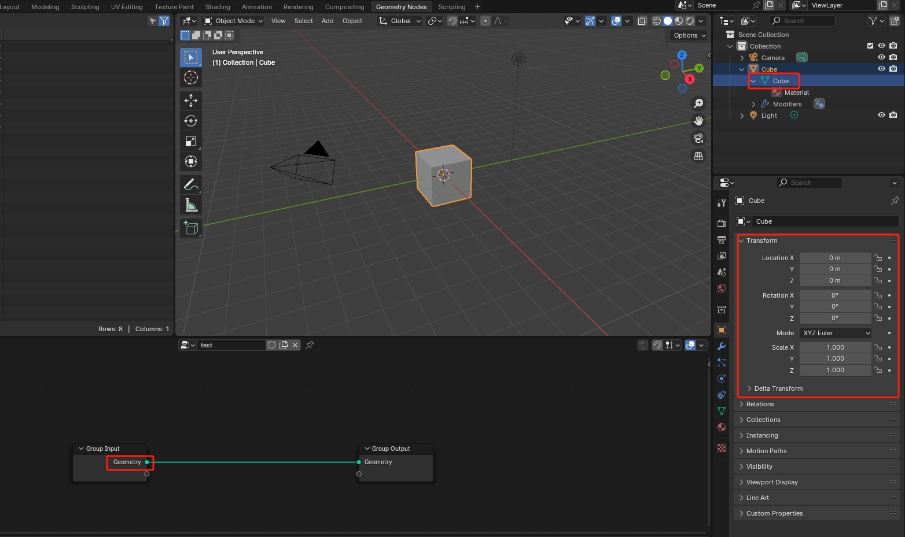
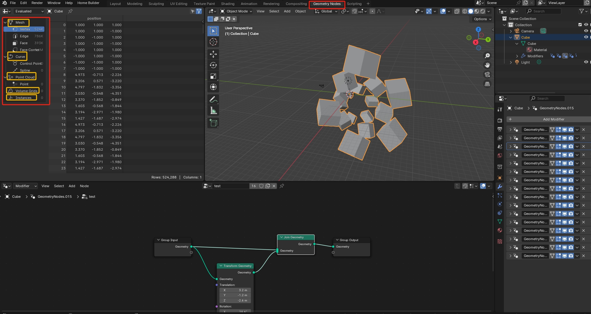

# 第一章 Geometry Node 简介

## 1. 概念

### 1.1 基础概念

#### 什么是 Blender 中的 Geometry ???

Geometry Nodes 所操作的数据，输入和输出，都是 **Geometry**

在 Blender 中，"Geometry"（几何体）是一个广泛的术语，用来描述 3D 模型或场景中构建物体形状的基本结构。

**几何体 - Gemetry** 是通过顶点（vertices）、边（edges）和面（faces）来定义的。

这些元素共同定义了模型的外观和空间占用

其核心数据就是模型所包含的 点、线、面 各元素的 **Transform** 数据

#### Geometry Node 概念

Geometry Nodes is a system for modifying the geometry of an object with node-based operations. It can be accessed by adding a Geometry Nodes Modifier.

几何节点（Geometry Nodes）是一个通过基于节点的操作来修改对象几何形状的系统。可以通过添加几何节点修改器来访问该系统。

上面的概念来自[官方文档](https://docs.blender.org/manual/zh-hans/4.1/modeling/geometry_nodes/introduction.html)

我这里给出的结论：

* **Geometry Node** 本身就是 **Modifier** ，而且是 **建模** 用的 **Modifier**
* **Geometry Node** 是针对 模型中 **几何数据（Geometry）** 的 **可视化编程语言** 

### 1.2 功能范围

几何节点可以修改不同类型的几何体：

* 网格 Meshs
* 曲线 Curves
* 点云 Point Clouds
* 体积 Volumes
* 实例 Instances

### 1.3 核心要点

几何节点模组，核心要点：

* 几何节点模组和别的模组一样，会序列化到硬盘，称为一种特殊的资源文件，一经创建，可以多次使用；同一个几何节点模组，可以加载到多个模型上。
* 同一个模型，同时可以添加多个几何节点模组，形成一个链装结构，前一个模组的输出，作为下一个模组的输入。
* 正如上一个要点，模块化的几何节点模组，可以将复杂逻辑进行拆分，增强几何节点模组的重用性。可以比对普通编程语言中的函数概念 ，函数可以拆分，函数可以重用。

## 2. 优点

### 2.1 非破坏性工作流

Geometry Nodes 的一个重要特性是非破坏性工作流。这意味着用户可以在不改变原始几何体的情况下，对其进行各种操作和修改。这种方法提供了更大的灵活性和控制力，允许用户随时调整和优化几何体。

### 2.2 可视化编程

Geometry Nodes 的另一个重要特性是几何数据可视化。用户可以轻松地查看和理解几何体的形状和结构，而无需深入到几何体的内部细节。这有助于用户更好地理解几何体的功能和作用，并更好地进行优化和调整。

### 2.3 高效且灵活

* 通过使用节点网络，用户可以显著提高建模和修改几何体的效率。复杂的几何操作可以通过少量的节点实现，从而节省大量的时间和精力。
* Geometry Nodes 提供了比传统建模方法更大的灵活性。用户可以通过调整节点参数，快速生成和修改几何体，而无需从头开始手动建模。

### 2.4 模块化且可复用

Geometry Nodes 的模块化设计使得用户可以轻松地创建和重用几何节点模组。

* 用户可以创建一个模组，然后将其应用于多个模型，从而实现对几何体的统一修改和调整。这提高了效率和效率，并提高了几何体的可复用性。
* Geometry Nodes 允许用户创建可重复使用的几何体和效果。通过保存和共享节点网络，用户可以在不同的项目中复用这些资源，提高工作效率。

## 3. 用途

Geometry Nodes 的应用领域

* 程序化建模

    程序化建模是 Geometry Nodes 的一个重要应用领域。用户可以使用 Geometry Nodes 生成复杂的建筑结构、自然景观等，通过调整参数快速创建不同的变体。

* 动画和特效

    Geometry Nodes 在动画和特效制作中也有广泛的应用。用户可以使用节点网络生成动态几何体、粒子系统等，实现各种复杂的动画和特效。

* 参数化设计

    参数化设计是一种通过调整参数来生成几何体的方法。Geometry Nodes 非常适合这种工作流，用户可以通过简单的参数调整，快速生成不同的几何体和效果。

 
 

> 参考资料
>
> * [Geometry Nodes 官方文档](https://docs.blender.org/manual/zh-hans/4.1/modeling/geometry_nodes/introduction.html)
> * [Geometry Nodes 官方教程](https://studio.blender.org/training/geometry-nodes-from-scratch/theory-basics/)