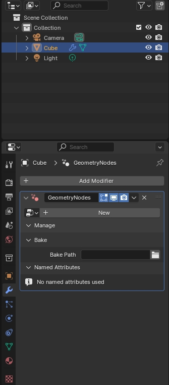
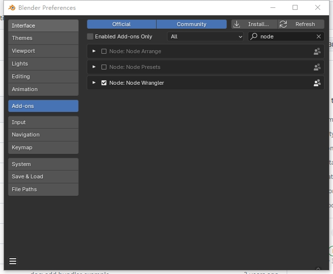
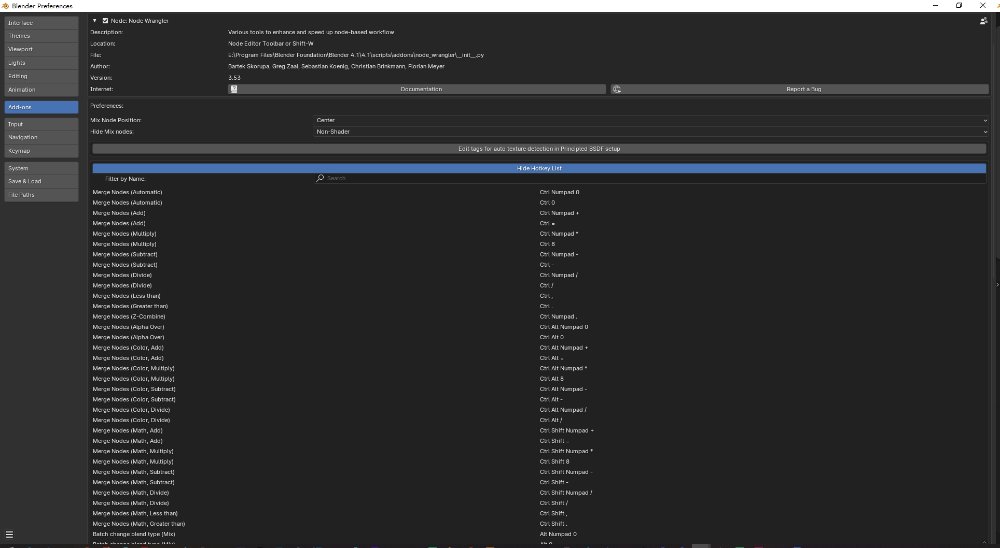
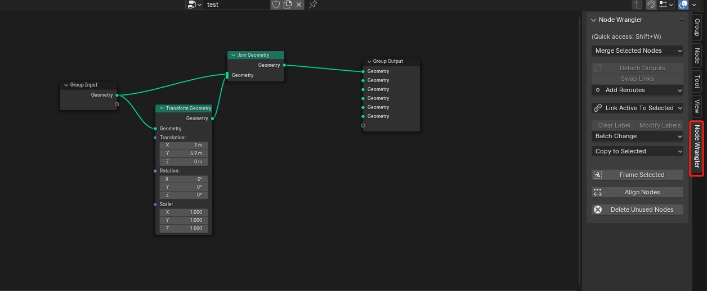
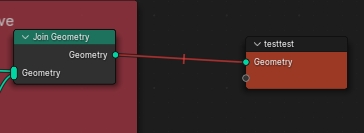
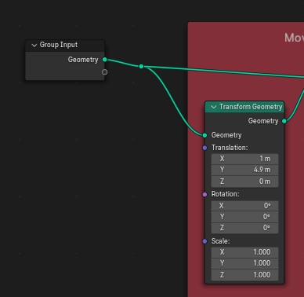

# 基本操作

## 1. Geometry Node Modifier 相关操作

两种方式添加：

* 通过属性窗口的 Modifier 分页，Add Modifier ，选择 Geometry Node Modifier，再 点击 New ，增加  Geometry Node 
  
* 直接在 Geometry Node 窗口中添加

## 2. 节点常用操作

使用 add-on 增强 Node Editor 的功能。

### 3.1 Node Wrapper

几个常用操作：

* shift + w : 打开 Node Wrapper 快捷菜单

**增删复制**
* shift + a：新建节点
* shift + d: 复制节点
* ctrl + shift + d：复制节点，同时复制连接
* x：删除选中节点  
* strl + x：删除  但保持节点的连接      
* Alt + x：删除所有未连接的节点，即清除无效节点
* backspace：重置节点，将所选节点的设置恢复为默认设置，同时保持连接。

**链接操作**
* ctrl + rmb 拖动：割断链接
* ctrl + alt + rmb 拖动：mute 链接，不割断，但哑火失效
  
* shift + rmb 拖动：在切割链接的位置，新增加一个链接点 reroute ，并不会断开连接
  

**查看结果**
* shift + alt + lmb ： 连接当前选中节点到输出节点（在几何节点中，只有几何输出可以连接到最终输出）
*  Ctrl + Shift + 左键点击节点：预览该节点信息，自动添加一个 Viewer 节点，可以预览当前节点的效果 

**懒人连接** 

* alt + rmb 拖动：懒人连接（红），它将选择最接近拖动起点和终点的节点进行连接，因此您甚至不必单击节点。
* shift + alt + rmb 拖动：懒人连接（蓝），连接前它会显示可用输入和输出的菜单，以便您可以选择要连接的确切插座。它在处理大型节点树时特别有用，因为您无需频繁放大和缩小即可建立连接。
* Ctrl + shift + rmb 拖动：懒人连接（绿），它将选择最接近拖动起点和终点的节点进行合并链接。

**分组**
* Ctrl + g：将节点分组，分组后的节点组作为一个整体，可以当做一个节点来操作（类似于将多个节点放入一个函数中，整体调用）。
* Ctrl + Alt + g：取消分组，必须选中 Group Node 才能操作，将其中的节点移出分组
* tab ： 编辑选中分组，可以通过右键激活快捷菜单 - exit group，退出编辑

**Frame**
* Ctrl + j : 创建一个新框架（Frame node），将选中的节点放入其中。
* Alt + p : 选中节点退出当前框架
* x : 删除当前框架
* F2 : 命名、重命名 分组标签

### 3.2 Node Arrange

### 3.3 Node Presets