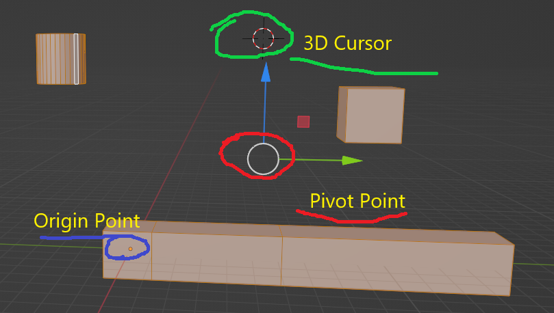
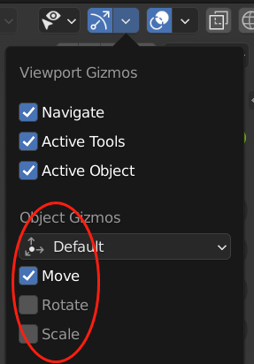
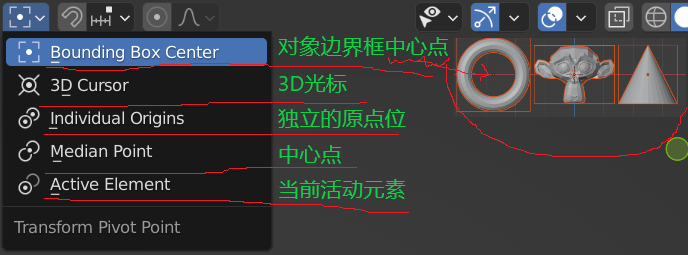
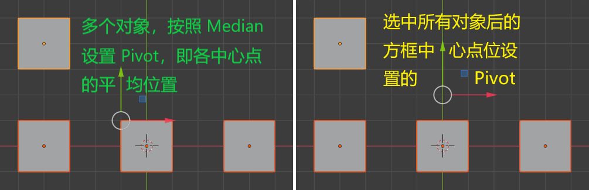
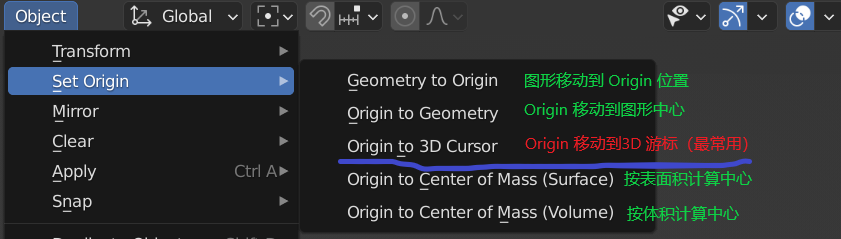
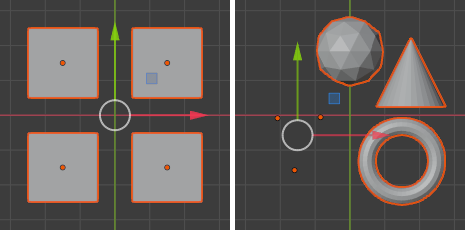

# Pivot、Origin、median、3D Cursor 区别及使用

## 1. Pivot Point 枢轴点

Pivot 在 Blender 3 中并不可见，但通过打开 Object Gismos 下面的任意复选框，可以用一个白色圆圈找到其位置

枢轴点 Pivot 是对象旋转、缩放的轴心

### 1.1 更改枢轴点位置

通过 Transform Pivot Point 下拉列表，可以更改枢轴点位置

- Object Mode ：  
  只能在 3D Cursor 和 Origin 间切换，原因是，Object 模式下，其他几个列表项都只能定位到 Origin 上

- Edit Mode：
  

Bounding Box Center 和 Media Point 区别  

## 2. Origin 原点

Origin 是对象创建时的中心点位，在 Blender 中，显示为选中对象上橙色的点。并非固定，可以随时更改位置，作为 Object 模式下 Transform 的 Pivot 点

### 更改方式：

可以通过 Object Mode： Object 菜单-> Set Origin 来设置 Origin 到不同位置

## 3. Median Point

中心点位非常类似于“重心”。

假设所有的元素（对象、面、点、线等等）都拥有相同的质量，那中心点就相当于物体的重心。

### Object Mode

在对象模式下，计算中心点时，只考虑 Origin

### Edit Mode

编辑模式下，选中的所有对象，都会被考虑进去

## 4. 3D Cursor

红白相间的救生圈一样的图标，功能很多，可以通过 Shift-s 激活 Pie Menu 来进行操作。

主要用来辅助定位，任何新建的对象，都会被定位到 3D cursor；还是用来更改 Pivot Point 位置的常用方法

用 Shift + 右键，可以将其定位到任意位置

 

 

配套视频教程：
[https://space.bilibili.com/43644141/channel/seriesdetail?sid=299912](https://space.bilibili.com/43644141/channel/seriesdetail?sid=299912)

文章也同时同步微信公众号，喜欢使用手机观看文章的可以关注

