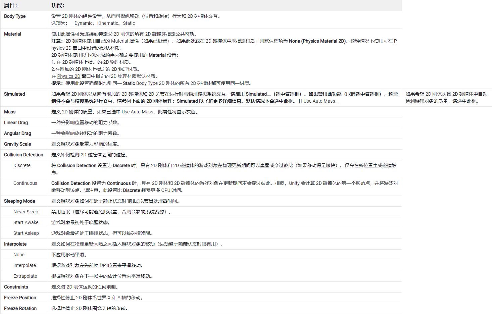
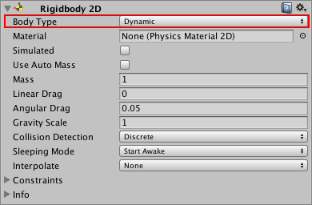
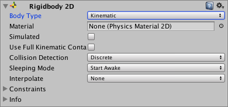
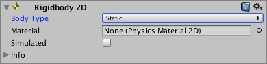
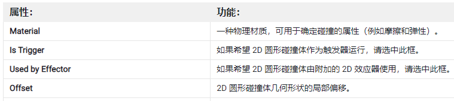
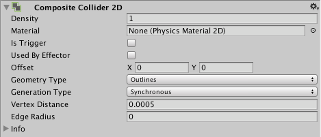
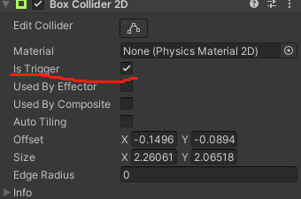
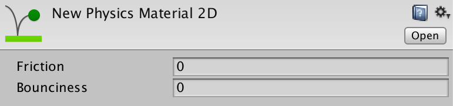

# 2D 物理系统入门

> [2D 物理系统官方手册](https://docs.unity3d.com/cn/2021.2/Manual/Physics2DReference.html)

本节主要讲 2D 物理系统中的碰撞体和刚体，2D 关节和效应器会在后面的课程中讲解

## 1. 2D 刚体 Rigidbody 2D

2D 刚体组件将对象置于物理引擎的控制之下，和 3D 标准刚体不同，刚体在 2D 中，对象只能在 XY 平面中移动，并且只能在垂直于该平面的轴上旋转。

### 1.1 工作原理

发生碰撞时， 2D 刚体组件可以将碰撞将要导致的效果（如位移、旋转等），传达回 Transform 组件，Transform 组件就按照接收到的这些信息进行位移和旋转，表现出应用的碰撞效果

碰撞过程：

- collider 碰撞体 ---- 负责监测是否能够发生碰撞
- rigidbody 刚体 ---- 根据物理引擎设计的规则，产生碰撞后的效果数据
- Transform 变换 ---- 接收刚体传递过来的效果数据，将这些数据对应的效果表现出来，根据数据移动位置，发生旋转

> 注意:  
> 连接到同一 2D 刚体的多个 2D 碰撞体不会相互碰撞。这意味着可以创建一组碰撞体来有效充当单一复合碰撞体，使所有碰撞体都与 2D 刚体同步移动和旋转。

### 1.2 组件属性

Simulated

使用 Simulated 属性可停止（取消选中）和启动（检查）2D 刚体以及任何附加的 2D 碰撞体和 2D 关节与 2D 物理模拟系统之间的交互。与启用或禁用单个 2D 碰撞体和 2D 关节组件相比，对此属性进行更改将在内存和处理器方面具有更高的效率。

Use Full Kinematic Contacts

如果希望 Kinematic 2D 刚体与所有 2D 刚体类型碰撞，请启用此设置（选中复选框）。这种情况下类似于 Dynamic 2D 刚体，不同之处在于 Kinematic 2D 刚体在接触另一 2D 刚体时不会被物理引擎移动，而会充当一个具有无限质量的不可移动对象。

### 1.3 Body Type 属性

Body Type 有三个选项；每个选项定义一种常见和固定的行为。附加到 2D 刚体的 2D 碰撞体将继承 2D 刚体的 Body Type。这三个选项是：

- Dynamic
- Kinematic
- Static

所选的选项将定义：

- 移动（位置和旋转）行为
- 碰撞体相互作用

Body Type 发生变化时，各种与质量相关的内部属性都将立即重新计算，并且在游戏对象的下一个 FixedUpdate 期间需要重新估算连接到 2D 刚体的 2D 碰撞体的所有现有触点。根据触点数量以及连接到刚体的 2D 碰撞体数量，更改 Body Type 可能会导致性能变化。

#### 1.3.1 Body Type：Dynamic 动态

Dynamic 类型的 2D 刚体设计为在模拟条件下移动。这种刚体类型具有可用的全套属性（例如有限质量和阻力），并受重力和作用力的影响。Dynamic 刚体类型将与每个其他刚体类型碰撞，是最具互动性的刚体类型。这是需要移动的对象的最常见刚体类型，因此是 2D 刚体的默认刚体类型。此外，由于具有动态性并与周围所有对象互动，因此也是性能成本最高的刚体类型。选择此刚体类型时，所有 2D 刚体属性均可用。

> 注意：  
> 请勿使用变换组件来设置 Dynamic 类型的 2D 刚体的位置或旋转(不要直接通过编码来进行位置更改/移动)。模拟系统会根据 Dynamic 2D 刚体的速度对该刚体重新定位；可以通过脚本施加于刚体的力来直接更改此值，也可以通过碰撞和重力来间接更改此值。  
> 说白了，就是控制 Dynamic 类型的 2D 刚体移动或旋转时，不要直接更改值（会跟物理系统相互影响，导致移动效果很诡异），而要通过力来间接更改，才能保证较为拟真的效果

#### 1.3.2 Body Type：Kinematic 力学、运动学

Kinematic 类型的 2D 刚体设计为在模拟条件下移动，但是仅在非常明确的用户控制下进行。虽然 Dynamic 2D 刚体受重力和作用力的影响，但 Kinematic 2D 刚体并不会受此影响。因此，Kinematic 2D 刚体的速度很快，与 Dynamic 2D 刚体相比，对系统资源的需求更低。Kinematic 2D 刚体按设计应通过 Rigidbody2D.MovePosition 或 Rigidbody2D.MoveRotation 进行显式重定位。应使用物理查询来检测碰撞，并通过脚本确定 2D 刚体应该移动的位置和方式。

Kinematic 2D 刚体仍然通过速度移动，但是此速度不受作用力和重力的影响。Kinematic 2D 刚体不会与其他 Kinematic 2D 刚体和 Static 2D 刚体碰撞，只会与 Dynamic 2D 刚体碰撞。与 Static 2D 刚体（见下文）相似，**Kinematic** 2D 刚体在碰撞期间的行为类似于不可移动的对象（就像具有无限质量）。选择此刚体类型时，与质量相关的属性将不可用。

#### 1.3.3 Body Type：Static 静态

Static 2D 刚体设计为在模拟条件下完全不动；如果任何对象与 Static 2D 刚体碰撞，此类型刚体的行为类似于不可移动的对象（就像具有无限质量）。此刚体类型也是使用资源最少的刚体类型。Static 刚体只能与 Dynamic 2D 刚体碰撞。不支持两个 Static 2D 刚体进行碰撞，因为这种刚体不是为了移动而设计的。

适合加到不会移动的固定物体上，比如 墙、树 等

可通过两种方法将 2D 刚体标记为 **Static**：

1.对于具有 2D 碰撞体组件的游戏对象，不附加任何 2D 刚体组件。所有此类 2D 碰撞体在内部均视为已附加到单个隐藏的 Static 2D 刚体组件。

2.对于需要附加 2D 刚体的游戏对象，将此 2D 刚体设置为 Static。

方法 1 是创建 Static 2D 碰撞体的快速方法。创建大量 Static 2D 碰撞体时，不为具有 2D 碰撞体的每个游戏对象添加 2D 刚体是比较容易实现的。

方法 2 用于提高性能。如果需要在运行时移动或重新配置 Static 2D 碰撞体，该碰撞体具有自己的 2D 刚体时完成这些操作会更快。如果需要在运行时移动或重新配置一组 2D 碰撞体，则将这些碰撞体全部设为一个标记为 Static 的父 2D 刚体的子代会比单独移动每个游戏对象更快。

注意：如上所述，**Static** 2D 刚体设计为不移动，因此不会考虑相交的两个 Static 2D 刚体对象之间的碰撞。然而，如果 Static 2D 刚体和 Kinematic 2D 刚体的其中一个 2D 碰撞体设置为触发器，两者就会交互作用。此外，还有一个功能可改变 Kinematic 刚体的交互对象（请参阅下文的 Use Full Kinematic Contacts）。

## 2. 2D 碰撞体

**2D 碰撞体**组件可定义用于物理碰撞的 2D 游戏对象的形状。碰撞体是不可见的，其形状不需要与游戏对象的网格完全相同；事实上，粗略近似方法通常更有效，在游戏运行过程中难以察觉。

可用于 2D 刚体的 2D 碰撞体类型为：

- 用于圆形碰撞区域的 2D 圆形碰撞体。
- 用于正方形和矩形碰撞区域的 2D 盒型碰撞体。
- 用于自由形状碰撞区域的 2D 多边形碰撞体。
- 用于自由形状碰撞区域和非全封闭区域（例如圆凸角）的 2D 边界碰撞体。
- 用于圆形或菱形碰撞区域的 2D 胶囊碰撞体。
- 用于合并 2D 盒型碰撞体与 2D 多边形碰撞体的 2D 复合碰撞体。

通用属性：

> 注意：  
> 2D 游戏对象的所有碰撞体的名称都以“2D”结尾。名称中没有“2D”的碰撞体将用于 3D 游戏对象。请注意，不能混用 3D 游戏对象和 2D 碰撞体，也不能混用 2D 游戏对象和 3D 碰撞体。

### 2.1 CompositeCollider2D 复合碰撞体

可合并其他碰撞体的碰撞体。

与大多数碰撞体不同，此碰撞体没有定义固有的形状。相反，此碰撞体将合并所设置的 2D 盒型碰撞体 (Box Collider 2D) 或 2D 多边形碰撞体 (Polygon Collider 2D) 的形状。2D 复合碰撞体使用所有此类碰撞体的顶点（几何体），并将这些顶点合并为由 2D 复合碰撞体本身控制的新几何体。

2D 盒型碰撞体和 2D 多边形碰撞体组件具有 Used By Composite 复选框。勾选此复选框即可将这些碰撞体附加到 2D 复合碰撞体。这些碰撞体还与 2D 复合碰撞体附加到同一 2D 刚体。启用 Used by Composite 时，其他属性会从该组件中消失，因为这些属性现在由附加的 2D 复合碰撞体控制。

当其他碰撞体的 Collider2D.usedByComposite 设置为 true 时，CompositeCollider2D 将其合并。

当复合碰撞体使用碰撞体时，Editor 将忽略并且不显示 Collider2D.sharedMaterial、Collider2D.isTrigger 和 Collider2D.usedByComposite 属性。而是使用 CompositeCollider2D 上的相同属性。应将复合碰撞体的这些属性设置为将所有碰撞体均合并到复合碰撞体中。

复合碰撞体只能合并 BoxCollider2D 和 PolygonCollider2D。

### 2.2 触发器

触发器（触发碰撞器）是一种特殊类型的碰撞体。触发器不会阻止移动，但是物理系统仍会检查角色是否会与触发器碰撞。当你的角色进入触发器时，你将收到一条消息，以便你可以处理该事件。

一句话总结：触发器碰撞体只监测碰撞，不阻止移动；碰撞时，可接收到消息，根据需求添加相关处理代码

使用步骤：

1. 为碰撞体组件选中 “Is Trigger” 复选框，再测试游戏，会发现碰撞体不再阻止移动了；但实际上，Unity 还是会通过碰撞体记录碰撞；

   

2. 在使用触发器的游戏对象上添加脚本组件，在其中添加事件  
   void OnTriggerEnter2D(Collider2D other)  
   此事件会在每次被碰撞时执行，将你需要的逻辑代码写入事件方法中即可。

## 3. Collision2D 2D 碰撞细节类

[Collision2D API 文档](https://docs.unity3d.com/2021.2/Documentation/ScriptReference/Collision2D.html)

该类对象是回调函数返回的碰撞细节。用来描述碰撞过程本身

碰撞细节由 MonoBehaviour.OnCollisionEnter2D、MonoBehaviour.OnCollisionStay2D 和 MonoBehaviour.OnCollisionExit2D 回调返回。它详细说明了碰撞中涉及哪些 Collider2D 和 Rigidbody2D 对象，以及 Collider2D 相遇的接触点。

可以通过碰撞细节事件函数（回调函数）来编写两个刚体碰撞后的游戏逻辑

## 4. 2D 物理材质

2D 物理材质 (Physics Material 2D) 用于调整 2D 物理对象碰撞时这些对象之间的摩擦和弹性。可通过 Assets 菜单 (Assets > Create > Physics Material 2D) 创建 2D 物理材质。

使用方式：

要使用 2D 物理材质，只需将其拖动到已附加 2D 碰撞体的对象上，或将其拖动到 Inspector 中的碰撞体组件。

> 注意：  
> 在 3D 物理中，等效资源称为 Physic Material（物理材质）_（即 physic_ 末尾没有 S）。在脚本中不要混淆这两种拼写，这很重要。

 

 

配套视频教程：
[https://space.bilibili.com/43644141/channel/seriesdetail?sid=299912](https://space.bilibili.com/43644141/channel/seriesdetail?sid=299912)

文章也同时同步微信公众号，喜欢使用手机观看文章的可以关注

